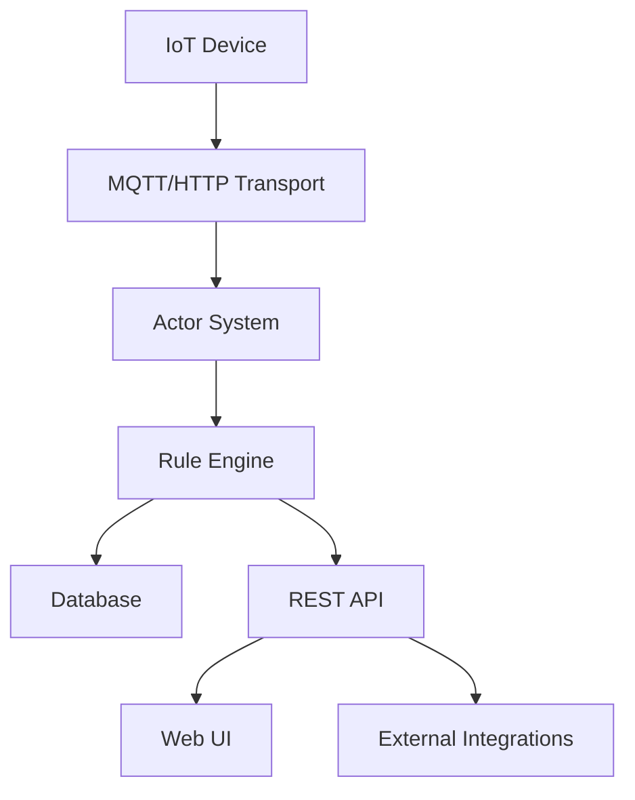
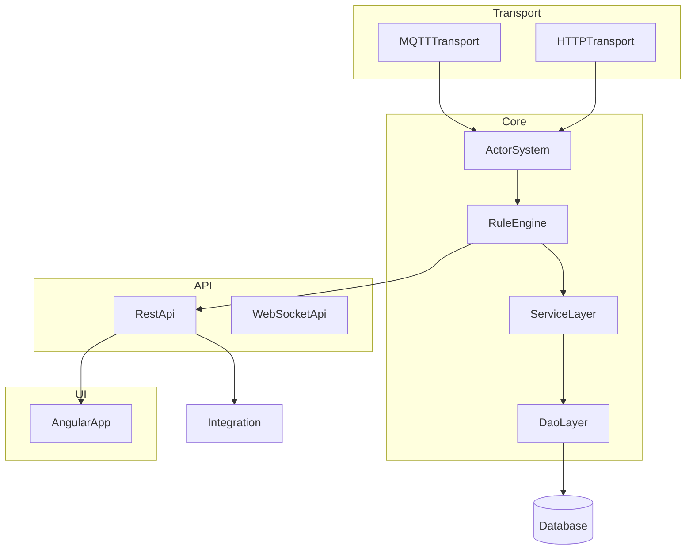

# Project Architecture Blueprint

*Generated: 2026-01-06*

---

## 1. Architecture Detection and Analysis

### Technology Stacks and Frameworks

- **Primary Language:** Java (backend, core services)
- **Other Languages:** JavaScript/TypeScript (UI, integrations), Python (labs, scripts)
- **Frameworks:** Spring (IoC, DI, AOP), Akka (actor model), Protobuf (serialization), MQTT/HTTP (transport), Angular (UI)
- **Build Tools:** Maven, npm/yarn
- **Deployment:** Docker, Kubernetes, systemd

### Architectural Patterns

- **Core:** Layered + Event-Driven (actor-based)
- **Subsystems:** Microservices (transport, rule engine, integrations), Monolithic core (platform services)
- **Patterns:** Clean Architecture (domain separation), Hexagonal (ports/adapters for integrations), CQRS (command/query separation in rule engine)

---

## 2. Architectural Overview

ThingsBoard uses a hybrid architecture:

- **Layered:** Clear separation between transport, service, data, and API layers
- **Event-Driven:** Actor system for asynchronous message processing
- **Microservices:** Pluggable modules for transport, integrations, and rule engine
- **Guiding Principles:** Modularity, extensibility, scalability, and resilience
- **Boundaries:** Enforced via Java packages, interfaces, and actor boundaries
- **Adaptations:** Custom actor system, hybrid monolith+microservice deployment

---

## 3. Architecture Visualization

### High-Level Overview (C4: System Context)



### Component Interaction (C4: Container)



---

## 4. Core Architectural Components

### Transport Layer

- **Purpose:** Ingests device data via MQTT/HTTP, normalizes, and forwards to actor system
- **Internal Structure:** Protocol adapters, session managers, message converters
- **Interaction:** Publishes messages to actor system, receives acks/commands
- **Evolution:** New protocols via adapter interface, config-driven

### Actor System

- **Purpose:** Asynchronous message routing, processing, and backpressure management
- **Internal Structure:** Akka-based actors, mailbox queues, supervision trees
- **Interaction:** Receives messages from transport, routes to rule engine, manages state
- **Evolution:** New actor types via inheritance, pluggable supervision strategies

### Rule Engine

- **Purpose:** Business logic execution, event processing, automation
- **Internal Structure:** Rule chains, nodes, context objects, message envelopes
- **Interaction:** Processes tbmsg, emits events, interacts with service/data layers
- **Evolution:** New rule nodes via plugin API, custom chains via UI/config

### Service Layer

- **Purpose:** Implements business services, orchestrates data access
- **Internal Structure:** Service interfaces, Spring beans, transactional boundaries
- **Interaction:** Consumed by rule engine, API, integrations
- **Evolution:** Extend via new service beans, interface-based contracts

### DAO/Data Layer

- **Purpose:** Data persistence and retrieval
- **Internal Structure:** Repository interfaces, ORM mappings, query builders
- **Interaction:** Consumed by service layer, direct access discouraged
- **Evolution:** New entities via repository pattern, schema migrations

### API Layer

- **Purpose:** Exposes REST/WebSocket endpoints for UI and integrations
- **Internal Structure:** Controller classes, DTOs, validation, security filters
- **Interaction:** Consumes service layer, exposes to UI/integrations
- **Evolution:** New endpoints via controller pattern, versioning via path

### UI Layer

- **Purpose:** User interface for management and visualization
- **Internal Structure:** Angular modules, components, services
- **Interaction:** Consumes REST/WebSocket APIs
- **Evolution:** New features via Angular modules/components

---

## 5. Architectural Layers and Dependencies

- **Layer Structure:**
  - UI → API → Service → DAO/Data → Database
  - Transport/Integration layers interact with Service/Rule Engine
- **Dependency Rules:**
  - Upper layers depend on abstractions of lower layers
  - No direct access from UI/API to DAO; always via Service
  - Actor system enforces async boundaries
- **Abstraction Mechanisms:**
  - Java interfaces, Spring DI, message envelopes
- **Circular Dependencies:**
  - Avoided by strict layering and actor boundaries
- **Dependency Injection:**
  - Spring @Autowired, constructor injection, config-based wiring

## 6. Data Architecture

- **Domain Model:** Entity classes for Device, Asset, Customer, User, etc.
- **Entity Relationships:**
  - Device ↔ Asset (many-to-many via relations)
  - Customer ↔ Device/Asset (ownership)
- **Data Access Patterns:**
  - Repository pattern (Spring Data), query builders
- **Data Transformation:**
  - DTOs for API, mappers for persistence
- **Caching:**
  - In-memory caches for profiles, device state, rule chains
- **Validation:**
  - Bean validation (JSR-303), custom validators in service/API

## 7. Cross-Cutting Concerns Implementation

### Authentication & Authorization

- Spring Security, JWT tokens, role-based access
- Permission checks in service/API layers
- Tenant/customer isolation via entity scoping

### Error Handling & Resilience

- Global exception handlers (API)
- Actor supervision for failures
- Retry logic in transport/integration
- Circuit breakers for external calls

### Logging & Monitoring

- SLF4J/Logback for logging
- Metrics via Micrometer/Prometheus
- Distributed tracing (correlationId)

### Validation

- Input validation at API boundary
- Business rule validation in service layer

### Configuration Management

- application.yml, environment variables
- Secrets via env/config server
- Feature flags via config

## 8. Service Communication Patterns

- **Service Boundaries:**
  - Microservices for transport, integrations, rule engine
- **Protocols:**
  - gRPC, HTTP/REST, MQTT, WebSocket
- **Sync/Async:**
  - Async: actor messages, event bus, queues
  - Sync: REST/gRPC for management APIs
- **API Versioning:**
  - Path-based versioning (e.g., /api/v1/)
- **Service Discovery:**
  - Static config, Kubernetes DNS
- **Resilience:**
  - Retries, timeouts, circuit breakers

## 9. Technology-Specific Architectural Patterns

### Java

- Spring Boot for DI, config, REST
- Akka for actor model
- Protobuf for serialization
- ORM: JPA/Hibernate

### Angular

- Modules, services, RxJS for state/effects
- REST/WebSocket data services

### Python (labs/scripts)

- Utility scripts, data analysis, integration tests

## 10. Implementation Patterns

- **Interface Design:** Java interfaces, default impls, SPI for plugins
- **Service Implementation:** Singleton beans, stateless services, transactional boundaries
- **Repository:** Spring Data, custom queries, transaction mgmt
- **Controller/API:** REST controllers, DTO mapping, validation
- **Domain Model:** Entities, value objects, event classes

## 11. Testing Architecture

- **Strategies:** Unit, integration, end-to-end
- **Boundaries:** Mocking for unit, embedded DB for integration
- **Test Doubles:** Mockito, test containers
- **Test Data:** Builders, fixtures
- **Tools:** JUnit, Spring Test, Cypress (UI)

## 12. Deployment Architecture

- **Topology:** Monolith core, microservices for integrations/transport
- **Environments:** Dev, staging, prod via config
- **Dependency Resolution:** Spring profiles, config server
- **Containerization:** Docker, K8s manifests
- **Cloud Integration:** Optional, via external services

## 13. Extension and Evolution Patterns

- **Feature Addition:** New rule nodes, transport adapters, Angular modules
- **Modification:** Interface-based extension, backward compatibility via versioning
- **Integration:** Adapter pattern, anti-corruption layers for external APIs

## 14. Architectural Pattern Examples

### Layer Separation Example (Java)

```java
public interface DeviceService { ... }
@Service
public class DeviceServiceImpl implements DeviceService { ... }
@RestController
public class DeviceController {
  @Autowired DeviceService deviceService;
}
```

### Component Communication Example (Actor)

```java
actorSystem.tell(new TbMsg(...), ruleEngineActorRef);
```

### Extension Point Example (Rule Node)

```java
public class CustomRuleNode implements TbNode { ... }
```

## 15. Architectural Decision Records

- **Actor Model:** Chosen for async, scalable message processing; alternatives (pure Spring events) lacked supervision and mailbox control.
- **Hybrid Monolith/Microservices:** Enables both simple deployment and horizontal scaling; pure microservices would increase ops complexity.
- **Spring Boot:** For rapid dev, DI, and ecosystem; alternatives (Guice, manual wiring) less mature.

## 16. Architecture Governance

- **Consistency:** Enforced via code review, static analysis, and CI checks
- **Automated Checks:** Linting, dependency analysis, test coverage
- **Review Process:** PR review, architecture review meetings
- **Documentation:** Markdown specs, diagrams, ADRs

## 17. Blueprint for New Development

- **Workflow:**
  - Start with requirements/spec
  - Define interfaces and contracts
  - Implement in appropriate layer (service, rule node, etc.)
  - Add tests (unit/integration)
  - Document in markdown/specs
- **Templates:**
  - Use existing service, controller, and rule node templates
  - Organize files by feature/module
- **Pitfalls:**
  - Avoid direct DAO access from API/UI
  - Prevent metadata mutation across async branches
  - Watch for actor mailbox overload
  - Ensure test coverage for new features

---

*This blueprint was generated on 2026-01-06. Update regularly to reflect architectural evolution.*
