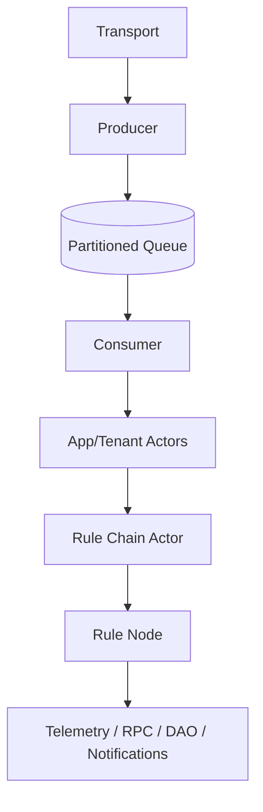

# ThingsBoard AI Documentation Workspace

A developer-focused documentation and lab workspace for exploring and explaining the ThingsBoard codebase, with structured specs, Mermaid diagrams, and hands-on labs. It also includes prompt blueprints and instructions to keep documentation and contributions consistent.

## Technology Stack

- Java (server-side) — primary language of ThingsBoard core referenced by specs
- Markdown + Mermaid — documentation and diagrams
- VS Code + GitHub Copilot — authoring workflow guided by project instructions

## Project Architecture (Docs Focus)

The repository centers on documentation of the ThingsBoard Rule Engine and related services. A high-level flow used throughout the specs:



- Detailed component docs live under spec/ and link to real source files in the `thingsboard/` tree.
- Hands-on labs under labs/ help validate behaviors through practical steps and expected outputs.

## Getting Started

### Clone

```bash
git clone <this-repo-url>
cd ai-doc
```

### Open and Explore

- Open the workspace in VS Code
- Start with the spec index: [spec/_index.md](spec/_index.md)
- Try the hands-on labs: [labs/_index.md](labs/_index.md)

> Note: If you intend to build or run the ThingsBoard code under `thingsboard/`, follow the official ThingsBoard setup guides for prerequisites and build steps.

## Project Structure

- `thingsboard/` — upstream ThingsBoard source references (used by specs)
- `spec/` — developer specs with diagrams and code references; start at [spec/_index.md](spec/_index.md)
- `labs/` — hands-on exercises to validate flows; start at [labs/_index.md](labs/_index.md)
- `.github/instructions/` — project instructions and standards for docs and contributions
- `.github/prompts/` — blueprint prompts (e.g., architecture, README generator)
- `docs/` — additional guides (if present)

## Quick Links

- Specs Index: [spec/_index.md](spec/_index.md)
- Labs Index: [labs/_index.md](labs/_index.md)
- Spec: TbContext & Services: [spec/tb-context-and-services.md](spec/tb-context-and-services.md)
- Spec: Queue & Actors: [spec/rule-engine-queue-and-actors.md](spec/rule-engine-queue-and-actors.md)
- Spec: Transport → Rule Engine: [spec/transport-to-rule-engine-flow.md](spec/transport-to-rule-engine-flow.md)

## Key Features

- Clear, code-anchored specs for Rule Engine interfaces, context, messaging, queues/actors, telemetry/attributes, RPC, and more
- End-to-end diagrams that reflect actual source flows
- Practical labs with goals, steps, and success criteria
- Prompt blueprints to bootstrap consistent documentation artifacts

## Development Workflow

This repo follows a specification-driven approach with explicit phases:

- Analyze — derive requirements and clarify scope
- Design — document technical design and interfaces
- Implement — add content or code in small, testable increments
- Validate — verify diagrams, flows, and labs against real behavior
- Reflect — refactor docs, improve clarity and coverage
- Handoff — package updates for review

See: [.github/instructions/spec-driven-workflow-v1.instructions.md](.github/instructions/spec-driven-workflow-v1.instructions.md)

## Coding Standards

- Prefer self-explanatory code and comment on “why,” not “what”
- Consistent, lint-friendly Markdown with clear sectioning and code fences

See:

- [.github/instructions/self-explanatory-code-commenting.instructions.md](.github/instructions/self-explanatory-code-commenting.instructions.md)
- [.github/instructions/markdown.instructions.md](.github/instructions/markdown.instructions.md)
- [.github/instructions/taming-copilot.instructions.md](.github/instructions/taming-copilot.instructions.md)

## Docs Style Guide

Follow the house rules for Markdown authoring to keep content consistent and lint-friendly:

- Use `##` for top-level section headings within docs; avoid extra heading levels unless necessary
- Surround headings and lists with blank lines
- Keep one list indentation level and use `-` for bullets
- Use fenced code blocks with language hints (e.g., ```bash)
- Validate Mermaid diagrams and avoid special characters (parentheses, commas) in node labels

See: [.github/instructions/markdown.instructions.md](.github/instructions/markdown.instructions.md)

## Testing

- Validate diagrams with Mermaid validator (used during edits)
- Use labs in `labs/` to confirm behaviors (routing, queue/actors, telemetry/attributes)
- Follow the Validate phase in Spec Driven Workflow for structured verification

## Contributing

- Keep changes focused and surgical; integrate with existing structure
- Follow the documentation standards and workflow instructions
- Reference code paths when asserting behavior; prefer links to files in `thingsboard/`

Helpful references:

- Prompts: [.github/prompts/](.github/prompts/)
- Instructions: [.github/instructions/](.github/instructions/)

## License

No explicit license file was found in this repository. If you plan to distribute or reuse content/code, add an appropriate LICENSE file and update this section.
