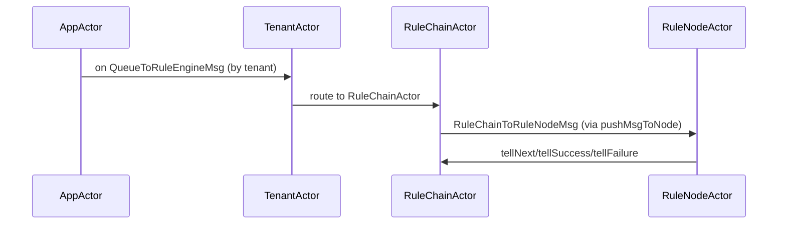
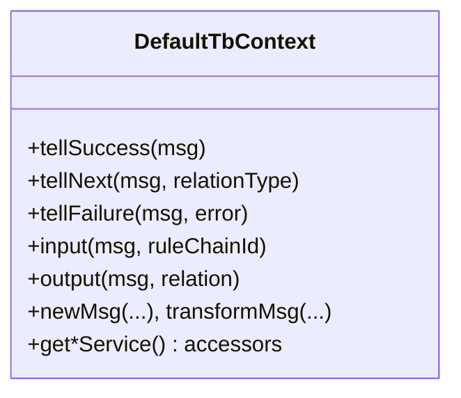

# Rule Engine Actor Internals Deep Dive

## Language & Context

- Language: Java (server-side)
- Domain: Actor hierarchy and processing for Rule Engine messages.

## Overview

From queue consumption to node execution, actor components deliver `TbMsg` according to tenant and rule chain topology.



## Key Responsibilities

- AppActor: top-level router; ensures `TenantActor` lifecycle.
- TenantActor: per-tenant dispatcher to target rule chains.
- RuleChainActor: executes routing logic (`onTellNext`, `pushToTarget`, `putToQueue`).
- RuleNodeActor: invokes `TbNode.onMsg()` via `DefaultTbContext`.

## RuleChain Routing

```mermaid
flowchart TD
  A[QueueToRuleEngineMsg] --> B[checkMsgValid]
  B --> C[checkComponentStateActive]
  C --> D[if relationTypes null → firstNode]
  D --> E[pushMsgToNode(firstNode)]
  C --> F[else onTellNext]
  F --> G[filter outbound relations by relationTypes]
  G --> H{count}
  H -- 0 --> I[callback success/failure]
  H -- 1 --> J[pushToTarget]
  H -- >1 --> K[fork with callback wrapper]
```

Implementation points:

- `RuleChainActorMessageProcessor.onTellNext(...)`
- `pushToTarget(...)` uses `TopicPartitionInfo.isMyPartition()` to decide local vs `putToQueue(...)`.
- `putToQueue(...)` clones `TbMsg` (new id) for cross-partition/rule-chain forwarding.

## Callback Semantics

Callbacks report delivery outcome to the upstream producer (transport/REST/etc.).

- Success: When all targeted deliveries complete successfully (single or multiple targets).
- Failure: If a target path fails, or if the actor stops while processing the message.
- Wrappers:
  - `TbQueueTbMsgCallbackWrapper`: wraps a single downstream path.
  - `MultipleTbQueueTbMsgCallbackWrapper`: aggregates N downstream callbacks and reports success when all N succeed (or failure on first error).

Edge cases:

- No outbound relations and relationTypes include `FAILURE` → failure callback with `RuleNodeException`.
- No outbound relations and no `FAILURE` requested → success callback.
- Actor shutdown while holding a message → `QueueToRuleEngineMsg` triggers `onFailure`.

## Partition Resolution

Per-message partitioning ensures ordered processing within a partition and scalable fan-out across partitions.

- Resolve partition: `TopicPartitionInfo tpi = systemContext.resolve(tenantId, originator, msg)`.
- Local vs remote:
  - `tpi.isMyPartition()` → direct `pushMsgToNode` (local delivery)
  - otherwise → `putToQueue` (forward to the owning partition with a cloned `TbMsg` id)
- Multi-partition produce: Producer clones messages per partition and sets a shared `correlationId` for tracing.

## Error Paths & State

- `checkMsgValid(msg)`: reject invalid message envelopes early.
- `checkComponentStateActive(msg)`: throws a `RuleNodeException` if chain inactive; `getInactiveException()` provides details.
- Missing node routes (e.g., old messages for removed nodes) → warn and treat as no-outbound-relations case.

## Debug & Logging Tips

- Enable debug for:
  - `org.thingsboard.server.actors.ruleChain`
  - `org.thingsboard.server.queue.common`
  - `org.thingsboard.server.service.queue.ruleengine`
- Trace fields:
  - `TbMsg.id` and `correlationId`
  - `partition` and `queueName`
  - `ruleChainId` and `ruleNodeId`

## Hands-on

- Run: ../labs/queue-actor-tracing-lab.md
- Goal: Observe `onTellNext` decisions, partitions, and callbacks end-to-end.

## DefaultTbContext

`DefaultTbContext` wraps platform services for the node and provides routing helpers used by `RuleNodeActor`.



## References

- application/src/main/java/org/thingsboard/server/actors/app/AppActor.java
- application/src/main/java/org/thingsboard/server/actors/tenant/TenantActor.java
- application/src/main/java/org/thingsboard/server/actors/ruleChain/RuleChainActorMessageProcessor.java
- rule-engine/rule-engine-impl/src/main/java/org/thingsboard/rule/engine/api/DefaultTbContext.java

---

Previous: rule-engine-queue-and-actors.md · Next: tb-context-and-services.md
