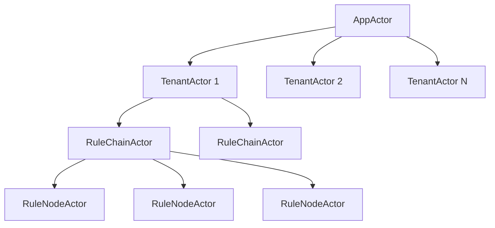
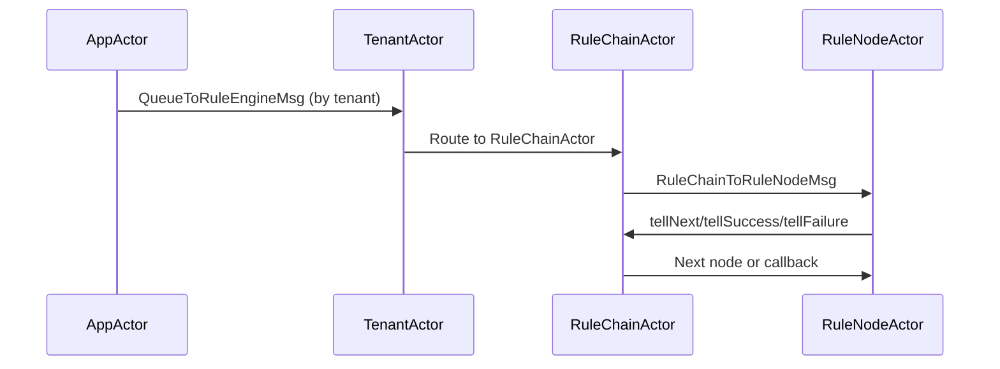
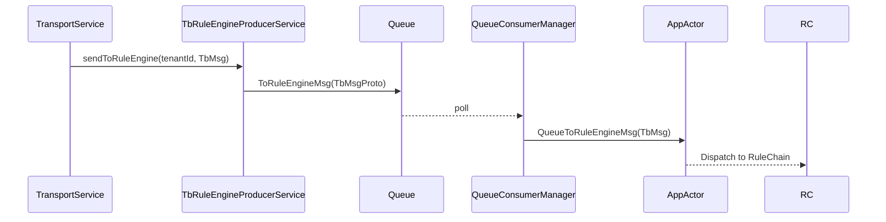
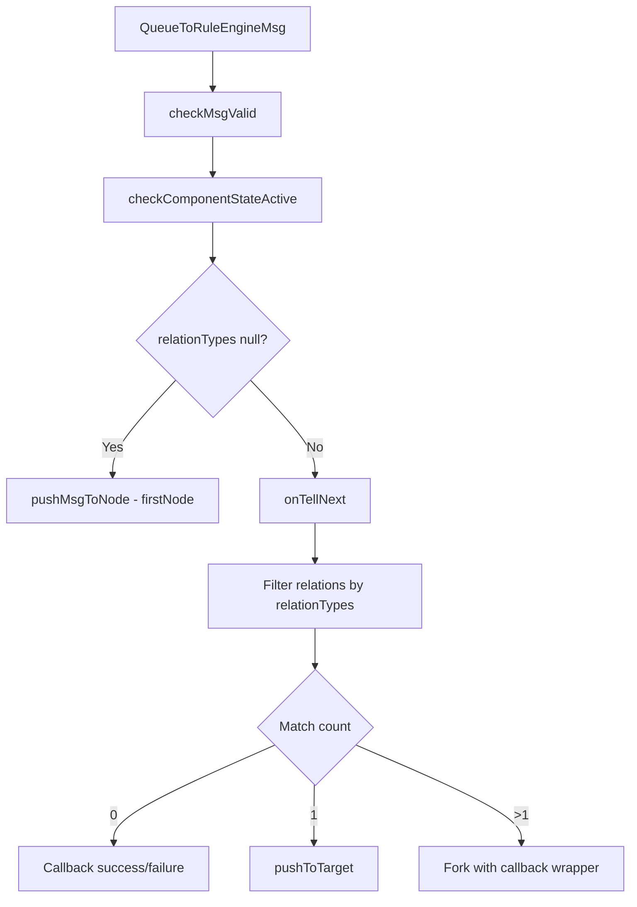
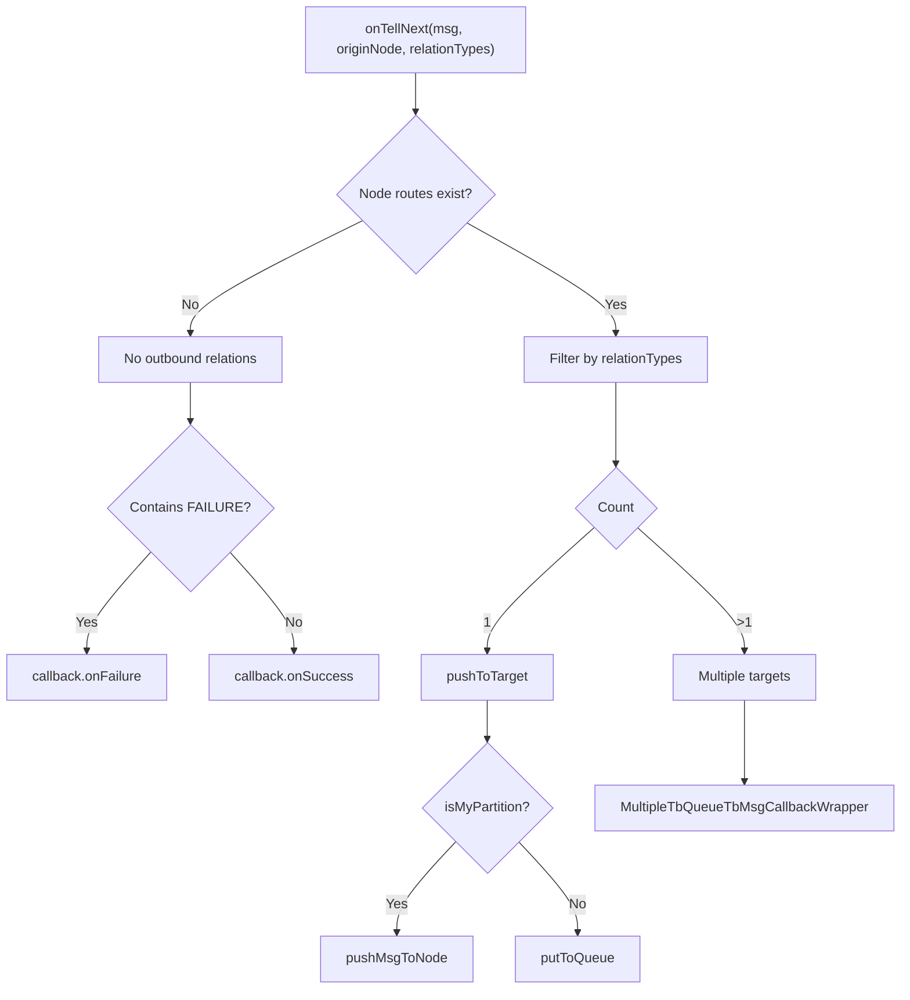
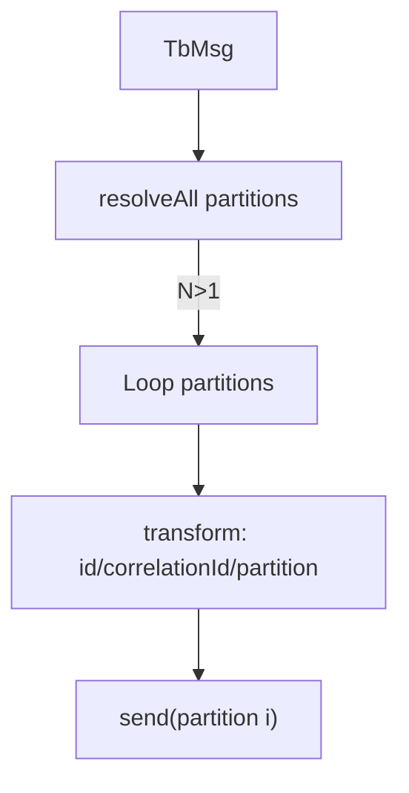
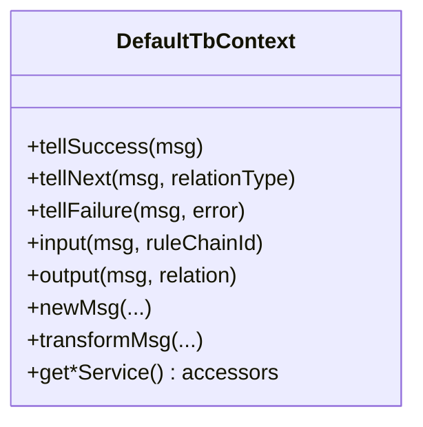

# Actor System and Message Routing Specification

## Overview

This document describes the actor-based processing model in ThingsBoard, including the actor hierarchy, message routing, partition resolution, and callback handling.

---

## Actor Hierarchy



### Actor Responsibilities

| Actor | Responsibility |
|-------|----------------|
| AppActor | Top-level router; manages TenantActor lifecycle |
| TenantActor | Per-tenant dispatcher to rule chains |
| RuleChainActor | Executes routing logic (onTellNext, pushToTarget) |
| RuleNodeActor | Invokes TbNode.onMsg() via DefaultTbContext |

---

## Message Flow



---

## Queue to Actor Flow



---

## QueueToRuleEngineMsg

The envelope that wraps TbMsg for actor processing:

| Field | Type | Description |
|-------|------|-------------|
| tenantId | TenantId | Target tenant |
| msg | TbMsg | The message to process |
| relationTypes | Set<String> | Relation types for routing |
| failureMessage | String | Failure context (optional) |
| callback | TbQueueCallback | Delivery callback |

Key methods:

| Method | Description |
|--------|-------------|
| isTellNext() | Whether relationTypes exist for routing |
| getMsg() | Get the wrapped TbMsg |
| getCallback() | Get the delivery callback |

---

## RuleChain Routing



### onTellNext Logic



---

## Partition Resolution

Per-message partitioning ensures ordered processing:

```java
TopicPartitionInfo tpi = systemContext.resolve(tenantId, originator, msg);

if (tpi.isMyPartition()) {
    // Local delivery
    pushMsgToNode(targetNode, msg);
} else {
    // Forward to owning partition
    putToQueue(tpi, msg.copy(newId));
}
```

### Multi-Partition Produce

When a message must go to multiple partitions:



- Sets shared `correlationId` for tracing
- Each partition gets message with unique ID
- First message keeps original ID

---

## Callback Semantics

Callbacks report delivery outcome to upstream producer:

| Scenario | Callback |
|----------|----------|
| Single target success | callback.onSuccess() |
| Single target failure | callback.onFailure(error) |
| Multiple targets all succeed | callback.onSuccess() |
| Any target fails | callback.onFailure(error) |
| Actor shutdown | callback.onFailure(reason) |

### Callback Wrappers

| Wrapper | Purpose |
|---------|---------|
| TbQueueTbMsgCallbackWrapper | Single downstream path |
| MultipleTbQueueTbMsgCallbackWrapper | Aggregates N callbacks, success when all succeed |

---

## DefaultTbContext

Wraps platform services for rule nodes:



---

## Error Handling

| Check | Action |
|-------|--------|
| checkMsgValid(msg) | Reject invalid message envelopes |
| checkComponentStateActive(msg) | Throw RuleNodeException if chain inactive |
| Missing node routes | Warn and treat as no-outbound-relations |

---

## Logging and Tracing

### Debug Packages

```
org.thingsboard.server.actors.app
org.thingsboard.server.actors.tenant
org.thingsboard.server.actors.ruleChain
org.thingsboard.server.queue.common
org.thingsboard.server.service.queue.ruleengine
```

### Trace Fields

| Field | Purpose |
|-------|---------|
| TbMsg.id | Unique message identifier |
| correlationId | Shared across partitions |
| partition | Target partition number |
| queueName | Queue name |
| ruleChainId | Current rule chain |
| ruleNodeId | Current rule node |

### Log Grep Patterns

```bash
grep -E "correlationId|partition|putToQueue|pushMsgToNode|onTellNext" server.log
grep -E "QueueToRuleEngineMsg|ToRuleEngineMsg" server.log
```

---

## Best Practices

### Do's

- Preserve `queueName` on TbMsg for correct partition resolution
- Use `correlationId` for multi-partition tracing
- Ensure callbacks are present when upstream expects delivery acks
- Log message ID and correlation ID for debugging

### Don'ts

- Don't drop callbacks - always call success or failure
- Don't assume local partition ownership
- Don't block actor threads with synchronous I/O

---

## Troubleshooting

| Issue | Investigation |
|-------|---------------|
| Stalled delivery | Check actor logs for onTellNext outcomes |
| Fan-out mismatch | Compare relationTypes to configured routes |
| Missing callbacks | Check for actor shutdown during processing |
| Partition issues | Verify partition ownership with isMyPartition() |

---

## See Also

- [Rule Engine Core](rule-engine-core.md)
- [Infrastructure & Queue](infrastructure-queue.md)
- [Rule Node Implementation Guide](rule-node-implementation-guide.md)
