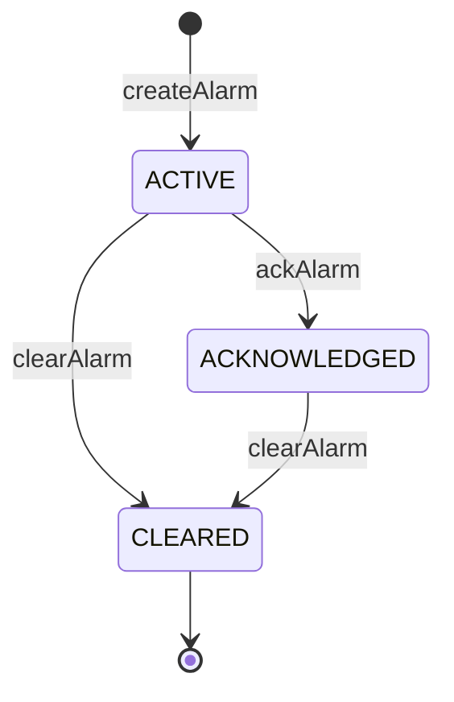
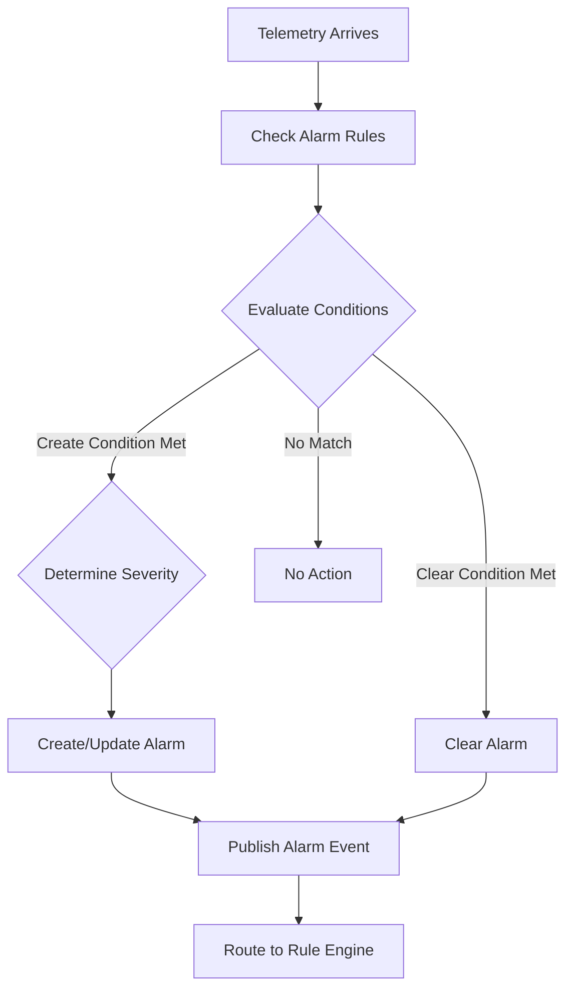
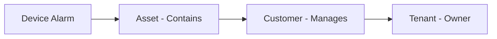
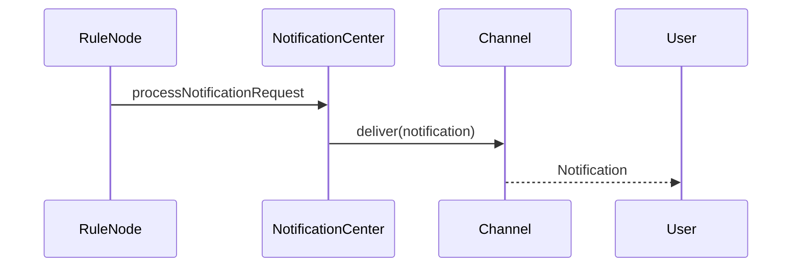
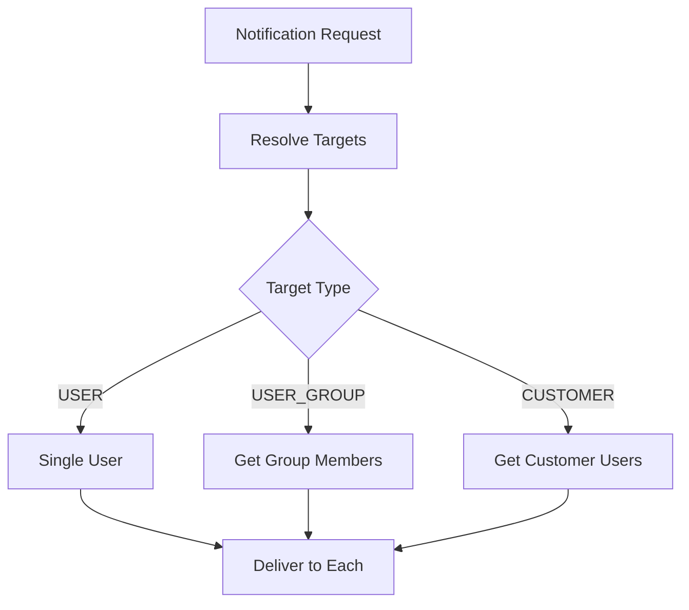
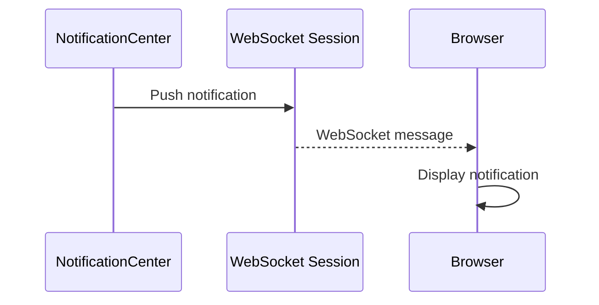

# Alarm and Notification Services Specification

## Overview

This document describes the alarm management and notification services in ThingsBoard, including alarm lifecycle, propagation, notification channels, and templates.

---

## Part 1: Alarm Service

### Key Interfaces

#### RuleEngineAlarmService

| Method | Description |
|--------|-------------|
| findLatestActiveByOriginatorAndType(...) | Find latest active alarm for originator and type |
| findLatestByOriginatorAndType(...) | Find latest alarm (any state) |
| createOrUpdateAlarm(AlarmInfo) | Create or update an alarm |
| clearAlarm(...) | Clear an alarm |
| ackAlarm(...) | Acknowledge an alarm |
| findAlarmById(tenantId, alarmId) | Retrieve alarm by id |

---

### Alarm Entity

| Field | Type | Description |
|-------|------|-------------|
| id | AlarmId | Unique identifier |
| tenantId | TenantId | Owning tenant |
| originator | EntityId | Source entity |
| type | String | Alarm type (e.g., "High Temp") |
| severity | AlarmSeverity | CRITICAL, MAJOR, MINOR, WARNING, INDETERMINATE |
| status | AlarmStatus | ACTIVE, CLEARED, ACKNOWLEDGED |
| startTs | long | Alarm start timestamp |
| endTs | long | Alarm end timestamp (if cleared) |
| details | JsonNode | Additional alarm details |

---

### Alarm Lifecycle



---

### Alarm Profile Rules

Alarm rules can be defined in device profiles for automatic alarm creation.

#### Condition Types

| Type | Description |
|------|-------------|
| SIMPLE | Single key threshold comparison |
| DURATION | Condition must hold for specified duration |
| REPEATING | Condition must occur N times in time window |
| CONSTANT | Always true (for testing) |

#### Example Configuration

```json
{
  "alarmType": "High Temperature",
  "createRules": {
    "CRITICAL": {
      "condition": {
        "spec": { "type": "SIMPLE" },
        "condition": [{
          "key": { "type": "TIME_SERIES", "key": "temperature" },
          "valueType": "NUMERIC",
          "predicate": {
            "type": "NUMERIC",
            "operation": "GREATER",
            "value": { "defaultValue": 50 }
          }
        }]
      }
    }
  },
  "clearRule": {
    "condition": [{
      "key": { "type": "TIME_SERIES", "key": "temperature" },
      "predicate": {
        "operation": "LESS_OR_EQUAL",
        "value": { "defaultValue": 25 }
      }
    }]
  }
}
```

---

### Alarm Processing Flow



---

### Alarm Propagation

Alarms can propagate to related entities.

| Property | Description |
|----------|-------------|
| propagate | Enable/disable propagation |
| propagateRelationTypes | Relation types to follow (e.g., Contains) |
| propagateToOwner | Propagate to owner |
| propagateToTenant | Propagate to tenant |



---

### Alarm Rule Nodes

#### TbCreateAlarmNode

| Property | Description |
|----------|-------------|
| alarmType | Alarm type to create |
| severity | Alarm severity |
| propagate | Enable propagation |
| alarmDetailsBuildJs | Script to build details |
| useMessageAlarmData | Use message as alarm data |

#### TbClearAlarmNode

| Property | Description |
|----------|-------------|
| alarmType | Alarm type to clear |
| alarmDetailsBuildJs | Script to update details |

---

## Part 2: Notification Service

### Key Interfaces

#### NotificationCenter

| Method | Description |
|--------|-------------|
| processNotificationRequest(...) | Process and deliver notification |
| sendNotification(...) | Send to specified targets |

---

### Notification Channels

| Channel | Description |
|---------|-------------|
| WEB | In-app notification (WebSocket push) |
| MOBILE | Mobile push notification (Firebase, APNs) |
| EMAIL | Email notification |
| SMS | SMS notification |
| SLACK | Slack message |

---

### Notification Flow



---

### Notification Templates

#### Template Variables

Templates support `${variableName}` substitution.

| Variable Type | Example |
|---------------|---------|
| Entity fields | `${deviceName}`, `${alarmType}` |
| Metadata | `${metadata.key}` |
| Custom data | `${info.customField}` |
| System | `${recipientTitle}`, `${tenantName}` |

#### Example Template

```json
{
  "name": "Device Offline Alert",
  "notificationType": "DEVICE_ACTIVITY",
  "configuration": {
    "EMAIL": {
      "subject": "Device ${deviceName} is offline",
      "body": "Device ${deviceName} inactive since ${lastActivityTime}"
    },
    "WEB": {
      "subject": "Device Offline",
      "body": "${deviceName} is offline"
    }
  }
}
```

---

### Notification Targets

| Type | Description |
|------|-------------|
| USER | Specific user by ID |
| USER_GROUP | All users in a group |
| CUSTOMER | All users of a customer |
| TENANT_ADMIN | All tenant administrators |
| SYSTEM_ADMIN | System administrators |
| AFFECTED_USER | User affected by the event |
| ORIGINATOR_ENTITY_OWNER | Owner of originator entity |



---

### Trigger Types

| Trigger | Description |
|---------|-------------|
| ALARM | Alarm created, updated, or cleared |
| DEVICE_ACTIVITY | Device connect, disconnect, inactive |
| ENTITY_ACTION | Entity created, updated, deleted |
| ALARM_COMMENT | Comment added to alarm |
| ALARM_ASSIGNMENT | Alarm assigned to user |
| RULE_ENGINE_LIFECYCLE | Rule chain/node state change |
| RATE_LIMITS | Rate limit exceeded |

---

### Notification Status

| Status | Description |
|--------|-------------|
| PENDING | Queued for delivery |
| SENT | Sent to channel |
| DELIVERED | Delivery confirmed |
| READ | User read (web only) |
| FAILED | Delivery failed |

---

### Web Notification (WebSocket)



### API Endpoints

| Endpoint | Method | Description |
|----------|--------|-------------|
| /api/notifications | GET | Get user notifications |
| /api/notifications/unread/count | GET | Get unread count |
| /api/notifications/{id}/read | POST | Mark as read |
| /api/notifications/read | POST | Mark all as read |

---

## Part 3: Related Communication Services

### Mail Service

| Method | Description |
|--------|-------------|
| sendEmail(email) | Send email asynchronously |
| sendEmailAsync(email) | Send with future result |

### SMS Service

| Method | Description |
|--------|-------------|
| sendSms(tenantId, customerId, numbers, message) | Send SMS |
| sendSmsAsync(tenantId, customerId, numbers, message) | Async SMS |
| isConfigured(tenantId) | Check if SMS is configured |

### Slack Service

| Method | Description |
|--------|-------------|
| sendMessage(tenantId, conversationId, message) | Send Slack message |

### Firebase Service

| Method | Description |
|--------|-------------|
| sendMessage(tenantId, fcmToken, title, body) | Send push notification |

---

## Best Practices

### Alarms

- Use consistent alarm types across rule chains
- Include relevant details in alarm payload
- Clear alarms promptly when condition resolves
- Use severity levels appropriately

### Notifications

- Use templates for consistent messaging
- Rate-limit notifications to avoid spam
- Monitor delivery status and failures
- Test notification channels before production

---

## See Also

- [Rule Engine Core](rule-engine-core.md)
- [Device & Asset Management](device-asset-management.md)
- [Security & Authentication](security-auth.md)
