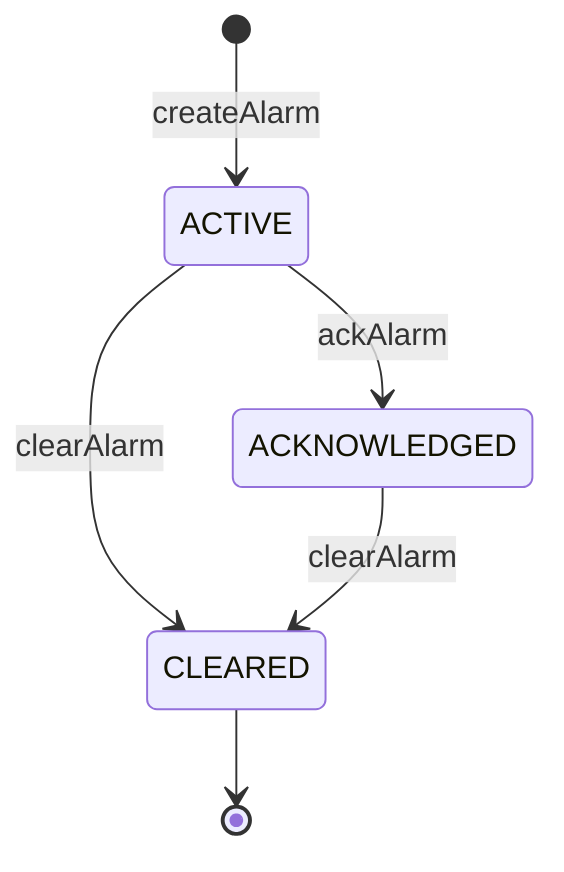

# Alarm Service Specification

## Overview

This document describes the Alarm management APIs and lifecycle within ThingsBoard, used for creating, updating, clearing, and querying alarms from rule nodes and services.

---

## Key Interfaces

### RuleEngineAlarmService

Located at: `org/thingsboard/rule/engine/api/RuleEngineAlarmService.java`

| Method                                      | Description                                      |
|---------------------------------------------|--------------------------------------------------|
| findLatestActiveByOriginatorAndType(...)    | Find latest active alarm for originator and type |
| findLatestByOriginatorAndType(...)          | Find latest alarm (any state) for originator     |
| createOrUpdateAlarm(AlarmInfo)              | Create or update an alarm                        |
| clearAlarm(...)                             | Clear an alarm by id or originator/type          |
| ackAlarm(...)                               | Acknowledge an alarm                             |
| findAlarmById(tenantId, alarmId)            | Retrieve alarm by id                             |

---

## Alarm Lifecycle

---

## Alarm Entity

| Field         | Type      | Description                        |
|---------------|-----------|------------------------------------|
| id            | AlarmId   | Unique alarm identifier            |
| tenantId      | TenantId  | Owning tenant                      |
| originator    | EntityId  | Source entity (device, asset, etc.)|
| type          | String    | Alarm type (e.g., "High Temp")     |
| severity      | AlarmSeverity | CRITICAL, MAJOR, MINOR, WARNING, INDETERMINATE |
| status        | AlarmStatus   | ACTIVE, CLEARED, ACKNOWLEDGED      |
| startTs       | long      | Alarm start timestamp              |
| endTs         | long      | Alarm end timestamp (if cleared)   |
| details       | JsonNode  | Additional alarm details           |

---

## Integration with Rule Engine

- Alarm nodes use `RuleEngineAlarmService` via `TbContext`
- Alarms can trigger downstream rule logic (e.g., notifications)
- Alarm events are published for UI and integrations

---

## Best Practices

- Use consistent alarm types across rule chains
- Include relevant details in alarm payload
- Clear alarms promptly when condition resolves
- Use severity levels appropriately

---

## See Also

- [TbContext & Services](tb-context-and-services.md)
- [Rule Engine Services (RPC, Telemetry, Notifications)](rule-engine-services-rpc-telemetry-notifications.md)
