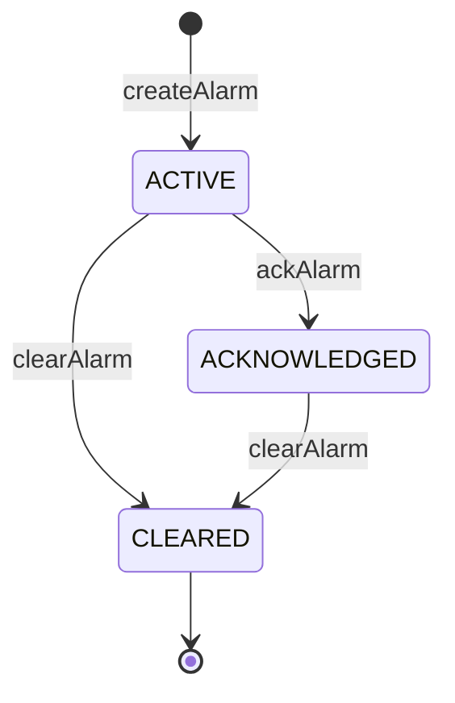
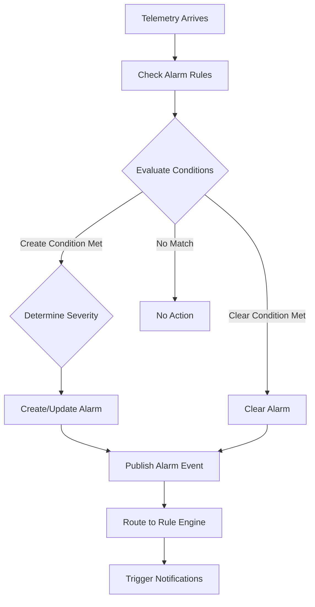
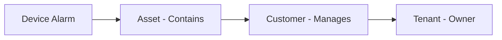

# Alarm Service Specification

## Overview

This document describes the Alarm management APIs and lifecycle within ThingsBoard, used for creating, updating, clearing, and querying alarms from rule nodes and services.

---

## Key Interfaces

### RuleEngineAlarmService

Located at: `org/thingsboard/rule/engine/api/RuleEngineAlarmService.java`

| Method                                      | Description                                      |
|---------------------------------------------|--------------------------------------------------|
| findLatestActiveByOriginatorAndType(...)    | Find latest active alarm for originator and type |
| findLatestByOriginatorAndType(...)          | Find latest alarm (any state) for originator     |
| createOrUpdateAlarm(AlarmInfo)              | Create or update an alarm                        |
| clearAlarm(...)                             | Clear an alarm by id or originator/type          |
| ackAlarm(...)                               | Acknowledge an alarm                             |
| findAlarmById(tenantId, alarmId)            | Retrieve alarm by id                             |

---

## Alarm Lifecycle



---

## Alarm Entity

| Field         | Type      | Description                        |
|---------------|-----------|------------------------------------|
| id            | AlarmId   | Unique alarm identifier            |
| tenantId      | TenantId  | Owning tenant                      |
| originator    | EntityId  | Source entity (device, asset, etc.)|
| type          | String    | Alarm type (e.g., "High Temp")     |
| severity      | AlarmSeverity | CRITICAL, MAJOR, MINOR, WARNING, INDETERMINATE |
| status        | AlarmStatus   | ACTIVE, CLEARED, ACKNOWLEDGED      |
| startTs       | long      | Alarm start timestamp              |
| endTs         | long      | Alarm end timestamp (if cleared)   |
| details       | JsonNode  | Additional alarm details           |

---

## Integration with Rule Engine

- Alarm nodes use `RuleEngineAlarmService` via `TbContext`
- Alarms can trigger downstream rule logic (e.g., notifications)
- Alarm events are published for UI and integrations

---

## Alarm Profile Configuration

Alarm rules can be defined in device profiles for automatic alarm creation.

### Alarm Rule Structure

| Field              | Type        | Description                                      |
|--------------------|-------------|--------------------------------------------------|
| alarmType          | String      | Alarm type identifier                            |
| createRules        | Map         | Conditions for creating alarms by severity       |
| clearRule          | Object      | Condition for clearing the alarm                 |
| propagate          | boolean     | Propagate to related entities                    |
| propagateRelationTypes | List    | Relation types for propagation                   |

### Condition Types

| Type               | Description                                      |
|--------------------|--------------------------------------------------|
| SIMPLE             | Single key threshold comparison                  |
| DURATION           | Condition must hold for specified duration       |
| REPEATING          | Condition must occur N times in time window      |
| CONSTANT           | Always true (for testing)                        |

### Alarm Rule Example (JSON)

```json
{
  "alarmType": "High Temperature",
  "createRules": {
    "CRITICAL": {
      "condition": {
        "spec": { "type": "SIMPLE" },
        "condition": [{
          "key": { "type": "TIME_SERIES", "key": "temperature" },
          "valueType": "NUMERIC",
          "predicate": {
            "type": "NUMERIC",
            "operation": "GREATER",
            "value": { "defaultValue": 50 }
          }
        }]
      }
    },
    "WARNING": {
      "condition": {
        "spec": { "type": "DURATION", "unit": "MINUTES", "value": 5 },
        "condition": [{
          "key": { "type": "TIME_SERIES", "key": "temperature" },
          "valueType": "NUMERIC",
          "predicate": {
            "type": "NUMERIC",
            "operation": "GREATER",
            "value": { "defaultValue": 30 }
          }
        }]
      }
    }
  },
  "clearRule": {
    "condition": [{
      "key": { "type": "TIME_SERIES", "key": "temperature" },
      "valueType": "NUMERIC",
      "predicate": {
        "type": "NUMERIC",
        "operation": "LESS_OR_EQUAL",
        "value": { "defaultValue": 25 }
      }
    }]
  }
}
```

---

## Alarm Processing Flow



---

## Alarm Propagation

Alarms can propagate to related entities (e.g., from device to asset to customer).

### Propagation Configuration

| Property                    | Description                                      |
|-----------------------------|--------------------------------------------------|
| propagate                   | Enable/disable propagation                       |
| propagateRelationTypes      | Relation types to follow (e.g., Contains, Manages)|
| propagateToOwner            | Propagate to owner (tenant/customer)             |
| propagateToTenant           | Propagate directly to tenant                     |

### Propagation Flow



---

## Alarm Comments

Users can add comments to alarms for collaboration and audit.

### AlarmComment Entity

| Field              | Type        | Description                                      |
|--------------------|-------------|--------------------------------------------------|
| id                 | AlarmCommentId | Unique identifier                             |
| alarmId            | AlarmId     | Parent alarm                                     |
| userId             | UserId      | Comment author                                   |
| type               | CommentType | SYSTEM or USER                                   |
| comment            | JsonNode    | Comment content                                  |
| createdTime        | long        | Creation timestamp                               |

---

## Alarm Query API

### Query Parameters

| Parameter          | Type        | Description                                      |
|--------------------|-------------|--------------------------------------------------|
| entityId           | EntityId    | Filter by entity                                 |
| searchStatus       | AlarmSearchStatus | ANY, ACTIVE, CLEARED, ACK, UNACK           |
| status             | AlarmStatus | Specific status filter                           |
| severityList       | List        | Filter by severity levels                        |
| typeList           | List        | Filter by alarm types                            |
| startTime          | long        | Time range start                                 |
| endTime            | long        | Time range end                                   |
| fetchOriginator    | boolean     | Include originator entity info                   |

### Query Response

```json
{
  "data": [
    {
      "id": { "id": "alarm-uuid", "entityType": "ALARM" },
      "tenantId": { "id": "tenant-uuid", "entityType": "TENANT" },
      "originator": { "id": "device-uuid", "entityType": "DEVICE" },
      "originatorName": "Temperature Sensor 1",
      "type": "High Temperature",
      "severity": "CRITICAL",
      "status": "ACTIVE_UNACK",
      "startTs": 1704537600000,
      "details": { "value": 55.2, "threshold": 50 }
    }
  ],
  "totalPages": 1,
  "totalElements": 1,
  "hasNext": false
}
```

---

## Alarm Rule Node

### TbCreateAlarmNode Configuration

| Property           | Type        | Description                                      |
|--------------------|-------------|--------------------------------------------------|
| alarmType          | String      | Alarm type to create                             |
| severity           | AlarmSeverity | Alarm severity                                 |
| propagate          | boolean     | Enable propagation                               |
| alarmDetailsBuildJs| String      | Script to build alarm details                    |
| useMessageAlarmData| boolean     | Use incoming message as alarm data               |

### TbClearAlarmNode Configuration

| Property           | Type        | Description                                      |
|--------------------|-------------|--------------------------------------------------|
| alarmType          | String      | Alarm type to clear                              |
| alarmDetailsBuildJs| String      | Script to update details on clear                |

---

## Best Practices

- Use consistent alarm types across rule chains
- Include relevant details in alarm payload
- Clear alarms promptly when condition resolves
- Use severity levels appropriately

---

## See Also

- [TbContext & Services](tb-context-and-services.md)
- [Rule Engine Services (RPC, Telemetry, Notifications)](rule-engine-services-rpc-telemetry-notifications.md)
