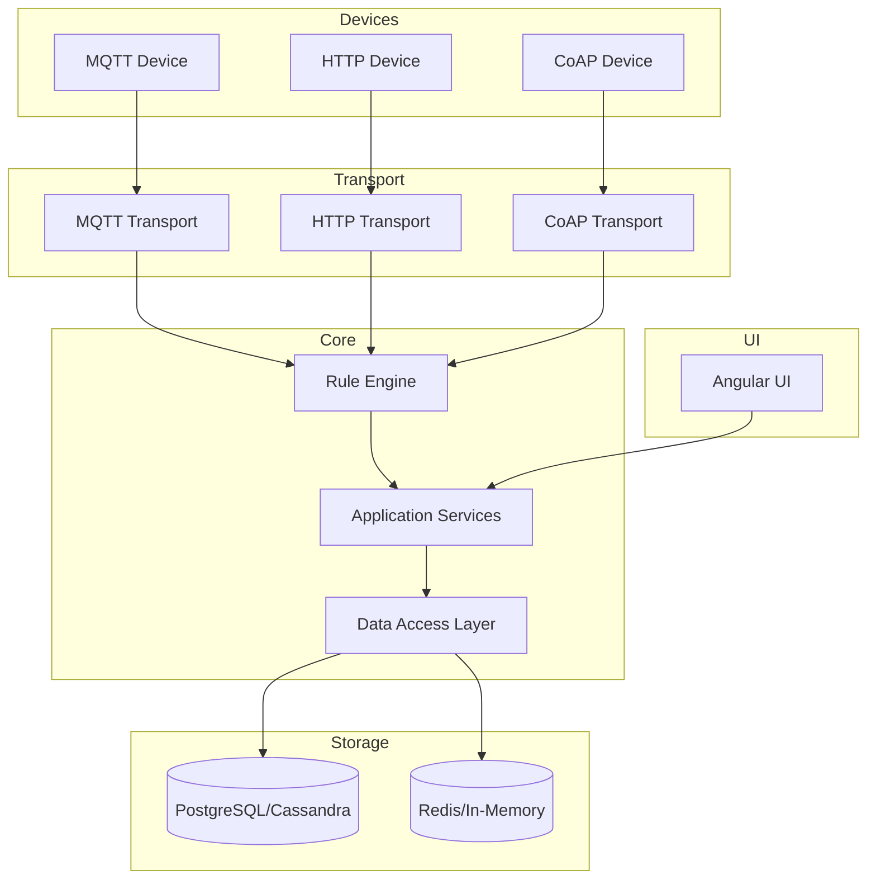
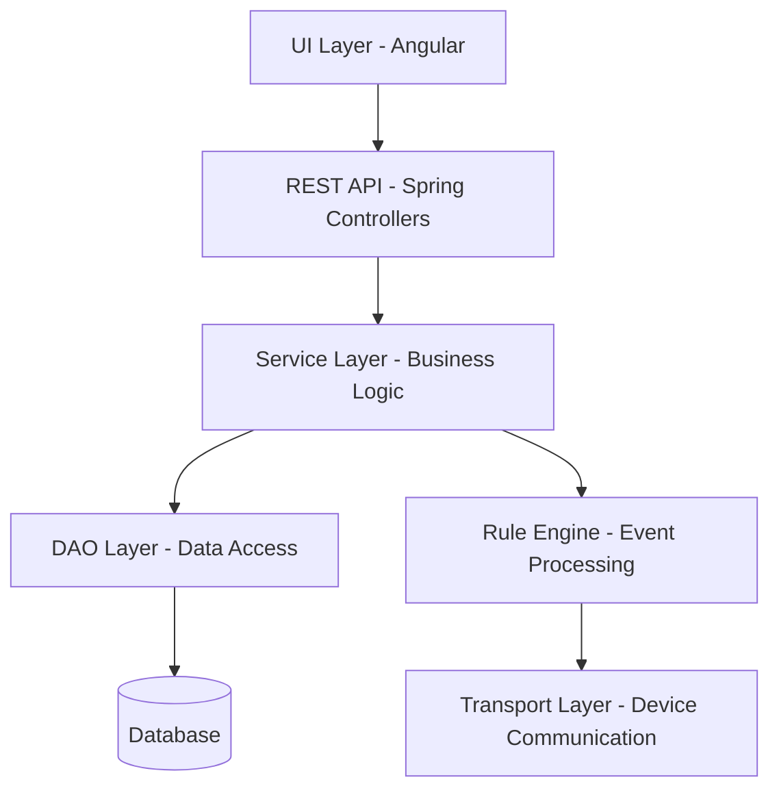
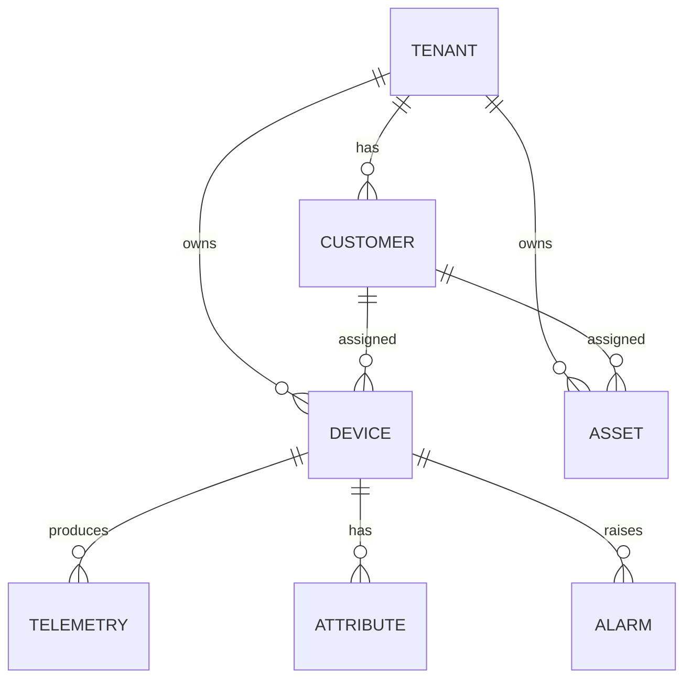

# Architecture Blueprint

## Overview

This specification provides a comprehensive architecture blueprint for the ThingsBoard IoT platform, serving as the definitive reference for maintaining architectural consistency and guiding new development.

---

## Architectural Style

ThingsBoard uses a hybrid **microservices and modular monolith** architecture:

- **Modular Monolith**: Core server and rule engine (shared JVM, module boundaries)
- **Microservices**: Edge, monitoring, and integration components (separate deployments)

### Guiding Principles

- Separation of concerns (UI, business logic, data access)
- Extensibility via modular nodes and services
- Asynchronous, non-blocking processing
- Centralized error handling and validation
- Interface-driven design

---

## High-Level Architecture



---

## Core Modules

### Application Module

| Aspect | Description |
|--------|-------------|
| Purpose | Main server logic, REST APIs, business services |
| Structure | Controllers (extend `BaseController`), services, configuration |
| Patterns | DI, interface-driven design, centralized error handling |
| Evolution | Add controllers/services following existing patterns |

### DAO Module

| Aspect | Description |
|--------|-------------|
| Purpose | Data access layer supporting SQL and NoSQL backends |
| Structure | DAO interfaces/implementations, async DAOs, caches |
| Patterns | Async CRUD with `ListenableFuture`, cache invalidation |
| Evolution | Add DAOs for new entities, maintain async patterns |

### Rule Engine Module

| Aspect | Description |
|--------|-------------|
| Purpose | Event-driven processing with modular rule nodes |
| Structure | `TbNode` interface, `TbContext`, `TbMsg`, node registry |
| Patterns | Message passing, context-driven services, stateless nodes |
| Evolution | Implement `TbNode`, annotate with `@RuleNode` |

### Transport Module

| Aspect | Description |
|--------|-------------|
| Purpose | Device connectivity (MQTT, HTTP, CoAP, LwM2M, SNMP) |
| Structure | Protocol modules, Protobuf schemas, session management |
| Patterns | Protocol adapters, message routing to rule engine |
| Evolution | Add protocol modules as needed |

### UI-NGX Module

| Aspect | Description |
|--------|-------------|
| Purpose | Angular web UI for dashboards, widgets, management |
| Structure | Angular modules, components, services, RxJS |
| Patterns | Service/component separation, reactive state |
| Evolution | Add components/services following Angular CLI conventions |

---

## Architectural Layers



### Dependency Rules

| Layer | Allowed Dependencies |
|-------|----------------------|
| UI | REST API only |
| REST API | Services, Common |
| Services | DAOs, Common |
| Rule Engine | Services, Common |
| Transport | Common, Rule Engine |

**Circular dependencies are not allowed** and are enforced by module boundaries.

---

## Technology Stack

### Backend

| Component | Technology |
|-----------|------------|
| Language | Java 17+ |
| Framework | Spring Boot 3+ |
| Async | ListenableFuture, CompletableFuture |
| Serialization | Protobuf, JSON |
| Database | PostgreSQL, Cassandra (optional) |
| Messaging | Kafka, RabbitMQ, In-Memory |
| Caching | Caffeine, Redis |

### Frontend

| Component | Technology |
|-----------|------------|
| Framework | Angular 18+ |
| State | RxJS, Services |
| Build | Angular CLI, Webpack |
| Testing | Jasmine, Karma, Cypress |

### Infrastructure

| Component | Technology |
|-----------|------------|
| Containerization | Docker |
| Orchestration | Kubernetes |
| Monitoring | Prometheus, Grafana |
| Logging | SLF4J, Logback |
| CI/CD | GitHub Actions, Jenkins |

---

## Design Patterns

### Backend Patterns

| Pattern | Usage |
|---------|-------|
| Factory | Node instantiation, service creation |
| Strategy | Node behavior selection, algorithm switching |
| Observer | Event-driven node chains, subscriptions |
| Template Method | Common lifecycle logic in base classes |
| Singleton | Service beans, caches |
| Repository | DAO layer abstraction |

### Frontend Patterns

| Pattern | Usage |
|---------|-------|
| Singleton | Angular services |
| Observer | RxJS streams, subscriptions |
| Facade | Service abstraction over REST APIs |
| Component | UI element encapsulation |

---

## Cross-Cutting Concerns

### Authentication & Authorization

- Spring Security for backend
- JWT tokens for API/UI authentication
- Permission checks in services and controllers

### Error Handling

- Centralized in `BaseController` for REST
- Try/catch with logging in services and nodes
- Retry and fallback for async operations

### Logging & Monitoring

- SLF4J/Logback for structured logging
- Prometheus metrics for observability
- Grafana dashboards for visualization

### Configuration Management

- Externalized via environment variables, files, UI
- Spring profiles for environment-specific settings
- Feature flags for gradual rollouts

---

## Data Architecture

### Domain Model



### Data Access Patterns

| Pattern | Description |
|---------|-------------|
| Async DAO | Non-blocking database operations |
| Entity Cache | In-memory caching with invalidation |
| Timeseries Storage | Optimized for time-series data |
| Event Sourcing | Rule engine message flow |

---

## Service Communication

### Internal Communication

- Java interfaces for module communication
- Async message queues in rule engine
- Sync REST for UI-backend interaction

### External Communication

| Protocol | Purpose |
|----------|---------|
| MQTT | Device telemetry and commands |
| HTTP | REST APIs, device communication |
| CoAP | Constrained devices |
| gRPC | Edge and microservices |
| Kafka | Event streaming, queue processing |

### Resilience Patterns

| Pattern | Application |
|---------|-------------|
| Retry | Transient failures in async operations |
| Circuit Breaker | External service failures |
| Timeout | Preventing resource exhaustion |
| Bulkhead | Isolating failure domains |

---

## Extension Points

### Adding Rule Nodes

```java
@RuleNode(type = ComponentType.ACTION, name = "Custom Node", ...)
public class CustomNode implements TbNode {
    @Override
    public void init(TbContext ctx, TbNodeConfiguration config) {
        // Initialize configuration
    }
    
    @Override
    public void onMsg(TbContext ctx, TbMsg msg) {
        // Process message
        ctx.tellSuccess(msg);
    }
}
```

### Adding REST Endpoints

```java
@RestController
@RequestMapping("/api/custom")
public class CustomController extends BaseController {
    @PostMapping
    public ResponseEntity<?> handleRequest(@RequestBody CustomRequest request) {
        // Handle request
    }
}
```

### Adding UI Components

```typescript
@Component({
  selector: 'tb-custom-widget',
  templateUrl: './custom-widget.component.html'
})
export class CustomWidgetComponent implements OnInit {
  // Component implementation
}
```

---

## Testing Architecture

### Testing Pyramid

| Level | Framework | Coverage Target |
|-------|-----------|-----------------|
| Unit | JUnit, Jasmine | 80%+ |
| Integration | Spring Test, Karma | Critical paths |
| E2E | Cypress, Selenium | Key user flows |

### Test Practices

- Mock external dependencies with Mockito/WireMock
- Use in-memory databases for integration tests
- Testcontainers for infrastructure dependencies
- Contract tests for APIs

---

## Deployment Architecture

### Container Strategy

- Dockerfiles per module with multi-stage builds
- Docker Compose for development
- Kubernetes manifests for production

### Configuration

- Environment-specific via Spring profiles
- Secrets via Kubernetes secrets or vault
- Feature flags for controlled rollouts

---

## Governance

### Consistency Enforcement

- Code reviews for all changes
- Automated linting and static analysis
- Test coverage requirements in CI

### Documentation Requirements

- All extension points documented in `/spec`
- ADRs for significant architectural decisions
- OpenAPI specifications for REST APIs

---

## See Also

- [Backend Service Design](backend-service-design.md)
- [Technology Stack](technology-stack.md)
- [Rule Engine Core](rule-engine-core.md)
