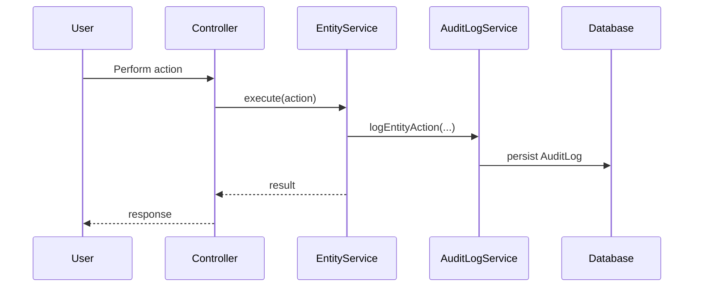

# Audit Logging Specification

## Overview

This document describes the audit logging system in ThingsBoard, which tracks user and system actions for compliance and troubleshooting.

---

## Key Components

### AuditLogService

| Method                        | Description                                      |
|-------------------------------|--------------------------------------------------|
| logEntityAction(...)          | Log an action on an entity                       |
| findAuditLogsByTenantId(...)  | Query audit logs for tenant                      |
| findAuditLogsByUserId(...)    | Query audit logs for user                        |
| findAuditLogsByEntityId(...)  | Query audit logs for entity                      |

---

## AuditLog Entity

| Field         | Type      | Description                        |
|---------------|-----------|------------------------------------|
| id            | AuditLogId | Unique identifier                 |
| tenantId      | TenantId  | Owning tenant                      |
| customerId    | CustomerId| Customer context (if applicable)   |
| userId        | UserId    | User who performed action          |
| entityId      | EntityId  | Target entity                      |
| entityName    | String    | Target entity name                 |
| actionType    | ActionType| Type of action                     |
| actionData    | JsonNode  | Action details                     |
| actionStatus  | ActionStatus | SUCCESS, FAILURE                |
| actionFailureDetails | String | Failure details (if any)      |
| createdTime   | long      | Timestamp                          |

---

## Action Types

| ActionType        | Description                                      |
|-------------------|--------------------------------------------------|
| ADDED             | Entity created                                   |
| DELETED           | Entity deleted                                   |
| UPDATED           | Entity updated                                   |
| ATTRIBUTES_UPDATED| Attributes modified                              |
| CREDENTIALS_UPDATED| Device credentials changed                      |
| ASSIGNED_TO_CUSTOMER| Entity assigned to customer                    |
| UNASSIGNED_FROM_CUSTOMER| Entity unassigned from customer            |
| LOGIN             | User login                                       |
| LOGOUT            | User logout                                      |
| RPC_CALL          | RPC invoked                                      |
| ALARM_ACK         | Alarm acknowledged                               |
| ALARM_CLEAR       | Alarm cleared                                    |

---

## Audit Log Flow

---

## Configuration

| Property                        | Description                        |
|---------------------------------|------------------------------------|
| audit-log.enabled               | Enable/disable audit logging       |
| audit-log.ttl                   | Retention period (days)            |
| audit-log.max-per-partition     | Max entries per partition          |

---

## Best Practices

- Enable audit logging in production
- Set appropriate retention period for compliance
- Monitor for failed login attempts
- Use audit logs for security investigations

---

## See Also

- [Security and Authentication](security-auth.md)
- [DAO & Entity Services Overview](dao-entity-services-overview.md)
