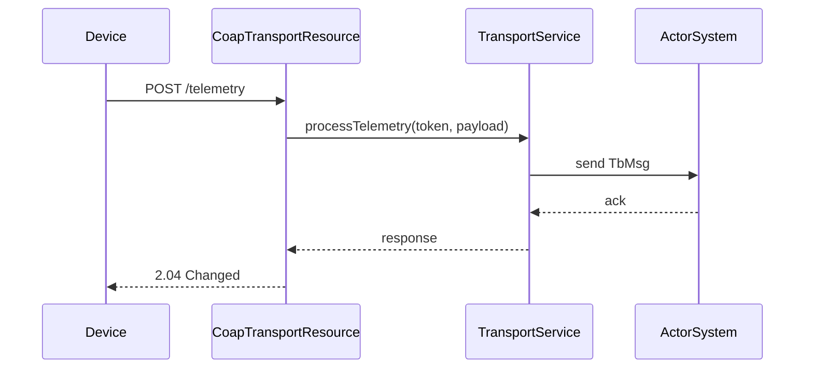

# CoAP Transport Flow Specification

## Overview

This document describes the CoAP transport layer in ThingsBoard, which enables lightweight device communication for constrained IoT devices.

---

## Key Components

### CoapTransportResource

Handles incoming CoAP requests from devices.

| Resource Path                | Method | Description                        |
|------------------------------|--------|------------------------------------|
| /api/v1/{deviceToken}/telemetry | POST | Submit device telemetry            |
| /api/v1/{deviceToken}/attributes | POST | Submit device attributes          |
| /api/v1/{deviceToken}/attributes | GET  | Request shared attributes          |
| /api/v1/{deviceToken}/rpc    | GET    | Observe for server-side RPC        |
| /api/v1/{deviceToken}/rpc/{requestId} | POST | Respond to server-side RPC  |

---

## Request Flow

---

## Authentication

- Device token in URI path
- Token validated against device credentials
- Invalid token returns 4.01 Unauthorized

---

## Payload Formats

- JSON (application/json)
- CBOR (application/cbor) for binary efficiency

---

## Error Handling

| CoAP Code | Meaning                        |
|-----------|--------------------------------|
| 2.04      | Changed (success)              |
| 4.00      | Bad request                    |
| 4.01      | Unauthorized                   |
| 5.00      | Internal server error          |

---

## Best Practices

- Use DTLS for security
- Prefer CBOR for constrained devices
- Use observe for RPC and attribute updates

---

## See Also

- [MQTT Transport Flow](mqtt-transport-flow.md)
- [HTTP Transport Flow](http-transport-flow.md)
- [Transport to Rule Engine Flow](transport-to-rule-engine-flow.md)
