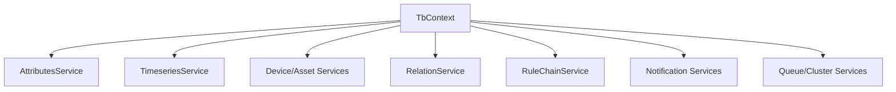

# DAO & Entity Services Overview

## Language & Context
- Language: Java (server-side)
- Domain: High-level guide to platform services surfaced via `TbContext` for node implementations.

Key access points:
- `TbContext` getters (e.g., `getAttributesService()`, `getTimeseriesService()`, `getDeviceService()`, `getRelationService()`, `getRuleChainService()`, etc.)

## Service Families & Typical Operations
- Attributes: read/write/delete scoped attributes on entities (`CLIENT_SCOPE`, `SHARED_SCOPE`, etc.)
- Timeseries: write telemetry points, query ranges, manage TTL
- Entities:
  - Device & DeviceProfile: resolve IDs, credentials, profile-driven behavior
  - Asset & AssetProfile: grouping and metadata
  - Customer, Tenant, User: multi-tenancy and ownership
  - EntityView: filtered subsets for visualization
- Relations: graph links between entities (create, delete, query by direction/type)
- Rule Chains: query chains and nodes, manage states per entity
- Resources & OTA: binary resources and over-the-air packages
- Queue & Cluster: topic/partition info, producing stats, API usage state
- Events & Audit: record events and audit logs
- Notifications: create/send requests and manage delivery

## Patterns for Nodes
- Resolve entities first (originator, related entities) using IDs and RelationService
- Persist attribute/timeseries changes via `RuleEngineTelemetryService` (preferred) or DAOs for advanced needs
- Use caches (`RuleEngineDeviceProfileCache`, `RuleEngineAssetProfileCache`) where available to avoid extra lookups
- Record outcomes to `AuditLogService` when changing configuration/state

## Best Practices
- Favor `RuleEngineTelemetryService` request DTOs for telemetry/attributes to keep calculated fields and websockets in sync
- Use `PageLink` + `PageData` for batched processing when scanning states (`findRuleNodeStates`)
- Respect tenant boundaries: `checkTenantEntity` / `checkTenantOrSystemEntity`

## References
- org/thingsboard/rule/engine/api/TbContext.java (all service getters)
