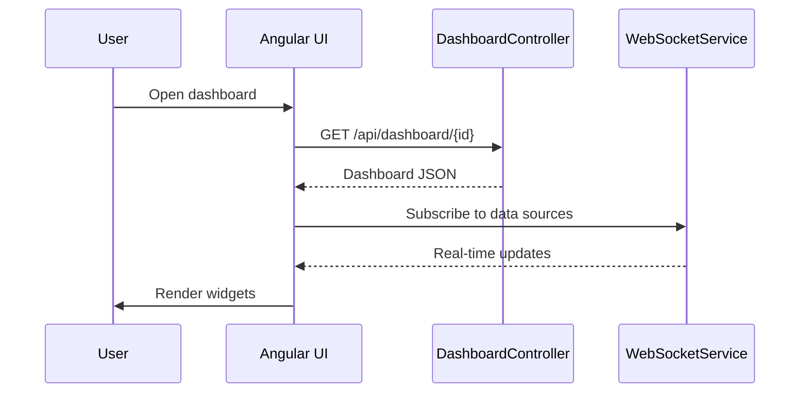

# Dashboard and Widgets Specification

## Overview

This document describes the dashboard and widget management APIs in ThingsBoard, used for creating, configuring, and displaying data visualizations.

---

## Key Components

### DashboardService

| Method                        | Description                                      |
|-------------------------------|--------------------------------------------------|
| findDashboardById(...)        | Retrieve dashboard by id                         |
| saveDashboard(...)            | Create or update dashboard                       |
| deleteDashboard(...)          | Remove dashboard                                 |
| assignDashboardToCustomer(...)| Assign dashboard to customer                     |
| findDashboardsByTenantId(...) | List dashboards for tenant                       |

### WidgetTypeService

| Method                        | Description                                      |
|-------------------------------|--------------------------------------------------|
| findWidgetTypeById(...)       | Retrieve widget type by id                       |
| saveWidgetType(...)           | Create or update widget type                     |
| deleteWidgetType(...)         | Remove widget type                               |
| findWidgetTypesByBundleId(...)| List widget types in a bundle                    |

### WidgetsBundleService

| Method                        | Description                                      |
|-------------------------------|--------------------------------------------------|
| findWidgetsBundleById(...)    | Retrieve widgets bundle by id                    |
| saveWidgetsBundle(...)        | Create or update widgets bundle                  |
| deleteWidgetsBundle(...)      | Remove widgets bundle                            |

---

## Dashboard Structure

| Field         | Type      | Description                        |
|---------------|-----------|------------------------------------|
| id            | DashboardId | Unique identifier                |
| tenantId      | TenantId  | Owning tenant                      |
| title         | String    | Dashboard title                    |
| configuration | JsonNode  | Layout and widget configuration    |
| assignedCustomers | List  | Customers with access              |

---

## Widget Configuration

| Field         | Type      | Description                        |
|---------------|-----------|------------------------------------|
| type          | String    | Widget type identifier             |
| title         | String    | Widget title                       |
| config        | JsonNode  | Widget-specific configuration      |
| dataSource    | JsonNode  | Data binding (entity, keys, etc.)  |

---

## Dashboard Flow

---

## Best Practices

- Use widget bundles to organize related widgets
- Limit widgets per dashboard for performance
- Use entity aliases for flexible data binding
- Test dashboards with expected data volumes

---

## See Also

- [WebSocket Subscriptions](websocket-subscriptions.md)
- [Timeseries & Attributes Requests](timeseries-and-attributes-requests.md)
