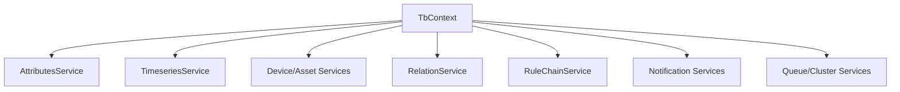
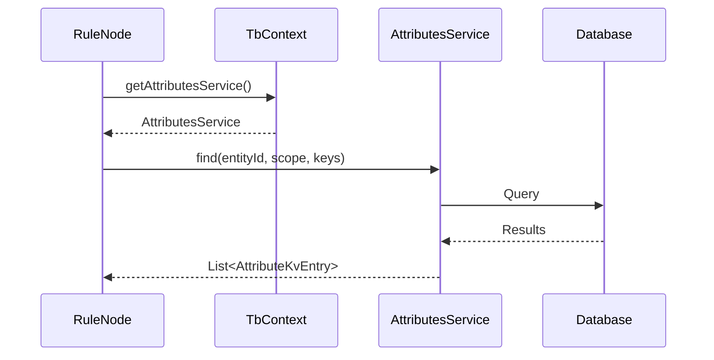
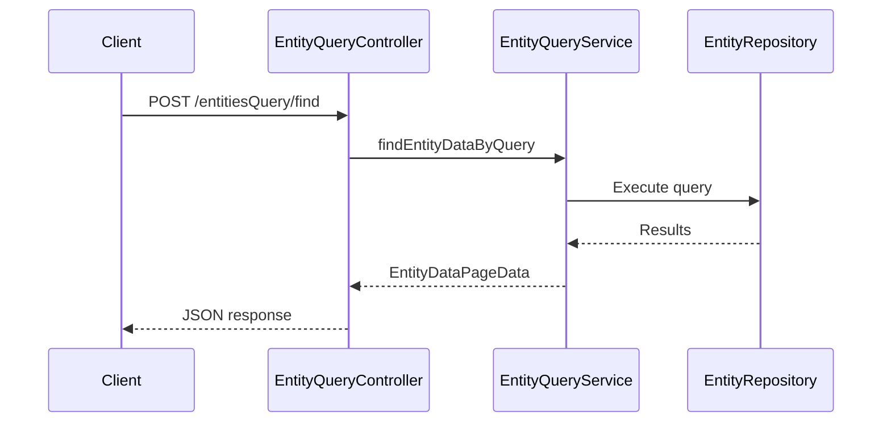
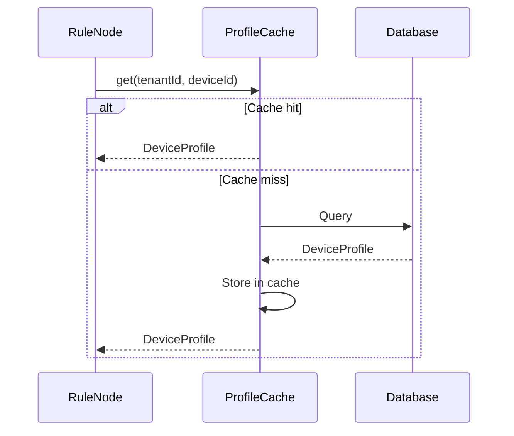

# Data Access Layer Specification

## Overview

This document describes the data access layer in ThingsBoard, including DAO patterns, entity services, entity queries, caching, and data storage strategies.

---

## Part 1: DAO Architecture

### Service Hierarchy



### Service Families

| Service Family | Operations |
|----------------|------------|
| Attributes | Read/write/delete scoped attributes |
| Timeseries | Write telemetry, query ranges, manage TTL |
| Entities | Device, Asset, Customer, Tenant, User CRUD |
| Relations | Graph links between entities |
| Rule Chains | Query chains/nodes, manage states |
| Resources | Binary resources and OTA packages |
| Events | Record events and audit logs |
| Notifications | Create/send notification requests |

---

### Attribute Scopes

| Scope | Description |
|-------|-------------|
| CLIENT_SCOPE | Device-reported attributes |
| SERVER_SCOPE | Platform-set attributes |
| SHARED_SCOPE | Bi-directional sync attributes |

### Attribute Operations



---

### Timeseries Storage

| Property | Description |
|----------|-------------|
| entityId | Target entity |
| key | Telemetry key name |
| ts | Timestamp (epoch ms) |
| value | Numeric, String, Boolean, or JSON |

### Storage Backends

| Backend | Use Case |
|---------|----------|
| PostgreSQL | Default, general purpose |
| Cassandra | High-volume time series |
| TimescaleDB | PostgreSQL with time-series optimization |

---

## Part 2: Entity Query API

### Query Structure

```json
{
  "entityFilter": { "type": "deviceType", "deviceType": "thermostat" },
  "keyFilters": [
    {
      "key": {"type": "ATTRIBUTE", "key": "active"},
      "valueType": "BOOLEAN",
      "predicate": {"operation": "EQUAL", "value": {"defaultValue": true}}
    }
  ],
  "entityFields": [
    {"type": "ENTITY_FIELD", "key": "name"},
    {"type": "ENTITY_FIELD", "key": "createdTime"}
  ],
  "latestValues": [
    {"type": "ATTRIBUTE", "key": "temperature"},
    {"type": "TIME_SERIES", "key": "humidity"}
  ],
  "pageLink": {
    "page": 0,
    "pageSize": 20,
    "sortOrder": {"key": {"type": "ENTITY_FIELD", "key": "name"}, "direction": "ASC"}
  }
}
```

### Entity Filter Types

| Type | Description |
|------|-------------|
| singleEntity | Match single entity by id |
| entityList | Match list of entity ids |
| entityName | Match by name pattern |
| entityType | Match all of a type |
| assetType | Match assets by type |
| deviceType | Match devices by type |
| relationsQuery | Match by entity relations |
| assetSearchQuery | Search assets by criteria |
| deviceSearchQuery | Search devices by criteria |

### Key Filter Structure

| Field | Type | Description |
|-------|------|-------------|
| key | EntityKey | Key to filter on |
| valueType | String | STRING, NUMERIC, BOOLEAN, DATE_TIME |
| predicate | Object | Comparison predicate |

### Predicate Operations

| Operation | Applies To |
|-----------|------------|
| EQUAL | All types |
| NOT_EQUAL | All types |
| GREATER | NUMERIC, DATE_TIME |
| LESS | NUMERIC, DATE_TIME |
| GREATER_OR_EQUAL | NUMERIC, DATE_TIME |
| LESS_OR_EQUAL | NUMERIC, DATE_TIME |
| STARTS_WITH | STRING |
| ENDS_WITH | STRING |
| CONTAINS | STRING |
| NOT_CONTAINS | STRING |

---

### Query Flow



### API Endpoints

| Endpoint | Method | Description |
|----------|--------|-------------|
| /api/entitiesQuery/find | POST | Find entities matching query |
| /api/entitiesQuery/count | POST | Count entities matching query |
| /api/entitiesQuery/findByQuery | POST | Find entities with data |

---

## Part 3: Relations

### Relation Types

| Relation | Description |
|----------|-------------|
| Contains | Parent contains child |
| Manages | Entity manages another |
| Custom | User-defined relation types |

### Relation Service

| Method | Description |
|--------|-------------|
| findByFrom(entityId, relationType) | Find relations from entity |
| findByTo(entityId, relationType) | Find relations to entity |
| saveRelation(relation) | Create or update relation |
| deleteRelation(relation) | Remove relation |

### Relations Query Example

```json
{
  "type": "relationsQuery",
  "rootEntity": {
    "entityType": "ASSET",
    "id": "building-uuid"
  },
  "direction": "FROM",
  "filters": [
    {"relationType": "Contains", "entityTypes": ["DEVICE"]}
  ],
  "maxLevel": 2
}
```

---

## Part 4: Caching

### Profile Caches

| Cache | Purpose |
|-------|---------|
| RuleEngineDeviceProfileCache | Device profile lookups |
| RuleEngineAssetProfileCache | Asset profile lookups |

### Cache Methods

| Method | Description |
|--------|-------------|
| get(tenantId, entityId) | Get profile for entity |
| getOrCreate(tenantId, entityId, defaultId) | Get or create with default |
| evict(tenantId, entityId) | Remove from cache |

### Caching Pattern



---

## Part 5: Rule Engine Telemetry Service

### Request DTOs

| DTO | Purpose |
|-----|---------|
| AttributesSaveRequest | Save attributes |
| AttributesDeleteRequest | Delete attributes |
| TimeseriesSaveRequest | Save timeseries |
| TimeseriesDeleteRequest | Delete timeseries |

### Preferred Pattern

Use `RuleEngineTelemetryService` for data operations to keep calculated fields and websockets in sync:

```java
// In rule node
AttributesSaveRequest request = AttributesSaveRequest.builder()
    .tenantId(ctx.getTenantId())
    .entityId(msg.getOriginator())
    .scope(DataConstants.SERVER_SCOPE)
    .entries(attributes)
    .build();

ctx.getTelemetryService().saveAttributes(request);
```

---

## Part 6: Pagination

### PageLink

| Field | Type | Description |
|-------|------|-------------|
| page | int | Page number (0-based) |
| pageSize | int | Items per page |
| sortOrder | SortOrder | Sorting configuration |
| textSearch | String | Text search filter |

### PageData Response

| Field | Type | Description |
|-------|------|-------------|
| data | List<T> | Page results |
| totalPages | int | Total pages |
| totalElements | long | Total items |
| hasNext | boolean | More pages available |

### Pagination Pattern

```java
PageLink pageLink = new PageLink(100, 0);
PageData<Device> devices;

do {
    devices = deviceService.findDevicesByTenantId(tenantId, pageLink);
    for (Device device : devices.getData()) {
        process(device);
    }
    pageLink = pageLink.nextPageLink();
} while (devices.hasNext());
```

---

## Best Practices

### Do's

- Use RuleEngineTelemetryService for data operations
- Use caches for profile lookups
- Use PageLink for batched processing
- Respect tenant boundaries
- Use specific entity filters to reduce result sets

### Don'ts

- Don't bypass service layer for direct DB access
- Don't ignore pagination for large datasets
- Don't cache mutable data without invalidation
- Don't query without tenant context

---

## See Also

- [Rule Engine Core](rule-engine-core.md)
- [Device & Asset Management](device-asset-management.md)
- [UI & Real-Time](ui-realtime.md)
