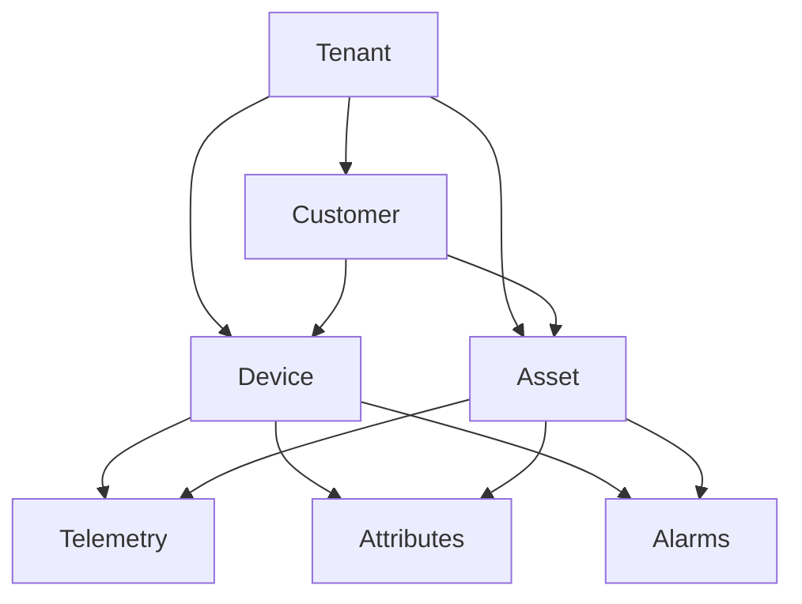
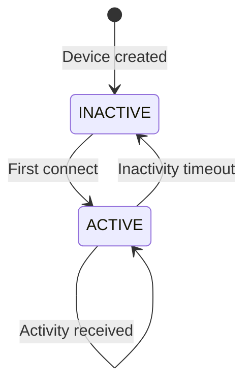
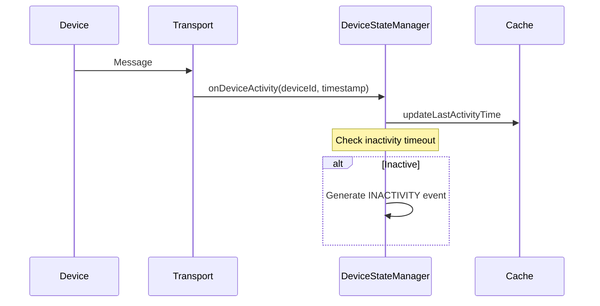
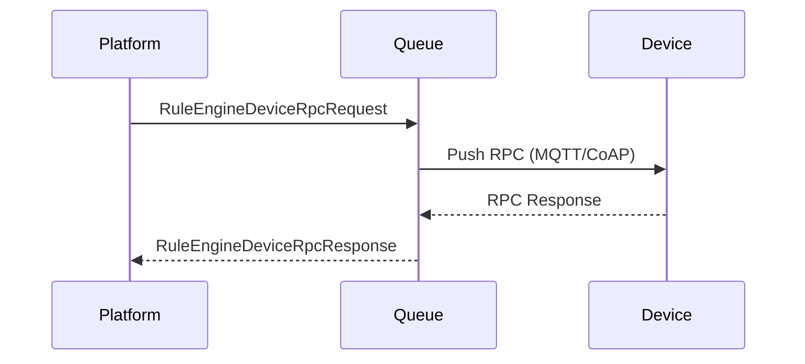
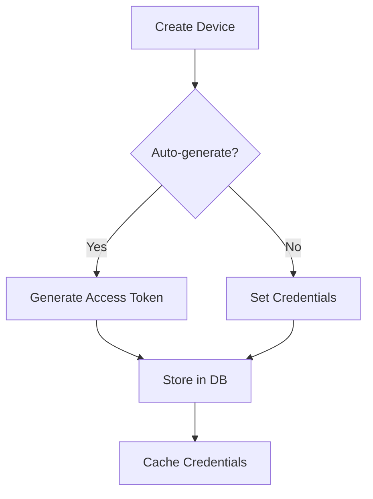
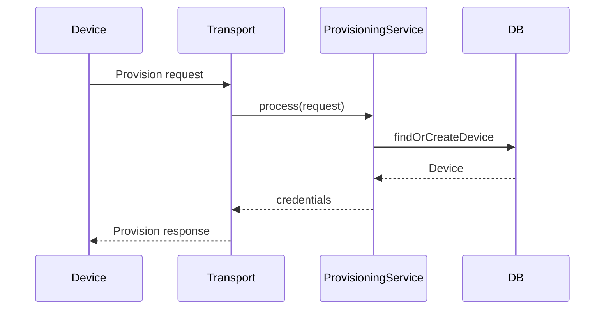
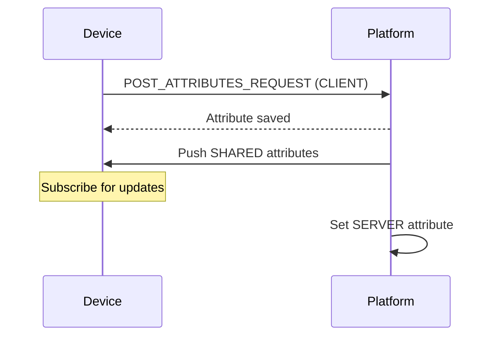

# Device and Asset Management Specification

## Overview

This document describes the device and asset lifecycle, profiles, RPC communication, and state management in ThingsBoard.

---

## Entity Hierarchy



---

## Device Profiles

Device profiles define device behavior, transport configuration, and alarm rules.

### Profile Structure

| Field | Type | Description |
|-------|------|-------------|
| id | DeviceProfileId | Unique identifier |
| tenantId | TenantId | Owning tenant |
| name | String | Profile name |
| type | DeviceProfileType | DEFAULT or edge-specific |
| transportType | DeviceTransportType | DEFAULT, MQTT, COAP, LWM2M, SNMP |
| provisionType | ProvisionType | DISABLED, ALLOW_CREATE_NEW_DEVICES, etc. |
| profileData | DeviceProfileData | Detailed configuration |
| defaultRuleChainId | RuleChainId | Default rule chain for devices |

### Profile Data

```json
{
  "alarms": [
    {
      "alarmType": "High Temperature",
      "createRules": {
        "CRITICAL": { "condition": "..." }
      },
      "clearRule": { "condition": "..." }
    }
  ],
  "configuration": {
    "type": "DEFAULT"
  },
  "transportConfiguration": {
    "type": "MQTT"
  }
}
```

---

## Device Lifecycle

### Device States



### DeviceStateManager Interface

| Method | Description |
|--------|-------------|
| onDeviceConnect(tenantId, deviceId) | Handle device connection |
| onDeviceDisconnect(tenantId, deviceId) | Handle device disconnection |
| onDeviceActivity(tenantId, deviceId, lastActivityTime) | Update activity timestamp |
| onDeviceInactivityTimeoutUpdate(tenantId, deviceId, timeout) | Update inactivity config |
| onQueueMsg(msg, callback) | Process device state messages |

### Activity Tracking



---

## Asset Profiles

Asset profiles define default behavior and rule chains for assets.

### Profile Structure

| Field | Type | Description |
|-------|------|-------------|
| id | AssetProfileId | Unique identifier |
| tenantId | TenantId | Owning tenant |
| name | String | Profile name |
| defaultRuleChainId | RuleChainId | Default rule chain for assets |

---

## Device RPC

### RPC Flow



### RuleEngineDeviceRpcRequest

| Field | Type | Description |
|-------|------|-------------|
| requestId | UUID | Unique request identifier |
| tenantId | TenantId | Tenant scope |
| deviceId | DeviceId | Target device |
| oneway | boolean | One-way (no response expected) |
| expirationTime | long | Request timeout |
| body | String | RPC method and params (JSON) |
| persisted | boolean | Persist pending request |

### RuleEngineDeviceRpcResponse

| Field | Type | Description |
|-------|------|-------------|
| requestId | UUID | Matching request ID |
| deviceId | DeviceId | Responding device |
| response | String | Response payload (JSON) |
| error | RpcError | Error details if failed |

### RPC Error Types

| Error | Description |
|-------|-------------|
| NO_ACTIVE_CONNECTION | Device not connected |
| TIMEOUT | Response not received in time |
| NO_SUCH_RPC | Unknown RPC method |
| INTERNAL | Server error |

---

## Device Credentials

### Credential Types

| Type | Description |
|------|-------------|
| ACCESS_TOKEN | Simple token for HTTP/CoAP |
| X509_CERTIFICATE | Certificate auth for MQTT/CoAP |
| MQTT_BASIC | Username/password for MQTT |
| LWM2M_CREDENTIALS | LwM2M-specific credentials |

### Credential Management



---

## Device Provisioning

### Provisioning Types

| Type | Description |
|------|-------------|
| DISABLED | Manual device creation only |
| ALLOW_CREATE_NEW_DEVICES | Auto-create on first connect |
| CHECK_PRE_PROVISIONED_DEVICES | Verify pre-registered devices |

### Provisioning Flow



---

## Entity Relations

### Relation Types

| Relation | Description |
|----------|-------------|
| Contains | Parent contains child (Asset → Device) |
| Manages | Entity manages another |
| Custom | User-defined relation types |

### Relation Service

| Method | Description |
|--------|-------------|
| findByFrom(entityId, relationType) | Find relations from entity |
| findByTo(entityId, relationType) | Find relations to entity |
| saveRelation(relation) | Create or update relation |
| deleteRelation(relation) | Remove relation |

---

## Profile Caching

### RuleEngineDeviceProfileCache

| Method | Description |
|--------|-------------|
| get(tenantId, deviceId) | Get profile for device |
| getOrCreate(tenantId, deviceId, defaultProfileId) | Get or create with default |
| evict(tenantId, deviceId) | Remove from cache |

### RuleEngineAssetProfileCache

| Method | Description |
|--------|-------------|
| get(tenantId, assetId) | Get profile for asset |
| evict(tenantId, assetId) | Remove from cache |

---

## Attributes

### Scope Types

| Scope | Description |
|-------|-------------|
| CLIENT_SCOPE | Device-reported attributes |
| SERVER_SCOPE | Platform-set attributes |
| SHARED_SCOPE | Bi-directional sync attributes |

### Attribute Operations



---

## Telemetry

### Timeseries Data

| Property | Description |
|----------|-------------|
| entityId | Target entity |
| key | Telemetry key name |
| ts | Timestamp (epoch ms) |
| value | Numeric, String, Boolean, or JSON |

### Storage Options

| Option | Use Case |
|--------|----------|
| PostgreSQL | Default, general purpose |
| Cassandra | High-volume time series |
| TimescaleDB | PostgreSQL with time-series optimization |

---

## Best Practices

### Do's

- Use device profiles for consistent behavior
- Define alarm rules in profiles
- Cache device/asset profiles for performance
- Use appropriate credential types
- Configure inactivity timeouts

### Don'ts

- Don't hardcode device configurations
- Don't skip profile assignment
- Don't ignore RPC timeouts
- Don't store credentials in plain text

---

## See Also

- [Transport Layer](transport-layer.md)
- [Alarm Service](alarm-service.md)
- [Rule Engine Core](rule-engine-core.md)
