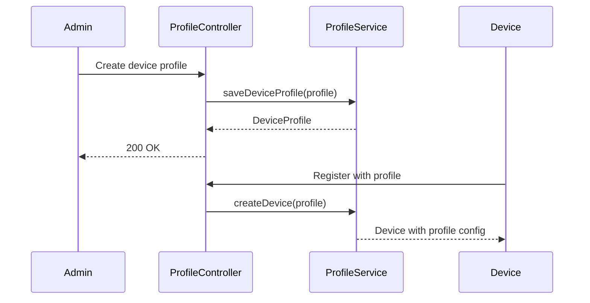

# Device and Asset Profiles Specification

## Overview

This document describes device and asset profiles in ThingsBoard, which define configuration templates, default rule chains, and transport settings for devices and assets.

---

## Key Concepts

### Device Profile

- Template for device configuration
- Defines default rule chain, queue, transport type
- Contains alarm rules and device provisioning settings
- Each device references exactly one device profile

### Asset Profile

- Template for asset configuration
- Defines default rule chain and queue
- Contains alarm rules
- Each asset references exactly one asset profile

---

## Key Interfaces

### DeviceProfileService

| Method                        | Description                                      |
|-------------------------------|--------------------------------------------------|
| findDeviceProfileById(...)    | Retrieve device profile by id                    |
| saveDeviceProfile(...)        | Create or update device profile                  |
| deleteDeviceProfile(...)      | Remove device profile                            |
| findDefaultDeviceProfile(...) | Get default profile for tenant                   |

### AssetProfileService

| Method                        | Description                                      |
|-------------------------------|--------------------------------------------------|
| findAssetProfileById(...)     | Retrieve asset profile by id                     |
| saveAssetProfile(...)         | Create or update asset profile                   |
| deleteAssetProfile(...)       | Remove asset profile                             |
| findDefaultAssetProfile(...)  | Get default profile for tenant                   |

---

## Device Profile Structure

| Field                 | Type      | Description                        |
|-----------------------|-----------|------------------------------------|
| id                    | DeviceProfileId | Unique identifier            |
| tenantId              | TenantId  | Owning tenant                      |
| name                  | String    | Profile name                       |
| type                  | DeviceProfileType | DEFAULT                    |
| transportType         | DeviceTransportType | MQTT, HTTP, COAP, LWM2M, etc. |
| provisionType         | DeviceProfileProvisionType | Provisioning method  |
| defaultRuleChainId    | RuleChainId | Default rule chain             |
| defaultQueueName      | String    | Default processing queue           |
| profileData           | DeviceProfileData | Transport and alarm config |

---

## Profile Data

### Transport Configuration

| Transport Type | Configuration                                    |
|----------------|--------------------------------------------------|
| MQTT           | Topic patterns, payload type, credentials        |
| HTTP           | Payload type                                     |
| COAP           | Payload type, power mode                         |
| LWM2M          | Object definitions, bootstrap config             |

### Alarm Configuration

| Field         | Type      | Description                        |
|---------------|-----------|------------------------------------|
| alarmRules    | List      | Alarm rule definitions             |
| createRules   | Map       | Conditions for creating alarms     |
| clearRule     | Object    | Condition for clearing alarm       |

---

## Profile Flow

---

## Caching

### RuleEngineDeviceProfileCache

| Method                        | Description                                      |
|-------------------------------|--------------------------------------------------|
| get(deviceProfileId)          | Get cached device profile                        |
| put(deviceProfileId, profile) | Cache device profile                             |
| evict(deviceProfileId)        | Evict from cache                                 |

### RuleEngineAssetProfileCache

| Method                        | Description                                      |
|-------------------------------|--------------------------------------------------|
| get(assetProfileId)           | Get cached asset profile                         |
| put(assetProfileId, profile)  | Cache asset profile                              |
| evict(assetProfileId)         | Evict from cache                                 |

---

## Best Practices

- Create profiles before devices/assets
- Use profiles for common configurations
- Define alarm rules in profiles for consistency
- Use default profiles for simple deployments

---

## See Also

- [Device State Management](device-state-management.md)
- [Alarm Service](alarm-service.md)
- [Transport to Rule Engine Flow](transport-to-rule-engine-flow.md)
