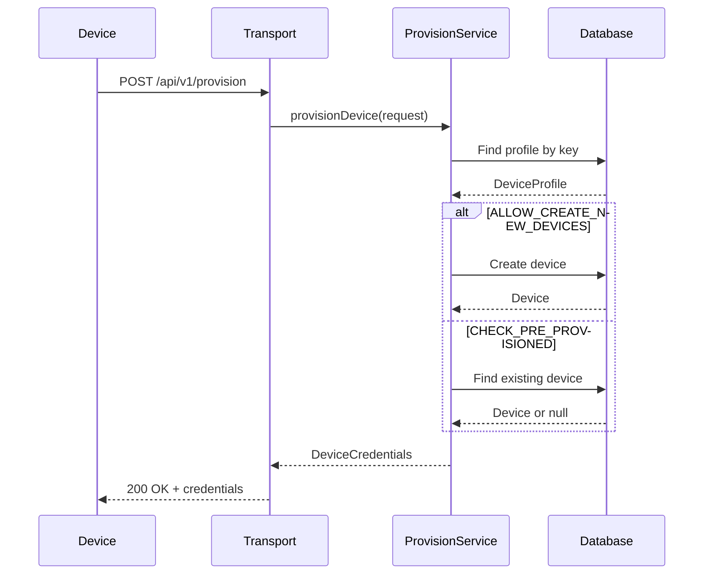
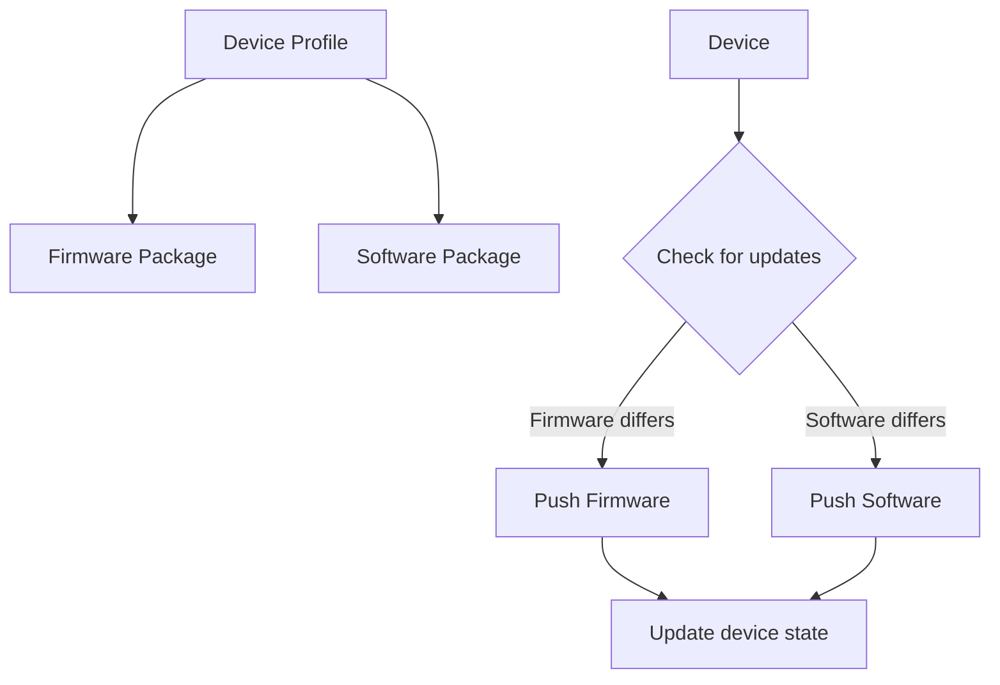
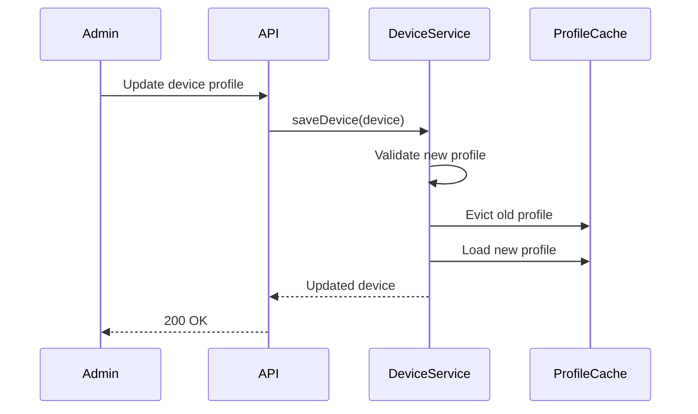

# Device and Asset Profiles Specification

## Overview

This document describes device and asset profiles in ThingsBoard, which define configuration templates, default rule chains, and transport settings for devices and assets.

---

## Key Concepts

### Device Profile

- Template for device configuration
- Defines default rule chain, queue, transport type
- Contains alarm rules and device provisioning settings
- Each device references exactly one device profile

### Asset Profile

- Template for asset configuration
- Defines default rule chain and queue
- Contains alarm rules
- Each asset references exactly one asset profile

---

## Key Interfaces

### DeviceProfileService

| Method                        | Description                                      |
|-------------------------------|--------------------------------------------------|
| findDeviceProfileById(...)    | Retrieve device profile by id                    |
| saveDeviceProfile(...)        | Create or update device profile                  |
| deleteDeviceProfile(...)      | Remove device profile                            |
| findDefaultDeviceProfile(...) | Get default profile for tenant                   |

### AssetProfileService

| Method                        | Description                                      |
|-------------------------------|--------------------------------------------------|
| findAssetProfileById(...)     | Retrieve asset profile by id                     |
| saveAssetProfile(...)         | Create or update asset profile                   |
| deleteAssetProfile(...)       | Remove asset profile                             |
| findDefaultAssetProfile(...)  | Get default profile for tenant                   |

---

## Device Profile Structure

| Field                 | Type      | Description                        |
|-----------------------|-----------|------------------------------------|
| id                    | DeviceProfileId | Unique identifier            |
| tenantId              | TenantId  | Owning tenant                      |
| name                  | String    | Profile name                       |
| type                  | DeviceProfileType | DEFAULT                    |
| transportType         | DeviceTransportType | MQTT, HTTP, COAP, LWM2M, etc. |
| provisionType         | DeviceProfileProvisionType | Provisioning method  |
| defaultRuleChainId    | RuleChainId | Default rule chain             |
| defaultQueueName      | String    | Default processing queue           |
| profileData           | DeviceProfileData | Transport and alarm config |

---

## Profile Data

### Transport Configuration

| Transport Type | Configuration                                    |
|----------------|--------------------------------------------------|
| MQTT           | Topic patterns, payload type, credentials        |
| HTTP           | Payload type                                     |
| COAP           | Payload type, power mode                         |
| LWM2M          | Object definitions, bootstrap config             |

### Alarm Configuration

| Field         | Type      | Description                        |
|---------------|-----------|------------------------------------|
| alarmRules    | List      | Alarm rule definitions             |
| createRules   | Map       | Conditions for creating alarms     |
| clearRule     | Object    | Condition for clearing alarm       |

---

## Profile Flow


---

## Caching

### RuleEngineDeviceProfileCache

| Method                        | Description                                      |
|-------------------------------|--------------------------------------------------|
| get(deviceProfileId)          | Get cached device profile                        |
| put(deviceProfileId, profile) | Cache device profile                             |
| evict(deviceProfileId)        | Evict from cache                                 |

### RuleEngineAssetProfileCache

| Method                        | Description                                      |
|-------------------------------|--------------------------------------------------|
| get(assetProfileId)           | Get cached asset profile                         |
| put(assetProfileId, profile)  | Cache asset profile                              |
| evict(assetProfileId)         | Evict from cache                                 |

---

## Device Provisioning

### Provisioning Types

| Type                  | Description                                      |
|-----------------------|--------------------------------------------------|
| DISABLED              | No auto-provisioning allowed                     |
| ALLOW_CREATE_NEW_DEVICES | Allow device creation during provisioning    |
| CHECK_PRE_PROVISIONED_DEVICES | Only provision pre-registered devices  |
| X509_CERTIFICATE_CHAIN | Provision using certificate chain              |

### Provisioning Flow



### Provision Request

```json
{
  "deviceName": "my-device",
  "provisionDeviceKey": "profile-provision-key",
  "provisionDeviceSecret": "profile-provision-secret"
}
```

---

## Transport Configuration Details

### MQTT Transport Configuration

| Field                   | Type      | Description                        |
|-------------------------|-----------|------------------------------------|
| deviceTelemetryTopic    | String    | Custom telemetry topic pattern     |
| deviceAttributesTopic   | String    | Custom attributes topic pattern    |
| sparkplug               | SparkplugConfig | Sparkplug B configuration    |
| sendAckOnValidationException | Boolean | Send PUBACK on validation error |

### CoAP Transport Configuration

| Field                   | Type      | Description                        |
|-------------------------|-----------|------------------------------------|
| coapDeviceTypeConfiguration | Object | CoAP settings                   |
| powerMode               | PowerMode | PSM, DRX, E_DRX                    |
| edrxCycle               | Long      | eDRX cycle duration                |
| pagingTransmissionWindow | Long     | Paging window                      |

### LwM2M Transport Configuration

| Field                   | Type      | Description                        |
|-------------------------|-----------|------------------------------------|
| observeAttr             | TelemetryMappingConfiguration | Observation settings |
| bootstrap               | Map       | Bootstrap server config            |
| clientLwM2mSettings     | Object    | Client settings                    |

### SNMP Transport Configuration

| Field                   | Type      | Description                        |
|-------------------------|-----------|------------------------------------|
| communicationConfigs    | List      | SNMP polling configurations        |
| community               | String    | SNMP community string              |
| port                    | Integer   | SNMP agent port                    |

---

## Firmware/Software Update Configuration

### OTA Package Assignment

| Field                   | Type      | Description                        |
|-------------------------|-----------|------------------------------------|
| firmwareId              | OtaPackageId | Assigned firmware package       |
| softwareId              | OtaPackageId | Assigned software package       |
| firmwareVersion         | String    | Target firmware version            |
| softwareVersion         | String    | Target software version            |

### Update Strategy



---

## Default Profile Behavior

| Scenario                | Behavior                                         |
|-------------------------|--------------------------------------------------|
| No profile specified    | Use tenant default profile                       |
| Default profile deleted | Cannot delete if devices exist                   |
| Profile not found       | Error during device creation                     |
| Profile transport mismatch | Error during device data processing          |

---

## Profile Migration

### Changing Device Profile



### Migration Considerations

- Transport type changes may require device reconnection
- Alarm rules reset to new profile's rules
- RPC methods may change based on profile
- Queue assignment may change

---

## Profile Data Versioning

| Field                   | Type      | Description                        |
|-------------------------|-----------|------------------------------------|
| version                 | Long      | Profile version number             |
| lastModifiedTs          | Long      | Last modification timestamp        |
| defaultDashboardId      | DashboardId | Default device dashboard        |

---

## API Endpoints

| Endpoint                                    | Method | Description                    |
|---------------------------------------------|--------|--------------------------------|
| /api/deviceProfile/{id}                     | GET    | Get device profile             |
| /api/deviceProfile                          | POST   | Create/update device profile   |
| /api/deviceProfile/{id}                     | DELETE | Delete device profile          |
| /api/deviceProfiles                         | GET    | List device profiles           |
| /api/deviceProfile/default                  | GET    | Get default device profile     |
| /api/deviceProfile/{id}/default             | POST   | Set as default profile         |

---

## Best Practices

- Create profiles before devices/assets
- Use profiles for common configurations
- Define alarm rules in profiles for consistency
- Use default profiles for simple deployments
- Test provisioning in non-production environment
- Version profiles for tracking changes
- Use meaningful profile names with transport type prefix

---

## See Also

- [Device State Management](device-state-management.md)
- [Alarm Service](alarm-service.md)
- [Transport to Rule Engine Flow](transport-to-rule-engine-flow.md)
- [OTA Updates](ota-updates.md)
