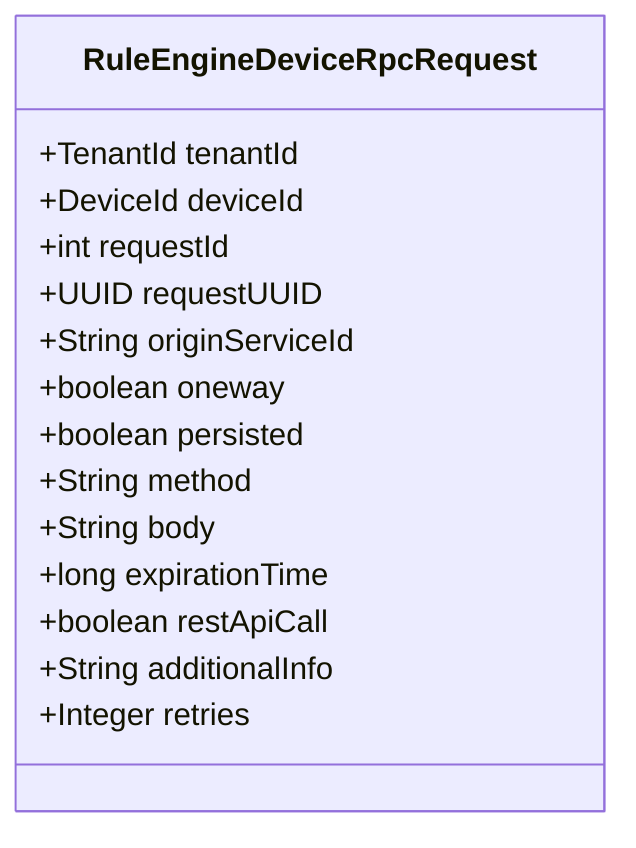
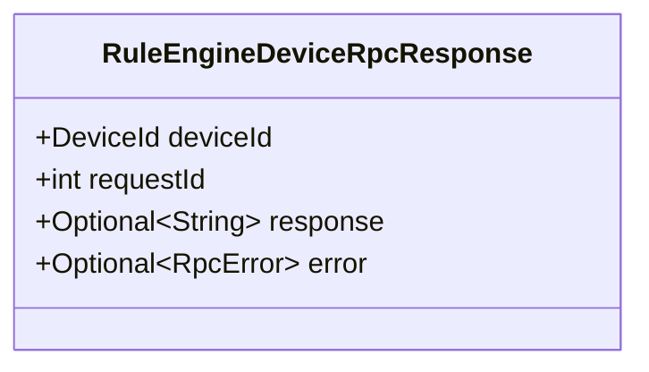
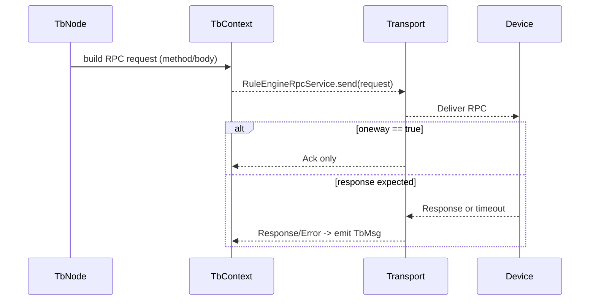

# ThingsBoard Device RPC via Rule Engine

## Language & Context
- Language: Java (server-side)
- Domain: Device RPC request/response DTOs used by the Rule Engine and Transport.

Key source files:
- org/thingsboard/rule/engine/api/RuleEngineDeviceRpcRequest.java
- org/thingsboard/rule/engine/api/RuleEngineDeviceRpcResponse.java

## RPC Request DTO
`RuleEngineDeviceRpcRequest` (immutable, Lombok `@Data @Builder`) encapsulates an outbound RPC invocation from the platform to a device.

Fields (selected):
- `tenantId`, `deviceId`: routing context
- `requestId` (int) and `requestUUID` (UUID): correlation identifiers
- `originServiceId`: service that originated the RPC (for clustered deployments)
- `oneway`: fire-and-forget semantics (no response expected)
- `persisted`: whether to persist and retry according to policies
- `method`, `body`: RPC method name and payload
- `expirationTime`: epoch millis deadline
- `restApiCall`: whether originated from REST
- `additionalInfo`: free-form JSON string for custom context
- `retries`: optional retry budget

## RPC Response DTO
`RuleEngineDeviceRpcResponse` (immutable, Lombok `@Data @Builder`) represents a device response or error.

Fields:
- `deviceId`, `requestId`
- `response`: `Optional<String>` payload
- `error`: `Optional<RpcError>` when failed or timed out

## Typical Flow

## Best Practices
- Set `expirationTime` and `retries` in alignment with transport capabilities.
- Avoid large `body` payloads; consider schema and compression if needed.
- For idempotency, prefer `requestUUID` for cross-service correlation.
- Use persisted RPCs for unreliable connectivity; monitor retry queues.

## Common Pitfalls
- Forgetting to check `oneway` and awaiting a response that will never arrive.
- Unbounded retry loops without `expirationTime` degrade system health.

## References
- org/thingsboard/rule/engine/api/RuleEngineDeviceRpcRequest.java
- org/thingsboard/rule/engine/api/RuleEngineDeviceRpcResponse.java
