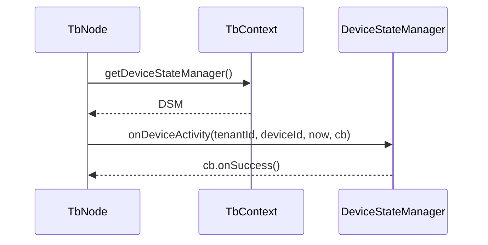

# Device State Management in Rule Engine

## Language & Context
- Language: Java (server-side)
- Domain: Tracking device connectivity and activity signals; interacting from TbNodes.

Key source files:
- org/thingsboard/rule/engine/api/DeviceStateManager.java
- org/thingsboard/rule/engine/api/TbContext.java (`getDeviceStateManager()`, `getDeviceStateNodeRateLimitConfig()`)

## Purpose
Device State Management centralizes updates related to device lifecycle signals (connect, activity, disconnect, inactivity) so that nodes and transports can report changes consistently and efficiently.

## API Surface
`DeviceStateManager` exposes:
- `onDeviceConnect(tenantId, deviceId, connectTime, callback)`
- `onDeviceActivity(tenantId, deviceId, activityTime, callback)`
- `onDeviceDisconnect(tenantId, deviceId, disconnectTime, callback)`
- `onDeviceInactivity(tenantId, deviceId, inactivityTime, callback)`
- `onDeviceInactivityTimeoutUpdate(tenantId, deviceId, inactivityTimeout, callback)`

Callbacks use `TbCallback` to signal success/failure asynchronously.

## Rate Limiting
`TbContext.getDeviceStateNodeRateLimitConfig()` returns configuration used by some nodes to throttle state updates (e.g., avoid flooding activity pings). Typical format is an implementation-specific rate-limit string; consult your deployment’s configuration.

Best practices:
- Debounce frequent signals in-node using `schedule(...)` or batching.
- Respect cluster-wide rate-limit config surfaced via context.

## Patterns of Use
- From transport handlers: update `onDeviceConnect`, then periodic `onDeviceActivity`.
- From rule nodes handling telemetry bursts: coalesce multiple readings to a single activity update.
- On device profile changes: call `onDeviceInactivityTimeoutUpdate` to align thresholds.

## Common Pitfalls
- Synchronous/blocking callbacks in `onMsg`; always use async `TbCallback` and route result upon completion if needed.
- Emitting activity updates per message without any throttling can overload storage.

## References
- org/thingsboard/rule/engine/api/DeviceStateManager.java
- org/thingsboard/rule/engine/api/TbContext.java
