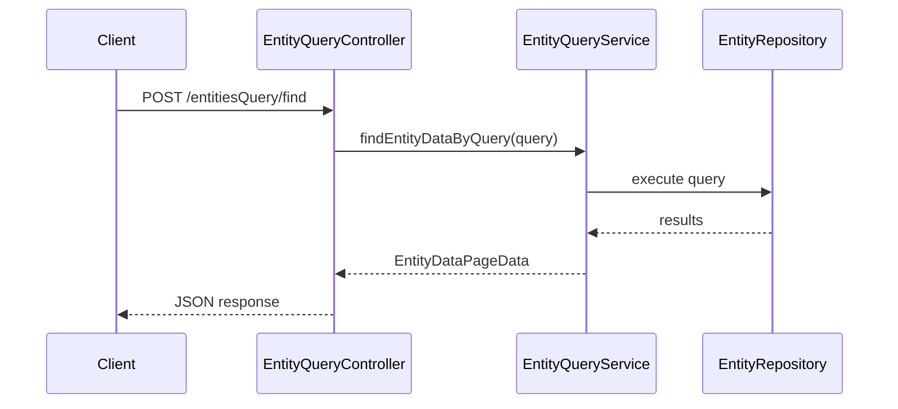

# Entity Query API Specification

## Overview

This document describes the entity query API in ThingsBoard, which provides flexible filtering, sorting, and pagination for entities and their data.

---

## Key Components

### EntityQueryController

| Endpoint                        | Method | Description                        |
|---------------------------------|--------|------------------------------------|
| /api/entitiesQuery/find         | POST   | Find entities matching query       |
| /api/entitiesQuery/count        | POST   | Count entities matching query      |
| /api/entitiesQuery/findByQuery  | POST   | Find entities with data            |

### EntityQueryService

| Method                        | Description                                      |
|-------------------------------|--------------------------------------------------|
| findEntityDataByQuery(...)    | Execute entity data query                        |
| countEntitiesByQuery(...)     | Count entities matching query                    |
| findAlarmDataByQuery(...)     | Execute alarm data query                         |

---

## Query Structure

| Field         | Type      | Description                        |
|---------------|-----------|------------------------------------|
| entityFilter  | EntityFilter | Filter by entity type, id, name, etc. |
| keyFilters    | List      | Filter by attribute/telemetry values |
| entityFields  | List      | Entity fields to return            |
| latestValues  | List      | Latest attribute/telemetry keys    |
| pageLink      | PageLink  | Pagination and sorting             |

---

## Entity Filter Types

| Type              | Description                                      |
|-------------------|--------------------------------------------------|
| singleEntity      | Match a single entity by id                      |
| entityList        | Match a list of entity ids                       |
| entityName        | Match by entity name pattern                     |
| entityType        | Match all entities of a type                     |
| assetType         | Match assets by type                             |
| deviceType        | Match devices by type                            |
| relationsQuery    | Match by entity relations                        |
| assetSearchQuery  | Search assets by criteria                        |
| deviceSearchQuery | Search devices by criteria                       |

---

## Key Filter Structure

| Field         | Type      | Description                        |
|---------------|-----------|------------------------------------|
| key           | EntityKey | Key to filter on                   |
| valueType     | String    | STRING, NUMERIC, BOOLEAN, DATE_TIME|
| predicate     | Object    | Comparison predicate               |

---

## Query Flow

---

## Best Practices

- Use specific filters to reduce result set
- Limit page size for large datasets
- Use key filters for attribute/telemetry filtering
- Prefer server-side pagination over client-side

---

## See Also

- [DAO & Entity Services Overview](dao-entity-services-overview.md)
- [WebSocket Subscriptions](websocket-subscriptions.md)
