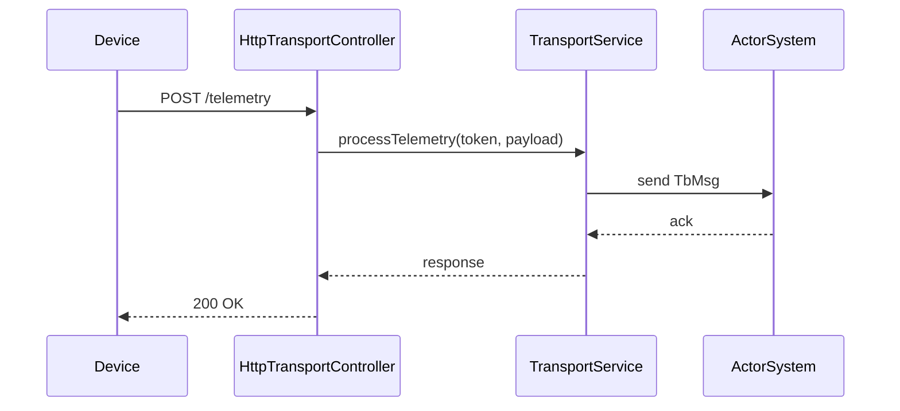
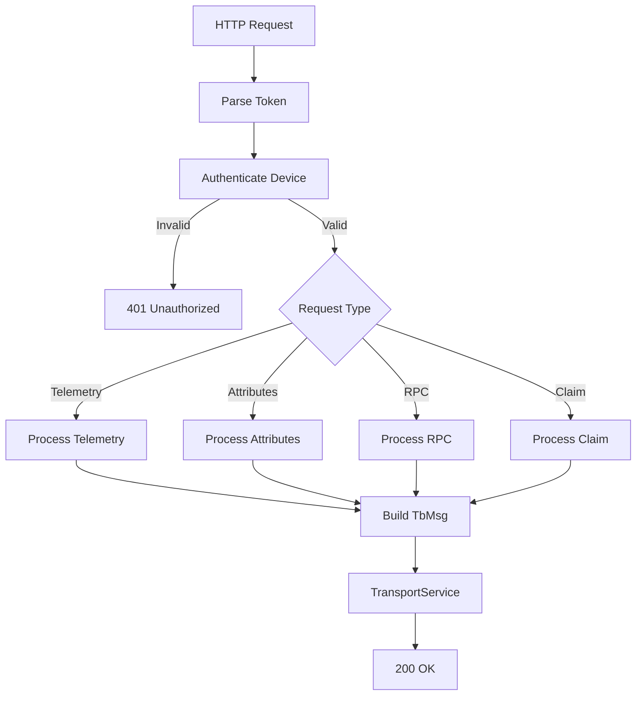
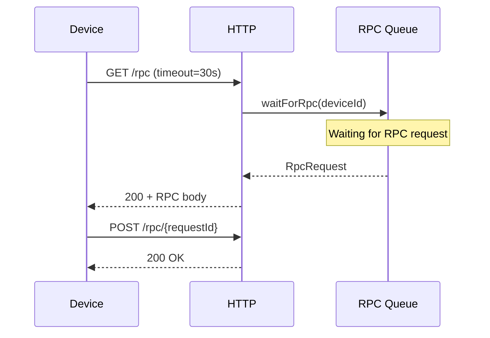
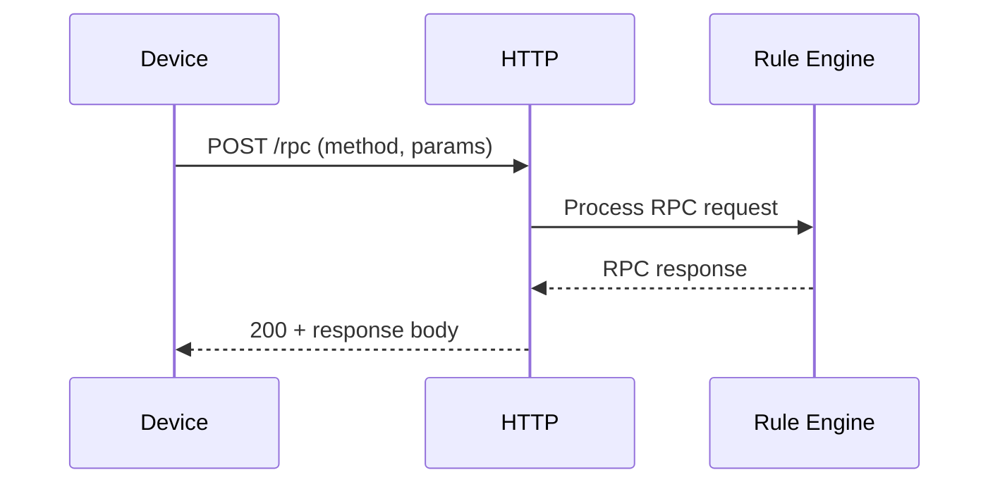

# HTTP Transport Flow Specification

## Overview

This document describes the HTTP transport layer in ThingsBoard, which handles device communication via REST APIs for telemetry, attributes, and RPC.

---

## Key Components

### HttpTransportController

Handles incoming HTTP requests from devices.

| Endpoint                                | Method | Description                        |
|-----------------------------------------|--------|------------------------------------|
| /api/v1/{deviceToken}/telemetry         | POST   | Submit device telemetry            |
| /api/v1/{deviceToken}/attributes        | POST   | Submit device attributes           |
| /api/v1/{deviceToken}/attributes        | GET    | Request shared attributes          |
| /api/v1/{deviceToken}/rpc               | GET    | Long-poll for server-side RPC      |
| /api/v1/{deviceToken}/rpc/{requestId}   | POST   | Respond to server-side RPC         |
| /api/v1/{deviceToken}/claim             | POST   | Claim device                       |

---

## Request Flow



---

## Authentication

- Device token in URL path
- Token validated against device credentials
- Invalid token returns 401 Unauthorized

---

## Payload Formats

**Telemetry (JSON):**

```json
{"temperature": 22.5, "humidity": 60}
```

**Attributes (JSON):**

```json
{"firmwareVersion": "1.2.3"}
```

---

## Error Handling

| Status | Meaning                        |
|--------|--------------------------------|
| 200    | Success                        |
| 400    | Bad request / invalid payload  |
| 401    | Unauthorized / invalid token   |
| 500    | Internal server error          |

---

## Complete API Endpoints

### Telemetry Endpoints

| Endpoint                                    | Method | Description                        |
|---------------------------------------------|--------|------------------------------------|
| /api/v1/{deviceToken}/telemetry             | POST   | Submit device telemetry            |

### Attribute Endpoints

| Endpoint                                    | Method | Description                        |
|---------------------------------------------|--------|------------------------------------|
| /api/v1/{deviceToken}/attributes            | POST   | Publish client attributes          |
| /api/v1/{deviceToken}/attributes            | GET    | Request shared/client attributes   |
| /api/v1/{deviceToken}/attributes/updates    | GET    | Subscribe to attribute updates     |

### RPC Endpoints

| Endpoint                                    | Method | Description                        |
|---------------------------------------------|--------|------------------------------------|
| /api/v1/{deviceToken}/rpc                   | GET    | Long-poll for server-side RPC      |
| /api/v1/{deviceToken}/rpc/{requestId}       | POST   | Respond to server-side RPC         |
| /api/v1/{deviceToken}/rpc                   | POST   | Client-side RPC request            |

### Device Management Endpoints

| Endpoint                                    | Method | Description                        |
|---------------------------------------------|--------|------------------------------------|
| /api/v1/{deviceToken}/claim                 | POST   | Claim device                       |
| /api/v1/provision                           | POST   | Provision new device               |
| /api/v1/{deviceToken}/firmware              | GET    | Get firmware info                  |
| /api/v1/{deviceToken}/software              | GET    | Get software info                  |

---

## Request Processing Pipeline



---

## Telemetry Payload Formats

### Simple JSON

```json
{"temperature": 22.5, "humidity": 60}
```

### JSON with Timestamp

```json
{
  "ts": 1704537600000,
  "values": {
    "temperature": 22.5,
    "humidity": 60
  }
}
```

### JSON Array with Timestamps

```json
[
  {
    "ts": 1704537600000,
    "values": {"temperature": 22.5}
  },
  {
    "ts": 1704537610000,
    "values": {"temperature": 23.0}
  }
]
```

---

## Attribute Request Parameters

| Parameter   | Description                                      |
|-------------|--------------------------------------------------|
| clientKeys  | Comma-separated client attribute keys            |
| sharedKeys  | Comma-separated shared attribute keys            |

### Example Request

```http
GET /api/v1/{token}/attributes?clientKeys=model,serial&sharedKeys=config
```

### Example Response

```json
{
  "client": {"model": "sensor-v1", "serial": "12345"},
  "shared": {"config": {"interval": 60}}
}
```

---

## RPC Handling

### Server-Side RPC (Long Polling)



### Client-Side RPC



### RPC Request Format

```json
{
  "method": "getConfig",
  "params": {"key": "interval"}
}
```

### RPC Response Format

```json
{
  "value": 60
}
```

---

## Device Provisioning

### Provision Request

```http
POST /api/v1/provision
Content-Type: application/json

{
  "deviceName": "my-device",
  "provisionDeviceKey": "key",
  "provisionDeviceSecret": "secret"
}
```

### Provision Response

```json
{
  "status": "SUCCESS",
  "credentialsType": "ACCESS_TOKEN",
  "credentialsValue": "generated-token"
}
```

---

## Long Polling Configuration

| Parameter          | Default | Description                              |
|--------------------|---------|------------------------------------------|
| timeout            | 20000   | Long poll timeout in milliseconds        |
| limit              | 100     | Max messages per request                 |

---

## Rate Limiting

| Limit Type         | Scope    | Description                              |
|--------------------|----------|------------------------------------------|
| requests.limit     | Device   | Max HTTP requests per device per second  |
| requests.limit     | Tenant   | Max HTTP requests per tenant per second  |
| payload.size       | Request  | Max payload size in bytes                |

---

## SSL/TLS Configuration

| Property                              | Description                          |
|---------------------------------------|--------------------------------------|
| transport.http.ssl.enabled            | Enable HTTPS                         |
| transport.http.ssl.protocol           | TLS version                          |
| transport.http.ssl.key_store          | Keystore path                        |
| transport.http.ssl.key_store_password | Keystore password                    |

---

## Gateway API

### Gateway Telemetry

```http
POST /api/v1/{gatewayToken}/telemetry
Content-Type: application/json

{
  "Device A": [{"ts": 1704537600000, "values": {"temp": 22}}],
  "Device B": [{"ts": 1704537600000, "values": {"temp": 24}}]
}
```

### Gateway Connect

```http
POST /api/v1/{gatewayToken}/connect
Content-Type: application/json

{"device": "Device A"}
```

### Gateway Disconnect

```http
POST /api/v1/{gatewayToken}/disconnect
Content-Type: application/json

{"device": "Device A"}
```

---

## Best Practices

- Use HTTPS in production
- Keep payloads compact
- Use telemetry for time-series, attributes for state
- Implement retry logic with exponential backoff
- Use batching for multiple data points
- Set appropriate timeouts for long-polling RPC
- Validate payload format before sending

---

## See Also

- [MQTT Transport Flow](mqtt-transport-flow.md)
- [CoAP Transport Flow](coap-transport-flow.md)
- [Transport to Rule Engine Flow](transport-to-rule-engine-flow.md)
- [Device Asset Profiles](device-asset-profiles.md)
