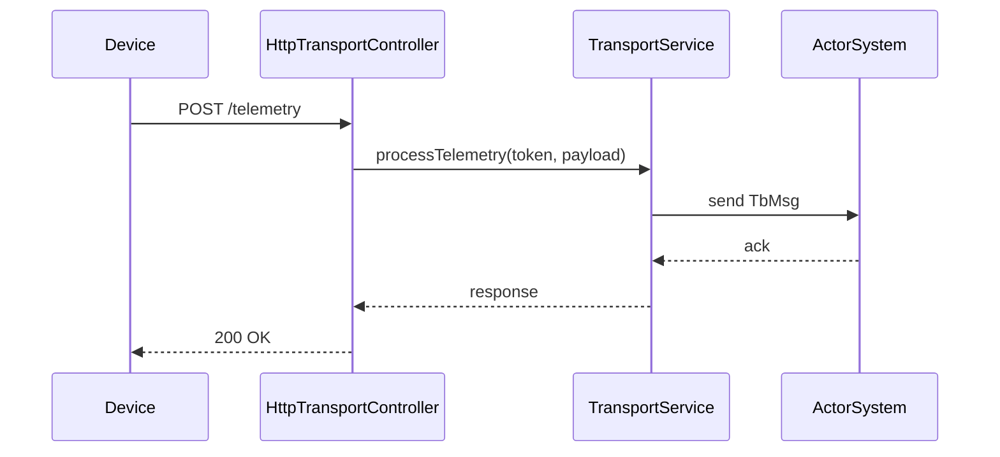

# HTTP Transport Flow Specification

## Overview

This document describes the HTTP transport layer in ThingsBoard, which handles device communication via REST APIs for telemetry, attributes, and RPC.

---

## Key Components

### HttpTransportController

Handles incoming HTTP requests from devices.

| Endpoint                                | Method | Description                        |
|-----------------------------------------|--------|------------------------------------|
| /api/v1/{deviceToken}/telemetry         | POST   | Submit device telemetry            |
| /api/v1/{deviceToken}/attributes        | POST   | Submit device attributes           |
| /api/v1/{deviceToken}/attributes        | GET    | Request shared attributes          |
| /api/v1/{deviceToken}/rpc               | GET    | Long-poll for server-side RPC      |
| /api/v1/{deviceToken}/rpc/{requestId}   | POST   | Respond to server-side RPC         |
| /api/v1/{deviceToken}/claim             | POST   | Claim device                       |

---

## Request Flow



---

## Authentication

- Device token in URL path
- Token validated against device credentials
- Invalid token returns 401 Unauthorized

---

## Payload Formats

**Telemetry (JSON):**

```json
{"temperature": 22.5, "humidity": 60}
```

**Attributes (JSON):**

```json
{"firmwareVersion": "1.2.3"}
```

---

## Error Handling

| Status | Meaning                        |
|--------|--------------------------------|
| 200    | Success                        |
| 400    | Bad request / invalid payload  |
| 401    | Unauthorized / invalid token   |
| 500    | Internal server error          |

---

## Best Practices

- Use HTTPS in production
- Keep payloads compact
- Use telemetry for time-series, attributes for state

---

## See Also

- [MQTT Transport Flow](mqtt-transport-flow.md)
- [Transport to Rule Engine Flow](transport-to-rule-engine-flow.md)
