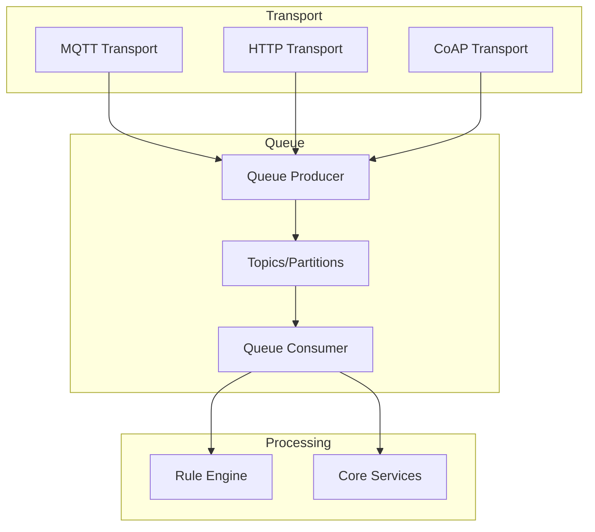
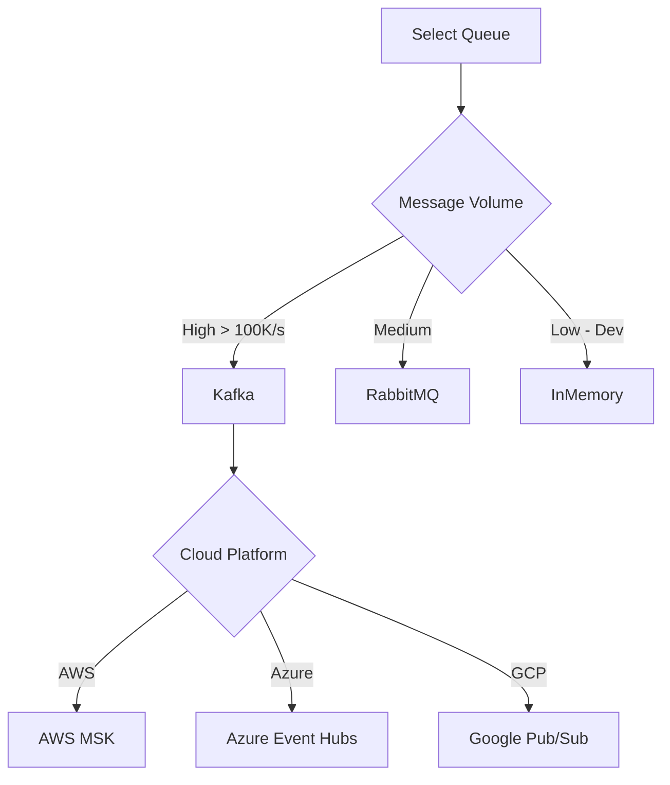
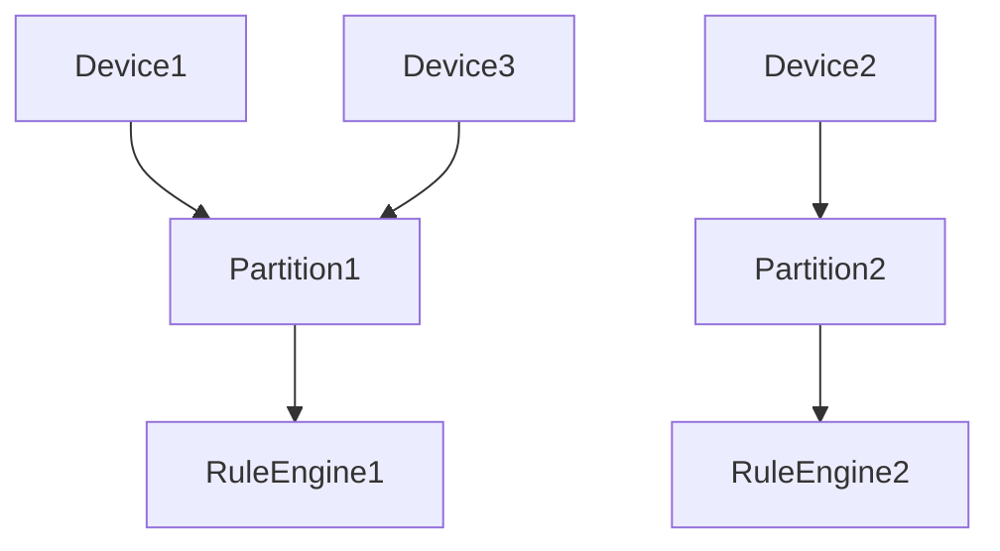
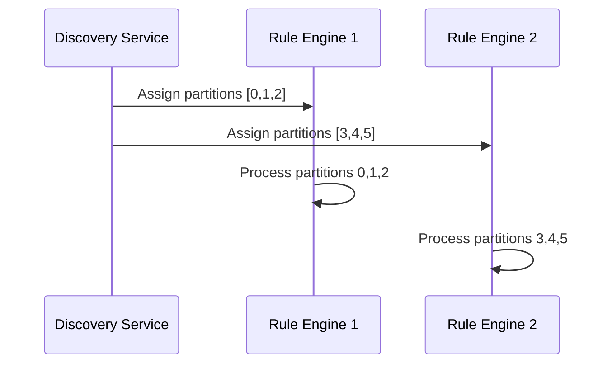
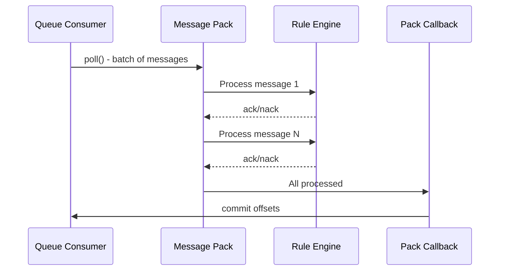
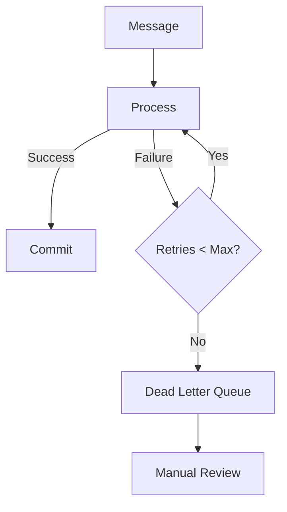
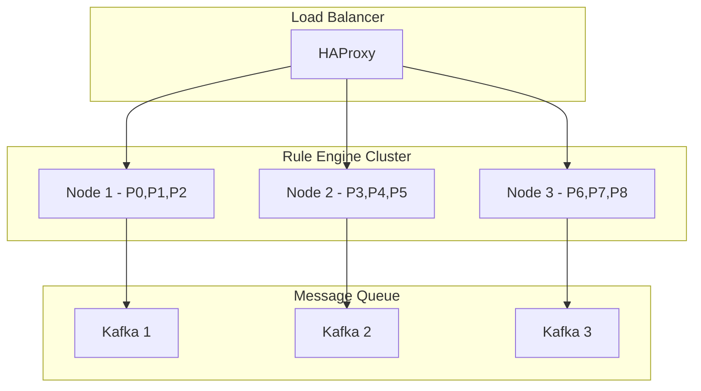
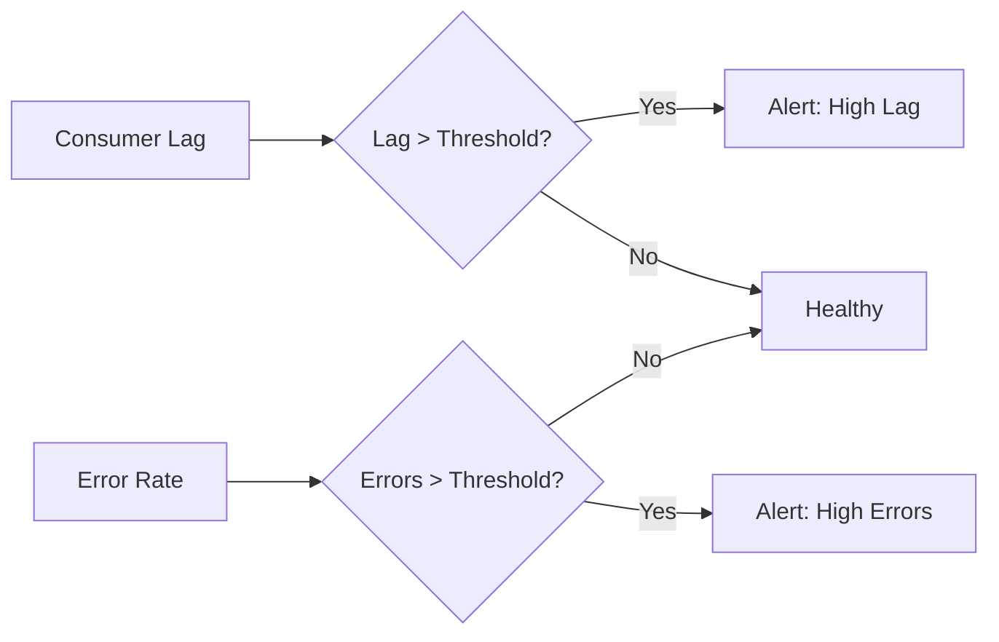

# Infrastructure and Queue Specification

## Overview

This document describes the queue infrastructure, partitioning model, technology stack, and operational considerations for ThingsBoard's backend services.

---

## Part 1: Queue Infrastructure

### Key Concepts

| Concept | Description |
|---------|-------------|
| Queue | Internal message routing between transport, rule engine, and services |
| Partitioning | Messages partitioned by originator for ordering and affinity |
| Backpressure | Flow control when consumers can't keep up |
| Dead Letter Queue | Storage for failed messages exceeding retry limits |

---

### Queue Architecture



---

### Queue Backends

| Backend | Use Case | Persistence | Clustering |
|---------|----------|-------------|------------|
| In-Memory | Development, testing | No | No |
| Kafka | Production, high throughput | Yes | Yes |
| RabbitMQ | Production, moderate throughput | Yes | Yes |
| AWS SQS | AWS cloud-native | Yes | Yes |
| Azure Service Bus | Azure deployments | Yes | Yes |
| Google Pub/Sub | GCP deployments | Yes | Yes |

### Selection Criteria



---

### Core Topics

| Topic | Purpose |
|-------|---------|
| tb_core | Core platform messages |
| tb_rule_engine | Rule engine processing |
| tb_transport.notifications | Transport layer notifications |
| tb_core.notifications | Core notifications |
| tb_edge | Edge synchronization |
| tb_ota_package | OTA update packages |
| tb_version_control | Version control operations |
| tb_housekeeper | Housekeeping tasks |

---

### Key Interfaces

#### TbQueueProducer

| Method | Description |
|--------|-------------|
| send(TopicPartitionInfo, TbProtoQueueMsg, callback) | Send message to queue partition |

#### TbQueueConsumer

| Method | Description |
|--------|-------------|
| subscribe(topics) | Subscribe to topics/partitions |
| poll(timeout) | Poll for new messages |
| commit() | Commit consumed offsets |

#### PartitionService

| Method | Description |
|--------|-------------|
| resolve(entityId) | Resolve partition for an entity |
| getPartitions(...) | Get partitions for a queue/topic |

---

## Part 2: Partitioning Model

### Consistent Hashing



- Same entity always maps to same partition
- Minimal reassignment on cluster changes
- Even distribution across partitions

```java
int partition = Math.abs(entityId.getId().hashCode() % partitionCount);
```

### Partition Ownership



### Rebalancing Triggers

- New node joins cluster
- Node leaves cluster (graceful or crash)
- Partition count changes

---

## Part 3: Message Processing

### Pack Processing

Messages are processed in packs for efficiency:



### Submit Strategies

| Strategy | Description |
|----------|-------------|
| BURST | Submit all messages immediately |
| BATCH | Batch messages up to batch-size |
| SEQUENTIAL | Process one message at a time |

### Processing Strategies

| Strategy | On Failure |
|----------|------------|
| RETRY_ALL | Retry entire pack |
| SKIP_ALL_FAILURES | Skip failed, continue with rest |
| RETRY_FAILED | Retry only failed messages |
| RETRY_TIMED_OUT | Retry only timed-out messages |

---

### Dead Letter Queue



| Property | Description |
|----------|-------------|
| queue.rule-engine.dlq.enabled | Enable dead letter queue |
| queue.rule-engine.dlq.topic | DLQ topic name |
| queue.rule-engine.max-retries | Max retries before DLQ |

---

## Part 4: Technology Stack

### Runtime & Frameworks

| Component | Purpose |
|-----------|---------|
| Java 17+ | Primary runtime |
| Spring Boot | Application framework |
| Spring Security | Authentication/authorization |
| Netty | High-performance networking |
| gRPC | Internal service communication |

### Data Storage

| Component | Purpose |
|-----------|---------|
| PostgreSQL | Primary relational database |
| Cassandra | Time-series data (optional) |
| TimescaleDB | Time-series with PostgreSQL |
| Redis | Caching and rate limiting |

### Messaging

| Component | Purpose |
|-----------|---------|
| Kafka | Primary message queue |
| RabbitMQ | Alternative message queue |
| Zookeeper | Service discovery and coordination |

### Observability

| Component | Purpose |
|-----------|---------|
| Prometheus | Metrics collection |
| Grafana | Dashboards and visualization |
| Jaeger | Distributed tracing |
| ELK Stack | Log aggregation |

---

## Part 5: High Availability

### Cluster Topology



### Failover Behavior

| Scenario | Behavior |
|----------|----------|
| Node Crash | Partitions reassigned to surviving nodes |
| Network Partition | Split-brain prevention via Zookeeper |
| Queue Unavailable | Messages buffered, retry with backoff |
| Overload | Backpressure propagated to producers |

---

## Part 6: Monitoring

### Key Metrics

| Metric | Description |
|--------|-------------|
| queue.producer.sent | Messages sent to queue |
| queue.consumer.polled | Messages polled from queue |
| queue.consumer.lag | Consumer lag (messages behind) |
| queue.processing.time | Message processing time |
| queue.errors | Processing errors |

### Health Indicators



---

## Configuration Reference

### Queue Properties

| Property | Description |
|----------|-------------|
| queue.type | Queue backend (kafka, in-memory, etc.) |
| queue.partitions.count | Number of partitions |
| queue.pack-processing-timeout | Timeout for message pack processing |

### Example Configuration

```yaml
queue:
  type: kafka
  rule-engine:
    topic: "tb_rule_engine"
    partitions: 10
    replication-factor: 3
    pack-processing-timeout: 60000
    submit-strategy:
      type: "BURST"
      batch-size: 1000
    processing-strategy:
      type: "SKIP_ALL_FAILURES"
```

---

## Best Practices

### Do's

- Size partitions based on expected load
- Monitor queue lag and consumer health
- Use dead-letter queues for failed messages
- Tune timeouts for latency-sensitive flows
- Enable replication for production queues

### Don'ts

- Don't use in-memory queues in production
- Don't ignore consumer lag alerts
- Don't set infinite retries
- Don't skip DLQ configuration

---

## See Also

- [Rule Engine Core](rule-engine-core.md)
- [Architecture Blueprint](architecture-blueprint.md)
- [Transport Layer](transport-layer.md)
