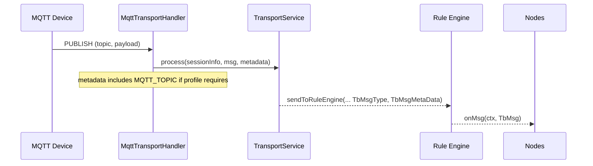
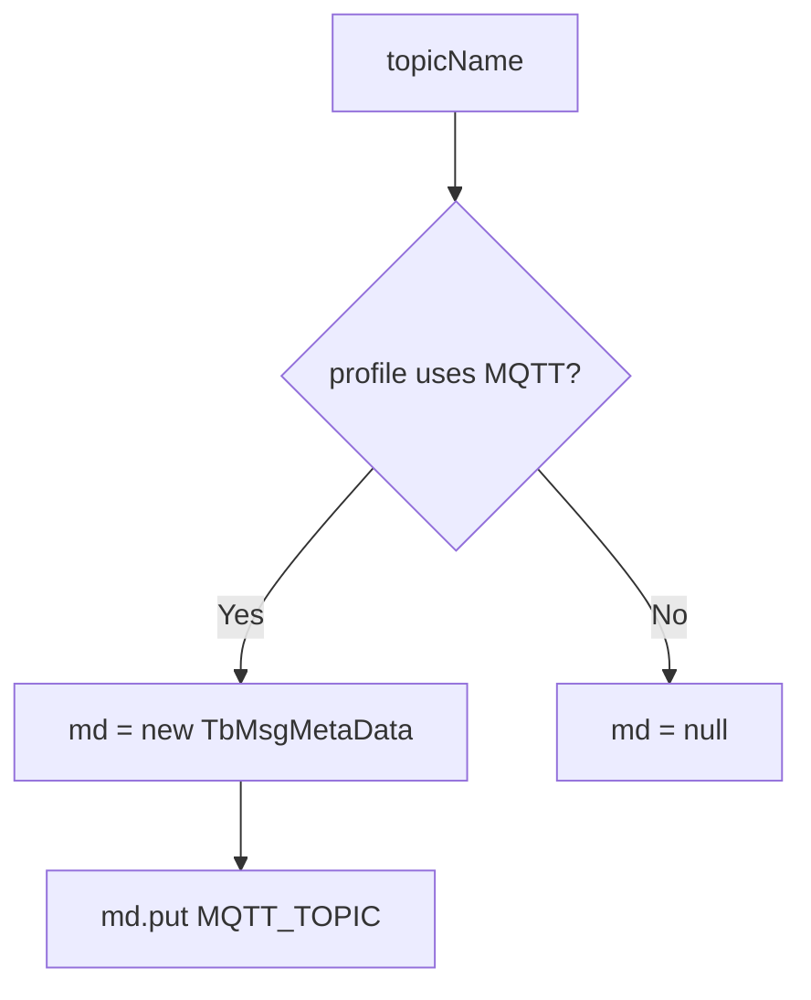
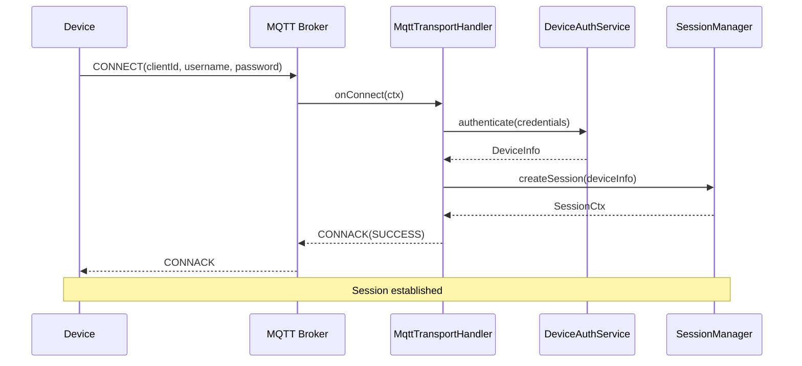
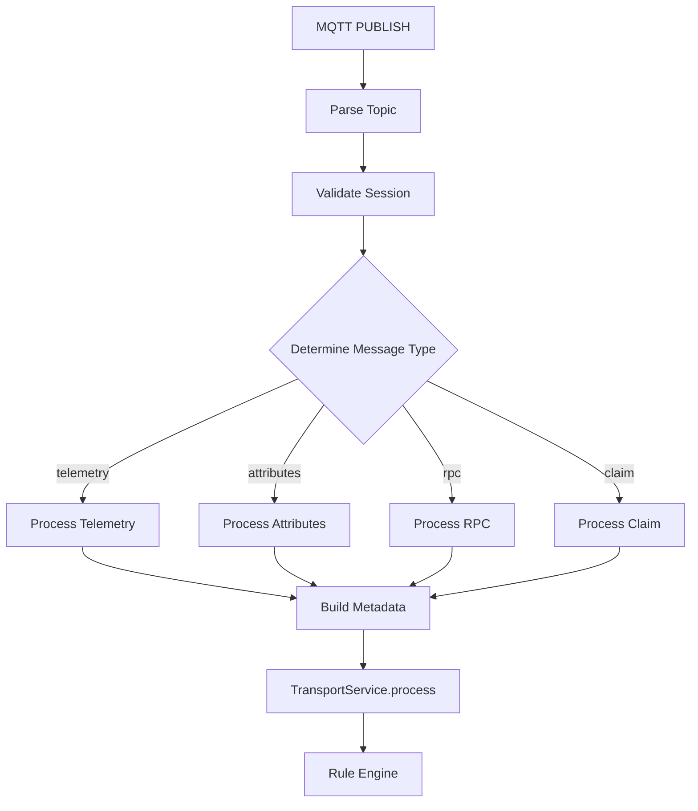
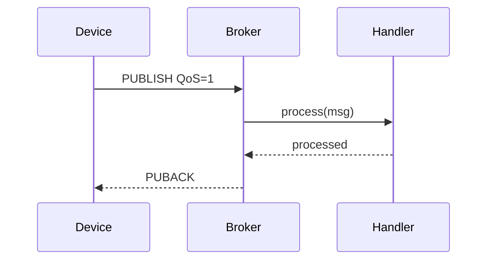
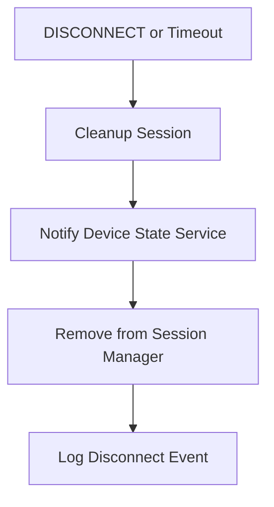
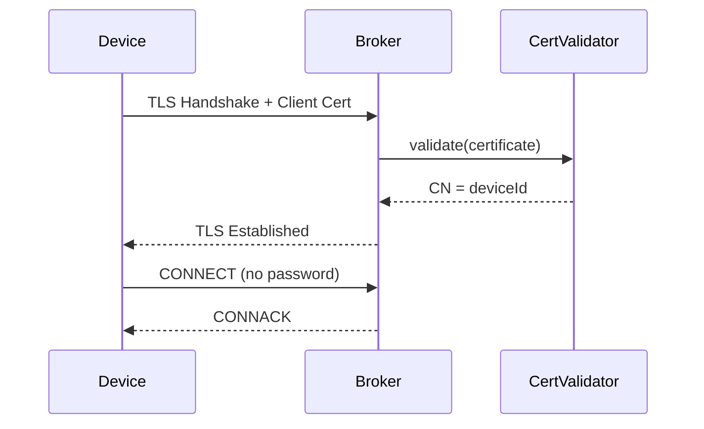

# MQTT Transport: Topic Handling and Metadata

## Language & Context

- Language: Java (server-side)
- Domain: How MQTT publish flows translate to `TbMsg` with metadata for the Rule Engine.

Key source file:

- common/transport/mqtt/src/main/java/org/thingsboard/server/transport/mqtt/MqttTransportHandler.java

## From MQTT Publish to Rule Engine

`MqttTransportHandler` parses topic names, constructs appropriate transport messages, and hands them to `TransportService.process(...)`. When the device profile indicates MQTT-type transport, it also injects metadata with the original topic name.



## Metadata Injection

Selected logic:

- `getMetadata(DeviceSessionCtx ctx, String topicName)` returns a `TbMsgMetaData` with `DataConstants.MQTT_TOPIC` set to the topic name if `ctx.isDeviceProfileMqttTransportType()` is true; otherwise returns null.
- This metadata is passed to `TransportService.process(...)`, which forwards it to the Rule Engine alongside the JSON payload.



## Practical Tips for Nodes

- Inspect `metadata['mqtt_topic']` (constant depends on `DataConstants`) when routing messages based on topic
- Align topic structure (e.g., `v1/devices/me/telemetry`) with node logic or `TbMsgTypeSwitchNode` branches
- Combine topic-based routing with device profile settings and security

---

## MQTT Topic Structure

### Standard Topics

| Topic Pattern                           | Purpose                              |
|-----------------------------------------|--------------------------------------|
| v1/devices/me/telemetry                 | Publish telemetry data               |
| v1/devices/me/attributes                | Publish client attributes            |
| v1/devices/me/attributes/request/{id}   | Request attributes from server       |
| v1/devices/me/attributes/response/{id}  | Receive attribute response           |
| v1/devices/me/rpc/request/{id}          | Receive RPC request from server      |
| v1/devices/me/rpc/response/{id}         | Respond to RPC request               |
| v1/devices/me/claim                     | Claim device                         |
| v1/devices/me/provision                 | Provision device                     |

### Gateway Topics

| Topic Pattern                           | Purpose                              |
|-----------------------------------------|--------------------------------------|
| v1/gateway/telemetry                    | Gateway publishes device telemetry   |
| v1/gateway/attributes                   | Gateway publishes device attributes  |
| v1/gateway/connect                      | Gateway connects device              |
| v1/gateway/disconnect                   | Gateway disconnects device           |
| v1/gateway/rpc                          | Gateway RPC handling                 |
| v1/gateway/claim                        | Gateway claims device                |

---

## MQTT Connection Flow



---

## MQTT Authentication Methods

### Access Token (Username)

```
Username: $ACCESS_TOKEN
Password: (empty or any value)
```

### Basic Authentication

```
Username: $DEVICE_NAME
Password: $DEVICE_PASSWORD
```

### X.509 Certificate

```
Client Certificate: device.pem
CA Certificate: ca.pem
No username/password required
```

---

## Message Processing Pipeline



---

## Payload Formats

### JSON (Default)

```json
{
  "temperature": 25.5,
  "humidity": 60
}
```

### JSON with Timestamp

```json
{
  "ts": 1704537600000,
  "values": {
    "temperature": 25.5,
    "humidity": 60
  }
}
```

### Protobuf

Binary Protobuf payload using device profile schema.

---

## QoS Handling

| QoS Level | Behavior                                         |
|-----------|--------------------------------------------------|
| 0         | At most once - no acknowledgment                 |
| 1         | At least once - PUBACK after processing          |
| 2         | Exactly once - full handshake (PUBREC/PUBREL)    |

### QoS Flow



---

## Session Management

### Session State

| State        | Description                                      |
|--------------|--------------------------------------------------|
| CONNECTED    | Active session, processing messages              |
| DISCONNECTING| Graceful disconnect in progress                  |
| DISCONNECTED | Session closed                                   |

### Session Cleanup



---

## Keep-Alive and Timeouts

| Parameter        | Default | Description                              |
|------------------|---------|------------------------------------------|
| keepAlive        | 60s     | Client keep-alive interval               |
| sessionTimeout   | 300s    | Session timeout after disconnect         |
| maxInFlight      | 10      | Max in-flight messages (QoS 1/2)         |

---

## SSL/TLS Configuration

### Server Configuration

| Property                              | Description                          |
|---------------------------------------|--------------------------------------|
| transport.mqtt.ssl.enabled            | Enable SSL/TLS                       |
| transport.mqtt.ssl.protocol           | TLS version (TLSv1.2, TLSv1.3)       |
| transport.mqtt.ssl.key_store          | Keystore path                        |
| transport.mqtt.ssl.key_store_password | Keystore password                    |
| transport.mqtt.ssl.credentials.type   | PEM or KEYSTORE                      |

### Client Certificate Authentication



---

## Rate Limiting

| Limit Type              | Scope    | Description                          |
|-------------------------|----------|--------------------------------------|
| messages.rate.limit     | Device   | Max messages per second per device   |
| messages.rate.limit     | Tenant   | Max messages per second per tenant   |
| sessions.max            | Global   | Max concurrent MQTT sessions         |

---

## Error Handling

| Error                   | MQTT Response                                    |
|-------------------------|--------------------------------------------------|
| Invalid credentials     | CONNACK (NOT_AUTHORIZED)                         |
| Unknown topic           | No action (silently dropped)                     |
| Payload parse error     | Logged, message dropped                          |
| Rate limit exceeded     | DISCONNECT or throttle                           |
| Session quota exceeded  | CONNACK (SERVER_UNAVAILABLE)                     |

---

## References

- common/transport/mqtt/src/main/java/org/thingsboard/server/transport/mqtt/MqttTransportHandler.java
