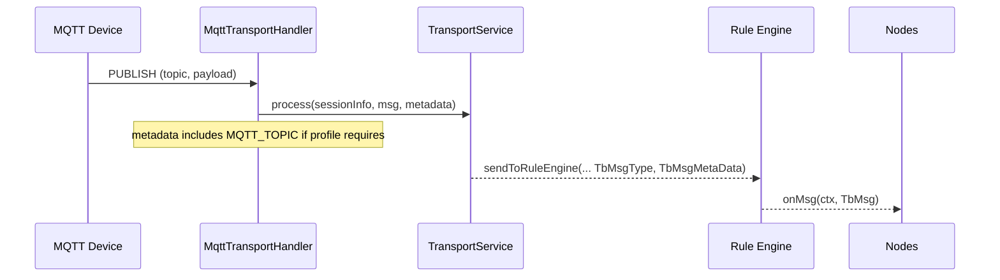
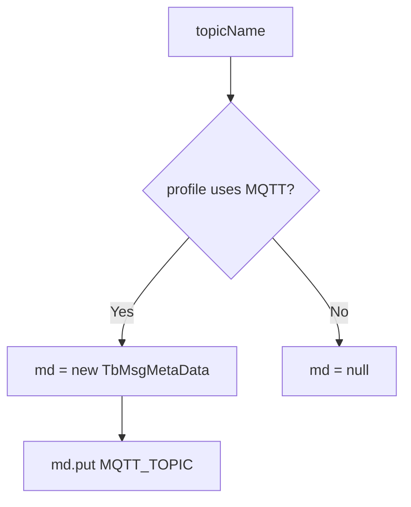

# MQTT Transport: Topic Handling and Metadata

## Language & Context
- Language: Java (server-side)
- Domain: How MQTT publish flows translate to `TbMsg` with metadata for the Rule Engine.

Key source file:
- common/transport/mqtt/src/main/java/org/thingsboard/server/transport/mqtt/MqttTransportHandler.java

## From MQTT Publish to Rule Engine
`MqttTransportHandler` parses topic names, constructs appropriate transport messages, and hands them to `TransportService.process(...)`. When the device profile indicates MQTT-type transport, it also injects metadata with the original topic name.

## Metadata Injection
Selected logic:
- `getMetadata(DeviceSessionCtx ctx, String topicName)` returns a `TbMsgMetaData` with `DataConstants.MQTT_TOPIC` set to the topic name if `ctx.isDeviceProfileMqttTransportType()` is true; otherwise returns null.
- This metadata is passed to `TransportService.process(...)`, which forwards it to the Rule Engine alongside the JSON payload.

## Practical Tips for Nodes
- Inspect `metadata['mqtt_topic']` (constant depends on `DataConstants`) when routing messages based on topic
- Align topic structure (e.g., `v1/devices/me/telemetry`) with node logic or `TbMsgTypeSwitchNode` branches
- Combine topic-based routing with device profile settings and security

## References
- common/transport/mqtt/src/main/java/org/thingsboard/server/transport/mqtt/MqttTransportHandler.java
