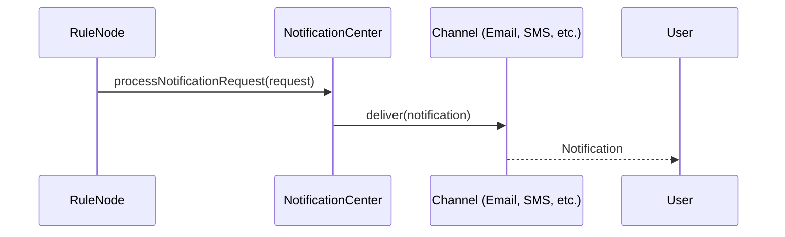

# Notification Service Specification

## Overview

This document describes the notification service in ThingsBoard, which handles sending notifications to users via various channels (web, mobile, email, SMS, Slack, etc.).

---

## Key Interfaces

### NotificationCenter

Located at: `org/thingsboard/rule/engine/api/NotificationCenter.java`

| Method                        | Description                                      |
|-------------------------------|--------------------------------------------------|
| processNotificationRequest(...)| Process and deliver a notification request      |
| sendNotification(...)         | Send notification to specified targets           |

### NotificationService

| Method                        | Description                                      |
|-------------------------------|--------------------------------------------------|
| findNotificationById(...)     | Retrieve notification by id                      |
| saveNotification(...)         | Create or update notification                    |
| deleteNotification(...)       | Remove notification                              |

---

## Notification Channels

| Channel   | Description                                      |
|-----------|--------------------------------------------------|
| WEB       | In-app notification (WebSocket push)             |
| MOBILE    | Mobile push notification (Firebase, APNs)        |
| EMAIL     | Email notification                               |
| SMS       | SMS notification                                 |
| SLACK     | Slack message                                    |

---

## Notification Flow

---

## Notification Request

| Field         | Type      | Description                        |
|---------------|-----------|------------------------------------|
| tenantId      | TenantId  | Owning tenant                      |
| targets       | List      | Target users/groups                |
| templateId    | UUID      | Notification template              |
| channel       | Channel   | Delivery channel                   |
| info          | JsonNode  | Dynamic content for template       |

---

## Best Practices

- Use templates for consistent messaging
- Rate-limit notifications to avoid spam
- Monitor delivery status and failures

---

## See Also

- [Rule Engine Services (RPC, Telemetry, Notifications)](rule-engine-services-rpc-telemetry-notifications.md)
- [TbContext & Services](tb-context-and-services.md)
