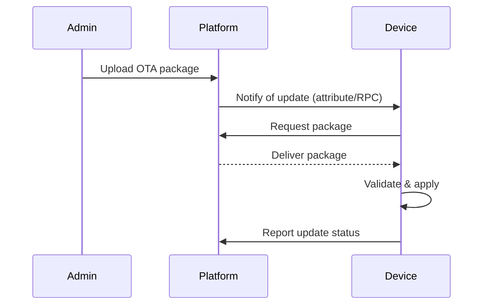

# OTA Updates Specification

## Overview

This document describes the OTA (Over-The-Air) update mechanism in ThingsBoard for firmware and software updates to devices.

---

## Key Components

### OtaPackageService

| Method                        | Description                                      |
|-------------------------------|--------------------------------------------------|
| findOtaPackageById(...)       | Retrieve OTA package by id                       |
| saveOtaPackage(...)           | Create or update OTA package                     |
| deleteOtaPackage(...)         | Remove OTA package                               |
| findOtaPackageByDeviceProfileIdAndType(...) | Find package for device profile   |

### OtaPackage Entity

| Field         | Type      | Description                        |
|---------------|-----------|------------------------------------|
| id            | OtaPackageId | Unique identifier               |
| tenantId      | TenantId  | Owning tenant                      |
| deviceProfileId | DeviceProfileId | Target device profile        |
| type          | OtaPackageType | FIRMWARE or SOFTWARE           |
| title         | String    | Package title                      |
| version       | String    | Version string                     |
| url           | String    | Download URL (if external)         |
| data          | byte[]    | Package data (if stored locally)   |
| checksum      | String    | Checksum for validation            |
| checksumAlgorithm | String | Algorithm (MD5, SHA256, etc.)    |

---

## OTA Update Flow

---

## Device Attributes

| Attribute         | Scope   | Description                        |
|-------------------|---------|------------------------------------|
| fw_version        | Client  | Current firmware version           |
| fw_title          | Client  | Current firmware title             |
| fw_state          | Client  | Update state (DOWNLOADING, VERIFIED, UPDATED, FAILED) |
| targetFwVersion   | Shared  | Target firmware version            |
| targetFwUrl       | Shared  | Download URL                       |
| targetFwChecksum  | Shared  | Checksum for validation            |

---

## Best Practices

- Use checksums to validate package integrity
- Support incremental/delta updates where possible
- Monitor update progress and failures
- Roll back on failure if supported

---

## See Also

- [Device State Management](device-state-management.md)
- [Timeseries & Attributes Requests](timeseries-and-attributes-requests.md)
