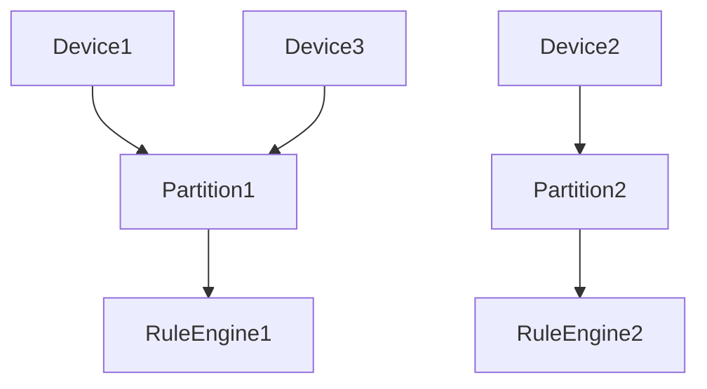

# Queue and Partitioning Specification

## Overview

This document describes the queue infrastructure and partitioning model used in ThingsBoard for message routing, load balancing, and high availability.

---

## Key Concepts

### Queue

- Internal message queues route messages between transport, rule engine, and services
- Queues support backpressure, retry, and dead-letter handling
- Configurable via application properties

### Partitioning

- Messages are partitioned by originator (device, asset, etc.)
- Ensures ordering and affinity for related messages
- Supports horizontal scaling of rule engine instances

---

## Key Interfaces

### TbQueueProducer

| Method                  | Description                                      |
|-------------------------|--------------------------------------------------|
| send(TopicPartitionInfo, TbProtoQueueMsg, callback) | Send message to queue partition |

### TbQueueConsumer

| Method                  | Description                                      |
|-------------------------|--------------------------------------------------|
| subscribe(topics)       | Subscribe to topics/partitions                   |
| poll(timeout)           | Poll for new messages                            |
| commit()                | Commit consumed offsets                          |

### PartitionService

| Method                  | Description                                      |
|-------------------------|--------------------------------------------------|
| resolve(entityId)       | Resolve partition for an entity                  |
| getPartitions(...)      | Get partitions for a queue/topic                 |

---

## Partitioning Model

- Partition assignment is consistent for a given entity
- Rebalancing occurs on cluster topology changes

---

## Queue Configuration

| Property                | Description                                      |
|-------------------------|--------------------------------------------------|
| queue.type              | Queue backend (kafka, in-memory, etc.)           |
| queue.partitions.count  | Number of partitions                             |
| queue.pack-processing-timeout | Timeout for message pack processing       |

---

## Best Practices

- Size partitions based on expected load
- Monitor queue lag and consumer health
- Use dead-letter queues for failed messages
- Tune timeouts for latency-sensitive flows

---

## See Also

- [Rule Engine Queue & Actors](rule-engine-queue-and-actors.md)
- [Transport to Rule Engine Flow](transport-to-rule-engine-flow.md)
