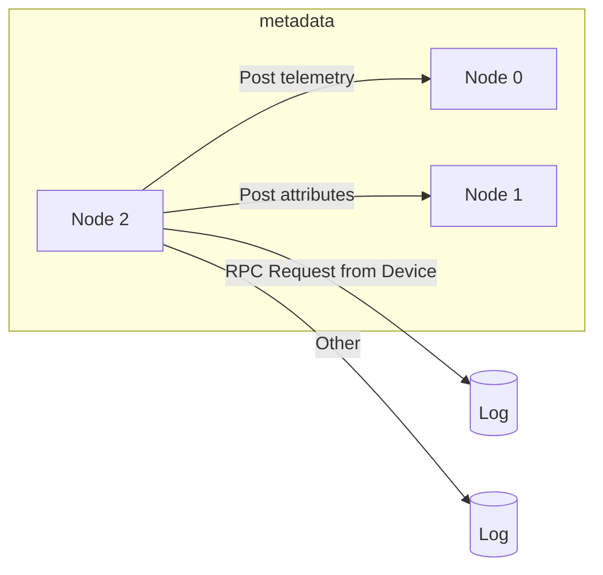
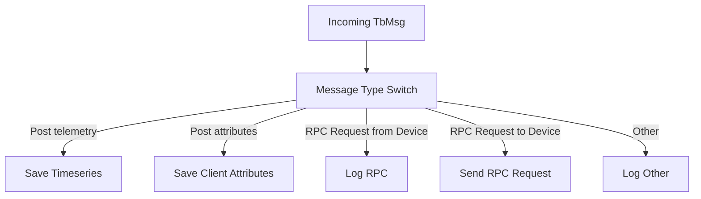

# Rule Chain JSON Templates: Structure and Mapping

## Language & Context
- Language: JSON descriptors, consumed by server-side Java
- Domain: Predefined rule chains packaged with ThingsBoard (e.g., Root Rule Chain)

Key source file example:
- application/src/main/data/json/tenant/rule_chains/root_rule_chain.json

## Structure Overview
A template bundles a `ruleChain` descriptor with `metadata` that defines nodes and their interconnections.

Top-level fields:
- `ruleChain`: name, type (`CORE`, `EDGE`), `root` flag, `debugMode`, optional configuration
- `metadata`:
  - `firstNodeIndex`: which node starts execution
  - `nodes`: array of node descriptors
  - `connections`: directed edges between nodes with a `type` (relation label)
  - `ruleChainConnections`: optional links to child rule chains

## Node Descriptor
- `type`: fully qualified class name of the TbNode implementation (e.g., `org.thingsboard.rule.engine.filter.TbMsgTypeSwitchNode`)
- `name`: display name
- `configurationVersion`: optional integer for config migrations
- `configuration`: node-specific configuration JSON, interpreted by the node
- `additionalInfo.layoutX/layoutY`: UI placement hints

## Connection Descriptor
- `fromIndex`, `toIndex`: indices into the `nodes` array
- `type`: relation label used by the engine to route (often derived from `TbMsgType` or custom relations)

## Example: Root Rule Chain
Excerpt (simplified):
- Node 2: `TbMsgTypeSwitchNode` routes based on message type
- Node 0: `TbMsgTimeseriesNode` saves timeseries
- Node 1: `TbMsgAttributesNode` saves client attributes
- Node 3/4: `TbLogNode` loggers for RPC/other
- Node 5: `TbSendRPCRequestNode` sends RPC to device
- Connections from Node 2 by relation types: `Post telemetry`, `Post attributes`, `RPC Request from Device`, `RPC Request to Device`, `Other`

## Authoring Tips
- Keep node `configuration` aligned with the node’s POJO config schema.
- When introducing a new node type, ensure `@RuleNode` metadata is accurate; the UI relies on it for editing.
- Use descriptive relation labels that map clearly to `TbMsgType` or decision outcomes.

## Common Pitfalls
- Mismatched node indices in `connections` causing dead routes.
- Upgrading node versions without handling `firstNodeIndex` and config migrations.

## References
- application/src/main/data/json/tenant/rule_chains/root_rule_chain.json
