# Rule Engine Core Specification

## Overview

This specification covers the core interfaces, data structures, and patterns of the ThingsBoard Rule Engine. It consolidates documentation for `TbNode`, `TbContext`, `TbMsg`, and `TbMsgMetaData` - the fundamental building blocks for all rule engine processing.

---

## Key Interfaces

### TbNode

The base interface for all rule engine nodes.

```java
public interface TbNode {
    void init(TbContext ctx, TbNodeConfiguration configuration) throws TbNodeException;
    void onMsg(TbContext ctx, TbMsg msg) throws ExecutionException, InterruptedException, TbNodeException;
    default void destroy() {}
}
```

| Method | Description |
|--------|-------------|
| `init` | Called once when node is created; parse and validate configuration |
| `onMsg` | Called for each message; must acknowledge via `tellSuccess`/`tellFailure` |
| `destroy` | Called on shutdown; cleanup resources |

### TbContext

Execution context for rule nodes providing message flow control and service access.


#### Message Flow Methods

| Method | Description |
|--------|-------------|
| `tellSuccess(TbMsg)` | Route to SUCCESS relations |
| `tellNext(TbMsg, String)` | Route to specific relation type |
| `tellNext(TbMsg, Set<String>)` | Route to multiple relation types |
| `tellFailure(TbMsg, Throwable)` | Route to FAILURE relations |
| `tellSelf(TbMsg, delayMs)` | Requeue to same node after delay (non-persistent) |
| `enqueue(...)` | Submit new message to queue |
| `input(TbMsg, RuleChainId)` | Forward to nested rule chain |
| `output(TbMsg, relationType)` | Return to caller rule chain |
| `ack(TbMsg)` | Acknowledge message (pack processing) |

#### Message Construction Methods

| Method | Description |
|--------|-------------|
| `newMsg(...)` | Create new message with specified parameters |
| `transformMsg(...)` | Transform existing message with modifications |
| `customerCreatedMsg(...)` | Helper for customer creation events |
| `deviceCreatedMsg(...)` | Helper for device creation events |
| `alarmActionMsg(...)` | Helper for alarm action events |

#### Service Access

TbContext provides access to all platform services:


---

## TbMsg Structure

The immutable message envelope carrying data through the rule engine.


### TbMsg Fields

| Field | Type | Description |
|-------|------|-------------|
| `id` | UUID | Unique message identifier |
| `ts` | long | Message timestamp (epoch ms) |
| `type` | String | Message type string (prefer `internalType`) |
| `internalType` | TbMsgType | Enum message type |
| `originator` | EntityId | Entity that produced the message |
| `customerId` | CustomerId | Optional customer context |
| `metaData` | TbMsgMetaData | Key-value metadata map |
| `dataType` | TbMsgDataType | Data encoding (e.g., JSON) |
| `data` | String | Message payload |
| `queueName` | String | Destination processing queue |
| `ruleChainId` | RuleChainId | Current rule chain |
| `ruleNodeId` | RuleNodeId | Current rule node |
| `correlationId` | UUID | Cross-service correlation |
| `partition` | Integer | Queue partition |

### Common Message Types (TbMsgType)

| Type | Description |
|------|-------------|
| `POST_TELEMETRY_REQUEST` | Telemetry data from device |
| `POST_ATTRIBUTES_REQUEST` | Attribute update from device |
| `ATTRIBUTES_UPDATED` | Attributes changed event |
| `ACTIVITY_EVENT` | Device activity detected |
| `INACTIVITY_EVENT` | Device inactivity timeout |
| `CONNECT_EVENT` | Device connected |
| `DISCONNECT_EVENT` | Device disconnected |
| `RPC_CALL_FROM_SERVER_TO_DEVICE` | Server-to-device RPC |
| `RPC_CALL_FROM_DEVICE_TO_SERVER` | Device-to-server RPC |
| `ALARM` | Alarm event |
| `ENTITY_CREATED` | Entity creation event |
| `ENTITY_UPDATED` | Entity update event |
| `ENTITY_DELETED` | Entity deletion event |

---

## TbMsgMetaData

Thread-safe key-value map for message context and routing.

### Common Metadata Keys

| Key | Description |
|-----|-------------|
| `deviceName` | Device name |
| `deviceType` | Device type |
| `tenantId` | Tenant identifier |
| `customerId` | Customer identifier |
| `ts` | Timestamp (as string) |
| `scope` | Attribute scope (SERVER_SCOPE, SHARED_SCOPE, CLIENT_SCOPE) |
| `ruleNodeId` | Current rule node ID |
| `ruleChainId` | Current rule chain ID |

### Metadata Operations

```java
// Get a value
String deviceName = msg.getMetaData().getValue("deviceName");

// Set a value
msg.getMetaData().putValue("customKey", "customValue");

// Copy for branching (avoids cross-branch mutations)
TbMsgMetaData copy = msg.getMetaData().copy();
```

### Copying Rules

- When branching a message to multiple targets, create a metadata copy per branch
- When reusing metadata across loop iterations, copy per iteration before adding iteration-specific fields

---

## Message Construction & Transformation

### Creating Messages

```java
TbMsgMetaData meta = new TbMsgMetaData();
meta.putValue("ts", String.valueOf(System.currentTimeMillis()));
meta.putValue("source", "custom-node");

TbMsg out = ctx.newMsg(
    ctx.getQueueName(),
    TbMsgType.ALARM,
    msg.getOriginator(),
    msg.getCustomerId(),
    meta,
    jsonPayload
);
ctx.tellNext(out, "ALARM");
```

### Transform vs Copy

```mermaid
flowchart TD
  A[Original TbMsg] --> B["copy(): change data/meta"]
  A --> C["transform(): safe context changes"]
  C --> D[ruleChainId changed → reset ruleNodeId]
  C --> E[preserve internal ctx where appropriate]
```



- Use `copy()` for simple data/metadata modifications
- Use `transform()` to maintain context safety across chains/nodes

### Serialization

- Protobuf: `TbMsg.toProto()` / `TbMsg.fromProto(...)`
- Preserves identity, routing context, metadata, and payload
- Non-serialized fields: callback handlers, internal processing stack

---

## Node Lifecycle


### Node State Management

| Method | Description |
|--------|-------------|
| `findRuleNodeStates(PageLink)` | Retrieve persisted node states |
| `saveRuleNodeState(...)` | Persist node state for entity |
| `clearRuleNodeStates()` | Clear all node states |

---

## Best Practices

### Message Handling

- Always acknowledge messages with `tellSuccess`, `tellNext`, or `tellFailure`
- Use `TbMsgType` enum instead of string types (string overloads are deprecated)
- Keep payloads compact - large payloads increase queue pressure
- Use metadata for routing/context, not for large data storage

### Node Implementation

- Keep nodes stateless except for configuration fields
- Validate all configuration in `init()`
- Use context-provided services for all entity operations
- Offload blocking I/O to executors (`getExternalCallExecutor()`)

### Concurrency

- Use `getSharedEventLoop()` for async operations
- Use dedicated executors for mail (`getMailExecutor`) and SMS (`getSmsExecutor`)
- Respect rate limits via `getDeviceStateNodeRateLimitConfig()`

---

## Common Pitfalls

| Pitfall | Solution |
|---------|----------|
| Missing message acknowledgment | Always call `tellSuccess`/`tellFailure` |
| Using `tellSelf` for critical flows | Use persistent queue for reliability |
| String message types | Use `TbMsgType` enum |
| Large metadata values | Keep metadata small; use payload for data |
| Blocking in `onMsg` | Use async patterns or executors |
| Cross-branch metadata mutation | Copy metadata per branch |

---

## Troubleshooting

| Issue | Resolution |
|-------|------------|
| Unexpected route | Verify relation types in `tellNext` match UI configuration |
| Lost retries | `tellSelf` is non-persistent; use queued re-delivery |
| Slow nodes | Offload blocking I/O; monitor thread pools |
| State drift | Validate `saveRuleNodeState` usage |

---

## See Also

- [Rule Node Implementation Guide](rule-node-implementation-guide.md)
- [Rule Node Inventory](rule-node-inventory.md)
- [Transport Overview](transport-overview.md)
