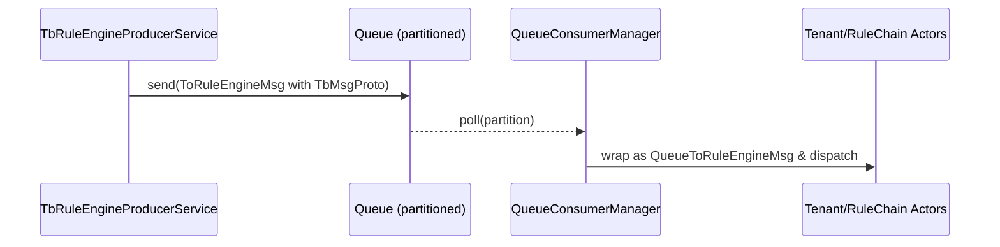
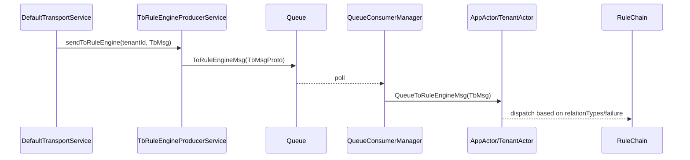

# Rule Engine Queues and Actor Routing

## Language & Context

- Language: Java (server-side)
- Domain: How `TbMsg` moves through partitioned queues into actors that drive rule chains.

Key source files:

- common/queue/src/main/java/org/thingsboard/server/queue/common/TbRuleEngineProducerService.java
- common/message/src/main/java/org/thingsboard/server/common/msg/queue/QueueToRuleEngineMsg.java
- common/message/src/main/java/org/thingsboard/server/common/msg/TbRuleEngineActorMsg.java
- application/src/main/java/org/thingsboard/server/service/queue/ruleengine/TbRuleEngineQueueConsumerManager.java (consumption)

## Produce → Partition → Consume

`TbRuleEngineProducerService` partitions and publishes `TbMsg` to the Rule Engine queue(s).



### Partitioning Details

- Resolves partitions via `PartitionService.resolveAll(ServiceType.TB_RULE_ENGINE, queueName, tenantId, originator)`
- If multiple partitions are returned, clones the `TbMsg` per partition:
  - Sets a shared `correlationId`
  - Assigns per-message `partition`
  - Keeps first message’s `id`, others get new UUIDs

```mermaid
flowchart TD
  A[TbMsg] --> B[resolveAll partitions]
  B -->|N>1| C[Loop partitions]
  C --> D[transform(): id/correlationId/partition]
  D --> E[send(partition i)]
```

## Actor Envelope: QueueToRuleEngineMsg

- Wraps `TbMsg` with `tenantId`, optional `relationTypes`, and an optional `failureMessage`
- Implements `TbRuleEngineActorMsg`, enabling polymorphic routing
- On actor stop, calls `msg.callback.onFailure(...)` with a meaningful reason
- `isTellNext()`: whether `relationTypes` exist to drive `tellNext` routing

## End-to-End Context

- Producers: Transport, REST, and other services call `sendToRuleEngine(...)`
- Consumers: `TbRuleEngineQueueConsumerManager` deserializes protobuf to `TbMsg`, creates `QueueToRuleEngineMsg`, and pushes to the actor system (Tenant → RuleChain → RuleNode)



## Relation Routing Internals (onTellNext)

This is how the Rule Chain actor decides where to send a message after a node calls `tellNext`/`tellSuccess`/`tellFailure`.

```mermaid
flowchart TD
  S[onTellNext(msg, originNode, relationTypes)] --> V{Node routes exist?}
  V -- no --> NREL[No outbound relations]
  NREL --> CBF{Contains FAILURE?}
  CBF -- yes --> FAIL[callback.onFailure(exception)]
  CBF -- no --> SUCC[callback.onSuccess()]
  V -- yes --> FLT[Filter relations by relationTypes]
  FLT --> CNT{Count}
  CNT -- 1 --> ONE[pushToTarget]
  ONE --> TPI{tpi.isMyPartition?}
  TPI -- yes --> RN{Target type}
  RN -- RULE_NODE --> PUSHNODE[pushMsgToNode]
  RN -- RULE_CHAIN --> RCRC[RuleChainToRuleChainMsg]
  TPI -- no --> PUTQ[putToQueue(newMsg per target)]
  CNT -- >1 --> MULTI[Multiple targets]
  MULTI --> WRAP[MultipleTbQueueTbMsgCallbackWrapper]
  WRAP --> PUTQ
```

Key references:

- RuleChain routing: application/src/main/java/org/thingsboard/server/actors/ruleChain/RuleChainActorMessageProcessor.java (`onTellNext`, `pushToTarget`, `putToQueue`)
- Message cloning for cross-partition: `putToQueue` creates new `TbMsg` ids for forwarded messages to other partitions or rule chains

Practical outcome:

- Single matching relation within same partition delivers directly to the target node
- Multiple relations wrap callbacks and fan-out via queue
- No matching relations resolves to success or failure callback depending on requested relation types

## Hands-on: Trace This Flow

Walk through a real message across producer → queue → actors and observe `onTellNext` decisions:

- See: ../labs/queue-actor-tracing-lab.md

## Best Practices

- Preserve `queueName` on `TbMsg` for correct partition resolution
- Use `correlationId` for multi-partition tracing
- Ensure `callback` is present when upstream expects delivery acks (e.g., transport pack)

## References

- common/queue/src/main/java/org/thingsboard/server/queue/common/TbRuleEngineProducerService.java
- common/message/src/main/java/org/thingsboard/server/common/msg/queue/QueueToRuleEngineMsg.java
- application/src/main/java/org/thingsboard/server/service/queue/ruleengine/TbRuleEngineQueueConsumerManager.java

---

Previous: transport-to-rule-engine-flow.md · Next: tb-context-and-services.md
