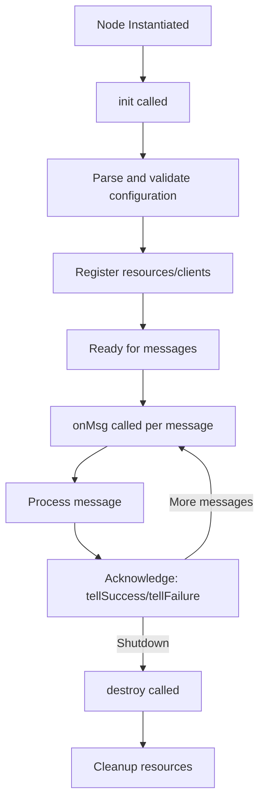
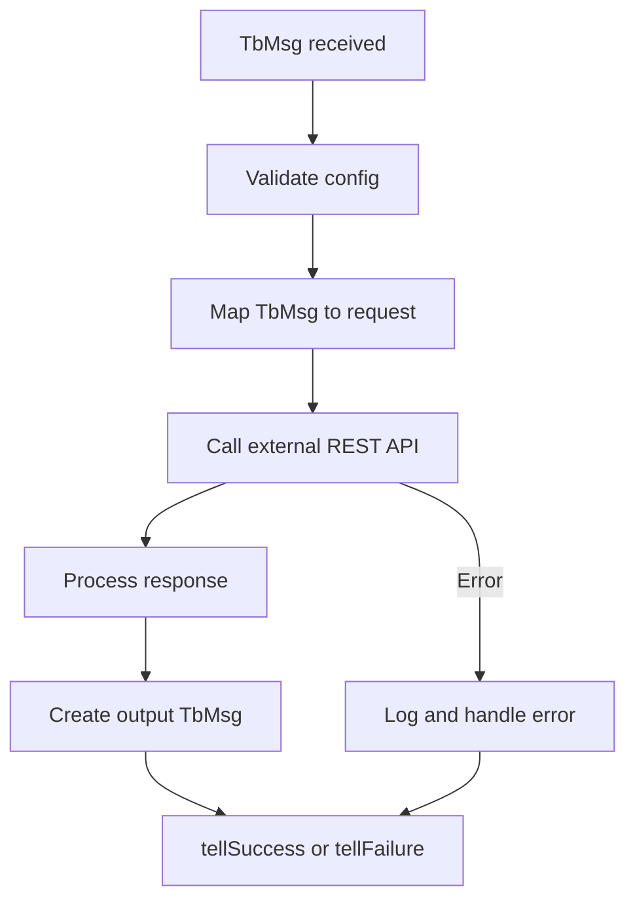

# Rule Node Implementation Guide

## Overview

This guide provides comprehensive documentation for implementing custom rule engine nodes in ThingsBoard. It covers the node interface, lifecycle, configuration, error handling, testing, and common patterns.

---

## Node Interface

All rule nodes must implement the `TbNode` interface:

```java
public interface TbNode {
    void init(TbContext ctx, TbNodeConfiguration configuration) throws TbNodeException;
    void onMsg(TbContext ctx, TbMsg msg) throws ExecutionException, InterruptedException, TbNodeException;
    default void destroy() {}
}
```

### @RuleNode Annotation

Nodes must be annotated with `@RuleNode` for discovery and UI integration:

```java
@RuleNode(
    type = ComponentType.ACTION,
    name = "My Custom Node",
    configClazz = MyNodeConfiguration.class,
    nodeDescription = "Performs custom action",
    nodeDetails = "Detailed description of node behavior",
    uiResources = {"static/rulenode/custom.js"},
    configDirective = "tbActionNodeMyCustomConfig"
)
public class MyCustomNode implements TbNode {
    // Implementation
}
```

| Property | Description |
|----------|-------------|
| `type` | ComponentType (FILTER, ENRICHMENT, TRANSFORMATION, ACTION, EXTERNAL) |
| `name` | Display name in UI |
| `configClazz` | Configuration class |
| `nodeDescription` | Short description |
| `nodeDetails` | Detailed HTML description |
| `uiResources` | JavaScript resources for UI |
| `configDirective` | Angular directive for configuration |

---

## Node Lifecycle



### init()

Called once when the node is created:

```java
@Override
public void init(TbContext ctx, TbNodeConfiguration configuration) throws TbNodeException {
    // Parse configuration
    this.config = TbNodeUtils.convert(configuration, MyNodeConfiguration.class);
    
    // Validate required fields
    if (StringUtils.isEmpty(config.getEndpoint())) {
        throw new TbNodeException("Endpoint is required");
    }
    
    // Initialize resources
    this.httpClient = HttpClient.newBuilder().build();
}
```

### onMsg()

Called for each message - **must always acknowledge**:

```java
@Override
public void onMsg(TbContext ctx, TbMsg msg) throws TbNodeException {
    try {
        // Process message
        String result = processMessage(msg);
        
        // Create output message
        TbMsg outMsg = TbMsg.transformMsg(msg, msg.getType(), msg.getOriginator(), 
            msg.getMetaData(), result);
        
        // Acknowledge success
        ctx.tellSuccess(outMsg);
    } catch (Exception e) {
        // Acknowledge failure
        ctx.tellFailure(msg, e);
    }
}
```

### destroy()

Called on shutdown for cleanup:

```java
@Override
public void destroy() {
    if (httpClient != null) {
        // Cleanup resources
    }
}
```

---

## Configuration

### Configuration Class

```java
@Data
public class MyNodeConfiguration implements NodeConfiguration<MyNodeConfiguration> {
    private String endpoint;
    private int timeout;
    private boolean logPayload;
    
    @Override
    public MyNodeConfiguration defaultConfiguration() {
        MyNodeConfiguration config = new MyNodeConfiguration();
        config.setEndpoint("http://localhost:8080");
        config.setTimeout(5000);
        config.setLogPayload(false);
        return config;
    }
}
```

### Configuration Upgrade

Support backward compatibility when configuration schema changes:

```java
@Override
public void init(TbContext ctx, TbNodeConfiguration configuration) throws TbNodeException {
    this.config = TbNodeUtils.convert(configuration, MyNodeConfiguration.class);
    
    // Handle legacy configuration
    if (config.getVersion() < 2) {
        config = migrateFromV1(config);
    }
}
```

---

## Message Routing

### Routing Methods

| Method | Description |
|--------|-------------|
| `tellSuccess(msg)` | Route to SUCCESS relations |
| `tellNext(msg, type)` | Route to specific relation |
| `tellNext(msg, types)` | Route to multiple relations |
| `tellFailure(msg, error)` | Route to FAILURE relation |
| `tellSelf(msg, delay)` | Requeue after delay (non-persistent) |

### Multi-Output Node

```java
@Override
public void onMsg(TbContext ctx, TbMsg msg) throws TbNodeException {
    JsonNode data = JacksonUtil.toJsonNode(msg.getData());
    double value = data.get("temperature").asDouble();
    
    if (value > 30) {
        ctx.tellNext(msg, "High");
    } else if (value < 10) {
        ctx.tellNext(msg, "Low");
    } else {
        ctx.tellNext(msg, "Normal");
    }
}
```

### Branching Messages

```java
@Override
public void onMsg(TbContext ctx, TbMsg msg) throws TbNodeException {
    // Copy metadata for each branch
    TbMsgMetaData meta1 = msg.getMetaData().copy();
    meta1.putValue("branch", "primary");
    
    TbMsgMetaData meta2 = msg.getMetaData().copy();
    meta2.putValue("branch", "secondary");
    
    TbMsg msg1 = TbMsg.transformMsg(msg, msg.getType(), msg.getOriginator(), meta1, msg.getData());
    TbMsg msg2 = TbMsg.transformMsg(msg, msg.getType(), msg.getOriginator(), meta2, msg.getData());
    
    ctx.tellNext(msg1, "Primary");
    ctx.tellNext(msg2, "Secondary");
}
```

---

## Async Processing

### Using Executors

```java
@Override
public void onMsg(TbContext ctx, TbMsg msg) throws TbNodeException {
    ListenableFuture<String> future = ctx.getExternalCallExecutor().submit(() -> {
        // Blocking I/O operation
        return callExternalApi(msg);
    });
    
    Futures.addCallback(future, new FutureCallback<String>() {
        @Override
        public void onSuccess(String result) {
            TbMsg outMsg = TbMsg.transformMsg(msg, msg.getType(), 
                msg.getOriginator(), msg.getMetaData(), result);
            ctx.tellSuccess(outMsg);
        }
        
        @Override
        public void onFailure(Throwable t) {
            ctx.tellFailure(msg, t);
        }
    }, ctx.getDbCallbackExecutor());
}
```

### Using CompletableFuture

```java
@Override
public void onMsg(TbContext ctx, TbMsg msg) throws TbNodeException {
    CompletableFuture.supplyAsync(() -> processAsync(msg), ctx.getExternalCallExecutor())
        .thenAccept(result -> {
            TbMsg outMsg = TbMsg.transformMsg(msg, msg.getType(), 
                msg.getOriginator(), msg.getMetaData(), result);
            ctx.tellSuccess(outMsg);
        })
        .exceptionally(t -> {
            ctx.tellFailure(msg, t);
            return null;
        });
}
```

---

## Service Access

### Available Services

```java
// Entity services
ctx.getDeviceService();
ctx.getAssetService();
ctx.getCustomerService();
ctx.getTenantService();

// Data services
ctx.getAttributesService();
ctx.getTimeseriesService();
ctx.getRelationService();

// Messaging services
ctx.getRpcService();
ctx.getNotificationCenter();
ctx.getMailService();
ctx.getSmsService();

// Caching
ctx.getDeviceProfileCache();
ctx.getAssetProfileCache();
```

### Example: Fetching Attributes

```java
@Override
public void onMsg(TbContext ctx, TbMsg msg) throws TbNodeException {
    ListenableFuture<List<AttributeKvEntry>> future = ctx.getAttributesService()
        .find(ctx.getTenantId(), msg.getOriginator(), DataConstants.SERVER_SCOPE, 
            Arrays.asList("threshold", "enabled"));
    
    Futures.addCallback(future, new FutureCallback<>() {
        @Override
        public void onSuccess(List<AttributeKvEntry> attrs) {
            // Process attributes
            ctx.tellSuccess(msg);
        }
        
        @Override
        public void onFailure(Throwable t) {
            ctx.tellFailure(msg, t);
        }
    }, ctx.getDbCallbackExecutor());
}
```

---

## Error Handling

### Exception Types

| Exception | Usage |
|-----------|-------|
| `TbNodeException` | Configuration or initialization errors |
| `RuntimeException` | Unexpected processing errors |

### Error Patterns

```java
@Override
public void onMsg(TbContext ctx, TbMsg msg) {
    try {
        // Validate input
        if (!isValid(msg)) {
            throw new IllegalArgumentException("Invalid message format");
        }
        
        // Process
        String result = process(msg);
        ctx.tellSuccess(TbMsg.transformMsg(msg, msg.getType(), 
            msg.getOriginator(), msg.getMetaData(), result));
            
    } catch (IllegalArgumentException e) {
        // Validation error - route to failure
        ctx.tellFailure(msg, e);
    } catch (Exception e) {
        // Log and fail
        log.error("Processing failed for msg: {}", msg.getId(), e);
        ctx.tellFailure(msg, e);
    }
}
```

### Retry Pattern

```java
private static final int MAX_RETRIES = 3;

@Override
public void onMsg(TbContext ctx, TbMsg msg) throws TbNodeException {
    int retryCount = getRetryCount(msg);
    
    try {
        callExternalService(msg);
        ctx.tellSuccess(msg);
    } catch (TransientException e) {
        if (retryCount < MAX_RETRIES) {
            TbMsgMetaData meta = msg.getMetaData().copy();
            meta.putValue("retryCount", String.valueOf(retryCount + 1));
            TbMsg retryMsg = TbMsg.transformMsg(msg, msg.getType(), 
                msg.getOriginator(), meta, msg.getData());
            ctx.tellSelf(retryMsg, 1000 * (retryCount + 1));
        } else {
            ctx.tellFailure(msg, e);
        }
    }
}
```

---

## Integration Nodes

### REST API Integration



```java
@RuleNode(type = ComponentType.EXTERNAL, name = "REST API Call", ...)
public class TbRestCallNode implements TbNode {
    private WebClient webClient;
    
    @Override
    public void init(TbContext ctx, TbNodeConfiguration configuration) throws TbNodeException {
        this.config = TbNodeUtils.convert(configuration, RestCallNodeConfiguration.class);
        this.webClient = WebClient.builder()
            .baseUrl(config.getEndpoint())
            .build();
    }
    
    @Override
    public void onMsg(TbContext ctx, TbMsg msg) {
        webClient.post()
            .bodyValue(msg.getData())
            .retrieve()
            .bodyToMono(String.class)
            .subscribe(
                result -> ctx.tellSuccess(TbMsg.transformMsg(msg, msg.getType(), 
                    msg.getOriginator(), msg.getMetaData(), result)),
                error -> ctx.tellFailure(msg, error)
            );
    }
}
```

---

## Testing

### Unit Testing

```java
public class MyCustomNodeTest {
    private MyCustomNode node;
    private TbContext ctx;
    private TbNodeConfiguration config;
    
    @Before
    public void setUp() throws TbNodeException {
        ctx = mock(TbContext.class);
        node = new MyCustomNode();
        
        MyNodeConfiguration nodeConfig = new MyNodeConfiguration();
        nodeConfig.setEndpoint("http://test.com");
        config = new TbNodeConfiguration(JacksonUtil.valueToTree(nodeConfig));
        
        node.init(ctx, config);
    }
    
    @Test
    public void testOnMsg_Success() throws Exception {
        TbMsg msg = TbMsg.newMsg("TEST", DeviceId.fromString("..."), 
            new TbMsgMetaData(), "{}");
        
        node.onMsg(ctx, msg);
        
        verify(ctx).tellSuccess(any(TbMsg.class));
        verify(ctx, never()).tellFailure(any(), any());
    }
    
    @Test
    public void testOnMsg_Failure() throws Exception {
        TbMsg msg = TbMsg.newMsg("TEST", DeviceId.fromString("..."), 
            new TbMsgMetaData(), "invalid");
        
        node.onMsg(ctx, msg);
        
        verify(ctx).tellFailure(any(TbMsg.class), any(Exception.class));
    }
}
```

### Integration Testing

```java
@SpringBootTest
public class MyCustomNodeIntegrationTest {
    @Autowired
    private RuleEngineService ruleEngineService;
    
    @Test
    public void testNodeInRuleChain() {
        // Create rule chain with custom node
        // Send message
        // Verify output
    }
}
```

---

## Best Practices

### Do's

- Always acknowledge messages with `tellSuccess`/`tellFailure`
- Validate configuration in `init()`
- Use `TbMsgType` enum instead of strings
- Offload blocking I/O to executors
- Copy metadata when branching messages
- Log errors with context (node ID, message ID)
- Support configuration upgrade for backward compatibility

### Don'ts

- Don't block in `onMsg()` - use async patterns
- Don't use `tellSelf` for critical retries (non-persistent)
- Don't access services outside `TbContext`
- Don't store message-specific state in node fields
- Don't ignore exceptions

---

## Common Pitfalls

| Pitfall | Solution |
|---------|----------|
| Missing acknowledgment | Always call `tellSuccess` or `tellFailure` |
| Blocking I/O in onMsg | Use executors or async clients |
| Shared mutable state | Nodes should be stateless for messages |
| Memory leaks | Clean up resources in `destroy()` |
| Infinite loops | Use retry counters and limits |

---

## See Also

- [Rule Engine Core](rule-engine-core.md)
- [Rule Node Inventory](rule-node-inventory.md)
- [Script Engine](script-engine.md)
