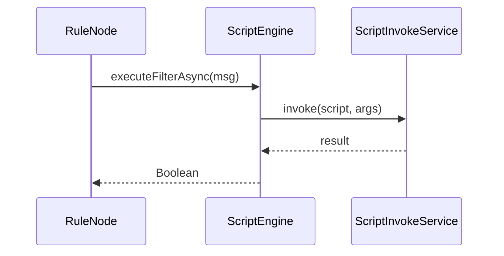

# Script Engine Specification

## Overview

This document describes the scripting APIs available in ThingsBoard for rule node logic, including JavaScript and TBEL (ThingsBoard Expression Language).

---

## Key Interfaces

### ScriptEngine

| Method | Return Type | Description |
|--------|-------------|-------------|
| executeUpdateAsync(TbMsg) | ListenableFuture<List<TbMsg>> | Transform and return updated messages |
| executeGenerateAsync(TbMsg) | ListenableFuture<TbMsg> | Generate a new message |
| executeFilterAsync(TbMsg) | ListenableFuture<Boolean> | Filter: return true to pass |
| executeSwitchAsync(TbMsg) | ListenableFuture<Set<String>> | Return relation labels for routing |
| executeJsonAsync(TbMsg) | ListenableFuture<JsonNode> | Return arbitrary JSON |
| executeToStringAsync(TbMsg) | ListenableFuture<String> | Return string result |
| destroy() | void | Clean up resources |

### ScriptInvokeService

Responsible for invoking scripts in a sandboxed environment:

- Tracks script execution statistics
- Handles blocked script detection
- Manages script execution tasks

### RuleNodeScriptFactory

Creates script engines for rule nodes, supporting:

- JavaScript (via remote JS executor)
- TBEL (ThingsBoard Expression Language)

---

## Script Types

| Type | Return | Purpose |
|------|--------|---------|
| Filter | Boolean | Allow/deny message flow |
| Transform | TbMsg or List | Modify message |
| Switch | Set<String> | Route to relation labels |
| Generate | TbMsg | Create new message |
| ToJson | JsonNode | Return JSON result |
| ToString | String | Return string result |

---

## Execution Model



---

## Script Context Variables

### Available in All Scripts

| Variable | Type | Description |
|----------|------|-------------|
| msg | Object | Parsed message payload (JSON) |
| metadata | Object | Message metadata key-value map |
| msgType | String | Message type (e.g., POST_TELEMETRY_REQUEST) |

### Additional Variables

| Script Type | Additional Variables |
|-------------|---------------------|
| Generate | prevMsg (previous message payload) |

---

## TBEL (ThingsBoard Expression Language)

TBEL is a high-performance expression language optimized for IoT data processing.

### Key Features

| Feature | Description |
|---------|-------------|
| JSON Native | Direct JSON object/array manipulation |
| Math Functions | Built-in math operations |
| String Operations | Comprehensive string manipulation |
| Date/Time | Date parsing and formatting |
| Type Coercion | Automatic type conversion |
| Null Safety | Safe navigation operators |

### TBEL vs JavaScript

| Aspect | TBEL | JavaScript |
|--------|------|------------|
| Execution Speed | ~10x faster | Standard |
| Memory Usage | Lower | Higher |
| Sandboxing | Built-in | Requires isolation |
| Syntax | Expression-focused | Full language |
| Use Case | Simple transforms | Complex logic |

---

## Built-in Functions

### Math Functions

```javascript
Math.abs(x), Math.ceil(x), Math.floor(x), Math.round(x)
Math.min(a, b), Math.max(a, b), Math.pow(base, exp)
Math.sqrt(x), Math.log(x), Math.random()
```

### String Functions

```javascript
str.length(), str.substring(start, end)
str.indexOf(substr), str.replace(old, new)
str.split(delimiter), str.trim()
str.toUpperCase(), str.toLowerCase()
str.startsWith(prefix), str.endsWith(suffix)
```

### JSON Functions

```javascript
JSON.stringify(obj), JSON.parse(str)
obj.keys(), obj.values(), obj.entries()
```

### Date Functions

```javascript
new Date(), Date.now()
date.getTime(), date.toISOString()
dateFormat(date, pattern)
```

### Binary Functions

```javascript
btoa(str), atob(encoded)
bytesToString(bytes, encoding)
stringToBytes(str, encoding)
```

---

## Script Examples

### Filter Script (TBEL)

```javascript
// Allow messages where temperature exceeds threshold
return msg.temperature > 25;
```

### Transform Script (TBEL)

```javascript
// Convert Fahrenheit to Celsius
var celsius = (msg.temperature - 32) * 5 / 9;
return {
  msg: { temperature: celsius, unit: 'C' },
  metadata: metadata,
  msgType: msgType
};
```

### Switch Script (TBEL)

```javascript
// Route based on severity
if (msg.temperature > 50) {
  return ['Critical'];
} else if (msg.temperature > 30) {
  return ['Warning'];
} else {
  return ['Normal'];
}
```

### Generate Script (JavaScript)

```javascript
// Create a new alarm message
var newMsg = {
  alarmType: 'High Temperature',
  severity: 'CRITICAL',
  details: {
    value: msg.temperature,
    threshold: 50
  }
};
return { msg: newMsg, metadata: metadata, msgType: 'ALARM' };
```

### Complex Transform (JavaScript)

```javascript
// Aggregate multiple sensors
var sensors = msg.sensors || [];
var avg = 0;
if (sensors.length > 0) {
  var sum = sensors.reduce(function(a, b) { return a + b; }, 0);
  avg = sum / sensors.length;
}

var result = {
  averageTemperature: avg,
  sensorCount: sensors.length,
  timestamp: Date.now()
};

return { msg: result, metadata: metadata, msgType: msgType };
```

---

## Metadata Manipulation

### Reading Metadata

```javascript
var deviceName = metadata['deviceName'];
var deviceType = metadata['deviceType'];
var timestamp = metadata['ts'];
```

### Modifying Metadata

```javascript
// In transform script
metadata['processed'] = 'true';
metadata['processingTime'] = String(Date.now());
return { msg: msg, metadata: metadata, msgType: msgType };
```

---

## Error Handling

### Exception Types

| Exception | Description |
|-----------|-------------|
| TbScriptException | Script execution failed |
| BlockedScriptInfo | Script exceeded error thresholds |

### Script Blocking

Scripts that repeatedly fail are blocked to prevent system degradation:

| Configuration | Description |
|---------------|-------------|
| script.execution.max_errors | Max errors before blocking |
| script.execution.block_duration | Block duration in seconds |

---

## Performance Considerations

### Do's

- Use TBEL for simple transformations
- Keep scripts focused and minimal
- Use built-in functions over custom logic
- Pre-compute values when possible
- Return early when filtering

### Don'ts

- Don't use infinite loops
- Don't make external calls from scripts
- Don't allocate large objects
- Don't store state between executions
- Don't use complex regular expressions

---

## Script Configuration

### Remote JS Executor

```yaml
js:
  evaluator: remote
  remote:
    host: localhost
    port: 8080
    max_pending_requests: 10000
    max_eval_requests_per_second: 200
```

### TBEL Configuration

```yaml
tbel:
  enabled: true
  max_script_body_size: 100000
  max_memory_limit_mb: 8
  max_errors: 3
```

---

## Testing Scripts

### Unit Testing Pattern

```java
@Test
void testFilterScript() throws Exception {
    String script = "return msg.temperature > 25;";
    ScriptEngine engine = factory.createEngine(ScriptType.FILTER, script);
    
    TbMsg msg = createMessage("{\"temperature\": 30}");
    Boolean result = engine.executeFilterAsync(msg).get();
    
    assertTrue(result);
}
```

### Debug Logging

```javascript
// Log values for debugging (visible in rule engine logs)
var debug = {
  input: msg,
  metadata: metadata,
  calculated: someValue
};
// Use only during development
```

---

## Best Practices

| Practice | Recommendation |
|----------|----------------|
| Language Choice | TBEL for simple, JS for complex |
| Error Handling | Validate inputs, handle nulls |
| Performance | Minimize object creation |
| Testing | Test scripts in isolation |
| Debugging | Use script test feature in UI |

---

## See Also

- [Rule Engine Core](rule-engine-core.md)
- [Rule Node Implementation Guide](rule-node-implementation-guide.md)
