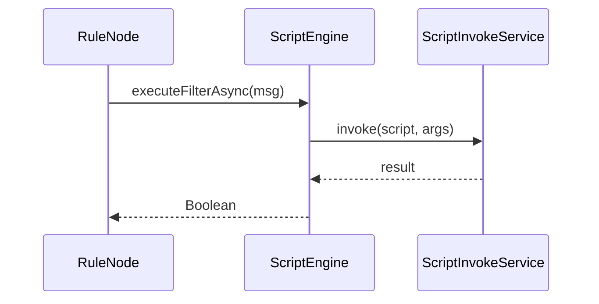

# Script Engine API Specification

## Overview

This document describes the scripting APIs available in ThingsBoard for rule node logic. Scripts are used for message transformation, filtering, switching, and custom logic within rule chains.

---

## Key Interfaces

### ScriptEngine

Located at: `org/thingsboard/rule/engine/api/ScriptEngine.java`

| Method                        | Return Type                   | Description                               |
|-------------------------------|-------------------------------|-------------------------------------------|
| executeUpdateAsync(TbMsg)     | ListenableFuture<List<TbMsg>> | Transform and return updated messages     |
| executeGenerateAsync(TbMsg)   | ListenableFuture<TbMsg>       | Generate a new message from the input     |
| executeFilterAsync(TbMsg)     | ListenableFuture<Boolean>     | Filter: return true to pass, false to drop|}
| executeSwitchAsync(TbMsg)     | ListenableFuture<Set<String>> | Return set of relation labels for routing |
| executeJsonAsync(TbMsg)       | ListenableFuture<JsonNode>    | Return arbitrary JSON result              |
| executeToStringAsync(TbMsg)   | ListenableFuture<String>      | Return string result                      |
| destroy()                     | void                          | Clean up resources                        |

### ScriptInvokeService

Responsible for invoking scripts in a sandboxed, managed environment.

- Tracks script execution statistics
- Handles blocked script detection
- Manages script execution tasks

### RuleNodeScriptFactory

Creates script engines for rule nodes, supporting:

- JavaScript (via remote JS executor)
- TBEL (ThingsBoard Expression Language)

---

## Script Types

- **Filter:** Returns boolean; used to allow/deny message flow
- **Transform:** Returns TbMsg or list; modifies message
- **Switch:** Returns set of relation labels for routing
- **Generate:** Creates a new message
- **ToJson:** Returns JsonNode
- **ToString:** Returns string

---

## Execution Model

---

## Error Handling

- `TbScriptException`: Thrown when script execution fails
- `BlockedScriptInfo`: Tracks scripts that have exceeded error thresholds

---

## Best Practices

- Keep scripts short and focused
- Avoid blocking operations in scripts
- Use TBEL for performance-critical transformations
- Test scripts thoroughly before deployment

---

## See Also

- [TbContext & Services](tb-context-and-services.md)
- [Rule Engine Core Interfaces](rule-engine-core-interfaces.md)
