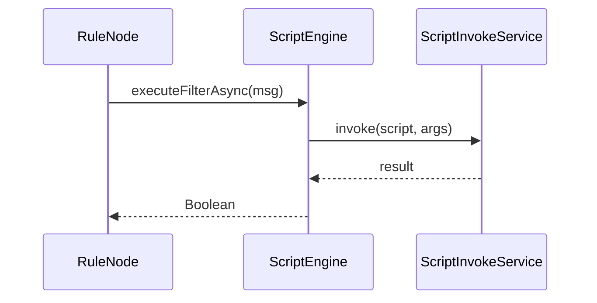
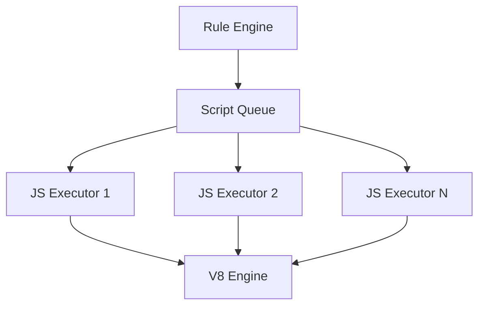
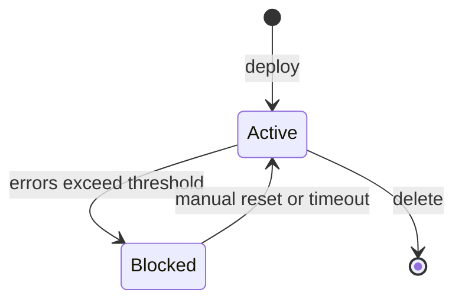

# Script Engine API Specification

## Overview

This document describes the scripting APIs available in ThingsBoard for rule node logic. Scripts are used for message transformation, filtering, switching, and custom logic within rule chains.

---

## Key Interfaces

### ScriptEngine

Located at: `org/thingsboard/rule/engine/api/ScriptEngine.java`

| Method                        | Return Type                   | Description                               |
|-------------------------------|-------------------------------|-------------------------------------------|
| executeUpdateAsync(TbMsg)     | ListenableFuture<List<TbMsg>> | Transform and return updated messages     |
| executeGenerateAsync(TbMsg)   | ListenableFuture<TbMsg>       | Generate a new message from the input     |
| executeFilterAsync(TbMsg)     | ListenableFuture<Boolean>     | Filter: return true to pass, false to drop|}
| executeSwitchAsync(TbMsg)     | ListenableFuture<Set<String>> | Return set of relation labels for routing |
| executeJsonAsync(TbMsg)       | ListenableFuture<JsonNode>    | Return arbitrary JSON result              |
| executeToStringAsync(TbMsg)   | ListenableFuture<String>      | Return string result                      |
| destroy()                     | void                          | Clean up resources                        |

### ScriptInvokeService

Responsible for invoking scripts in a sandboxed, managed environment.

- Tracks script execution statistics
- Handles blocked script detection
- Manages script execution tasks

### RuleNodeScriptFactory

Creates script engines for rule nodes, supporting:

- JavaScript (via remote JS executor)
- TBEL (ThingsBoard Expression Language)

---

## Script Types

- **Filter:** Returns boolean; used to allow/deny message flow
- **Transform:** Returns TbMsg or list; modifies message
- **Switch:** Returns set of relation labels for routing
- **Generate:** Creates a new message
- **ToJson:** Returns JsonNode
- **ToString:** Returns string

---

## Execution Model



---

## Error Handling

- `TbScriptException`: Thrown when script execution fails
- `BlockedScriptInfo`: Tracks scripts that have exceeded error thresholds

---

## TBEL (ThingsBoard Expression Language)

TBEL is a high-performance expression language optimized for IoT data processing.

### Key Features

| Feature           | Description                                      |
|-------------------|--------------------------------------------------|
| JSON Native       | Direct JSON object/array manipulation            |
| Math Functions    | Built-in math operations                         |
| String Operations | Comprehensive string manipulation                |
| Date/Time         | Date parsing and formatting                      |
| Type Coercion     | Automatic type conversion                        |
| Null Safety       | Safe navigation operators                        |

### Built-in Functions

```javascript
// Math
Math.abs(x), Math.ceil(x), Math.floor(x), Math.round(x)
Math.min(a, b), Math.max(a, b), Math.pow(base, exp)
Math.sqrt(x), Math.log(x), Math.random()

// String
str.length(), str.substring(start, end)
str.indexOf(substr), str.replace(old, new)
str.split(delimiter), str.trim()
str.toUpperCase(), str.toLowerCase()
str.startsWith(prefix), str.endsWith(suffix)

// JSON
JSON.stringify(obj), JSON.parse(str)
obj.keys(), obj.values(), obj.entries()

// Date
new Date(), Date.now()
date.getTime(), date.toISOString()
dateFormat(date, pattern)

// Base64
btoa(str), atob(encoded)

// Binary
bytesToString(bytes, encoding)
stringToBytes(str, encoding)
```

### TBEL vs JavaScript Comparison

| Aspect            | TBEL                        | JavaScript                   |
|-------------------|-----------------------------|------------------------------|
| Execution Speed   | ~10x faster                 | Standard V8/Nashorn          |
| Memory Usage      | Lower                       | Higher                       |
| Sandboxing        | Built-in                    | Requires isolation           |
| Syntax            | Expression-focused          | Full language                |
| Use Case          | Simple transforms           | Complex logic                |

---

## Script Context Variables

### Available in All Scripts

| Variable    | Type        | Description                                      |
|-------------|-------------|--------------------------------------------------|
| msg         | Object      | Parsed message payload (JSON)                    |
| metadata    | Object      | Message metadata key-value map                   |
| msgType     | String      | Message type (e.g., POST_TELEMETRY_REQUEST)      |

### Additional Variables by Script Type

| Script Type | Additional Variables                             |
|-------------|--------------------------------------------------|
| Filter      | None                                             |
| Transform   | None                                             |
| Switch      | None                                             |
| Generate    | prevMsg (previous message payload)               |

---

## Script Examples

### Filter Script (TBEL)

```javascript
// Allow messages where temperature exceeds threshold
return msg.temperature > 25;
```

### Transform Script (TBEL)

```javascript
// Convert Fahrenheit to Celsius
var celsius = (msg.temperature - 32) * 5 / 9;
return {
  msg: { temperature: celsius, unit: 'C' },
  metadata: metadata,
  msgType: msgType
};
```

### Switch Script (TBEL)

```javascript
// Route based on severity
if (msg.temperature > 50) {
  return ['Critical'];
} else if (msg.temperature > 30) {
  return ['Warning'];
} else {
  return ['Normal'];
}
```

### Generate Script (JavaScript)

```javascript
// Create a new alarm message
var newMsg = {
  alarmType: 'High Temperature',
  severity: 'CRITICAL',
  details: {
    value: msg.temperature,
    threshold: 50
  }
};
return { msg: newMsg, metadata: metadata, msgType: 'ALARM' };
```

---

## Remote JavaScript Executor

For JavaScript execution, ThingsBoard uses a remote executor for isolation and scalability.

### Architecture



### Configuration

| Property                           | Description                          |
|------------------------------------|--------------------------------------|
| js.evaluator                       | local or remote                      |
| js.remote.max_pending_requests     | Max queued script requests           |
| js.remote.max_requests_timeout     | Request timeout (ms)                 |
| js.remote.stats.enabled            | Enable execution statistics          |

---

## Script Blocking and Recovery

### Blocking Detection

Scripts are automatically blocked when they:

- Exceed execution time limits
- Throw repeated errors
- Consume excessive memory

### Blocked Script Info

| Field              | Description                                      |
|--------------------|--------------------------------------------------|
| scriptId           | Unique script identifier                         |
| blockedReason      | Reason for blocking                              |
| blockedSince       | Timestamp when blocked                           |
| errorCount         | Number of errors before blocking                 |
| lastError          | Last error message                               |

### Recovery



---

## Performance Tuning

| Setting                  | Recommendation                                   |
|--------------------------|--------------------------------------------------|
| Script Timeout           | 3000ms for transform, 1000ms for filter          |
| Max Pending Requests     | 10000 for high-throughput systems                |
| TBEL vs JS               | Use TBEL for simple operations (10x faster)      |
| Script Caching           | Scripts are cached; avoid dynamic script changes |

---

## Best Practices

- Keep scripts short and focused
- Avoid blocking operations in scripts
- Use TBEL for performance-critical transformations
- Test scripts thoroughly before deployment

---

## See Also

- [TbContext & Services](tb-context-and-services.md)
- [Rule Engine Core Interfaces](rule-engine-core-interfaces.md)
