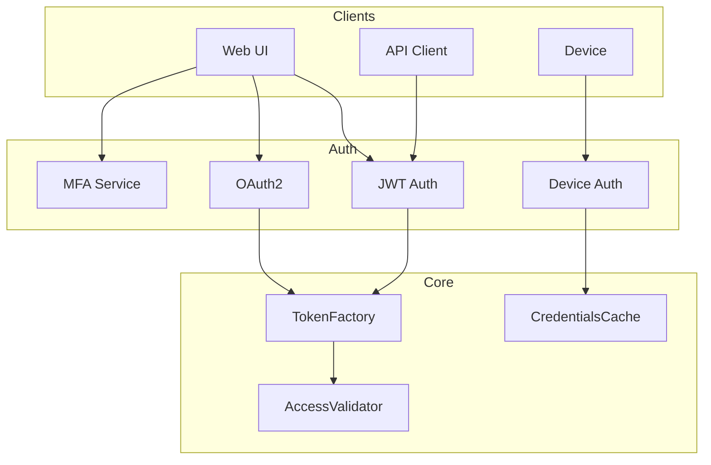
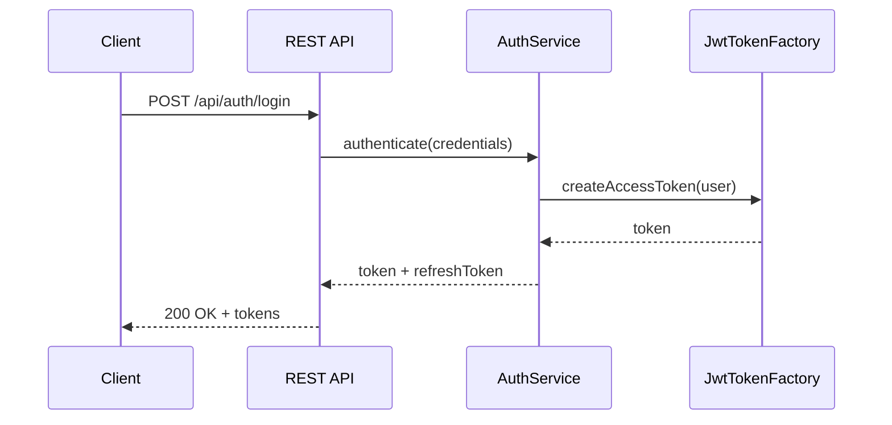
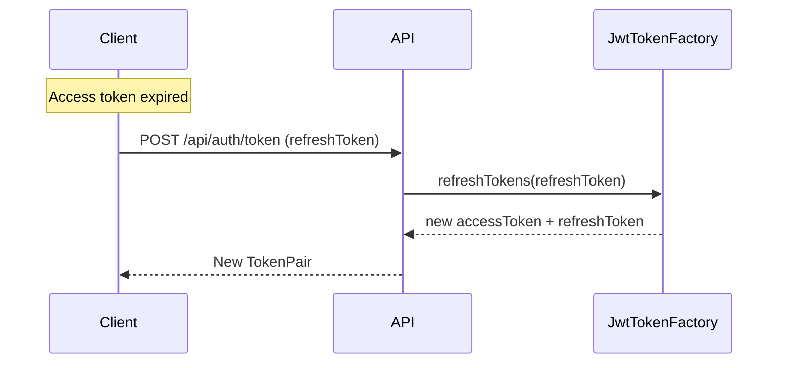
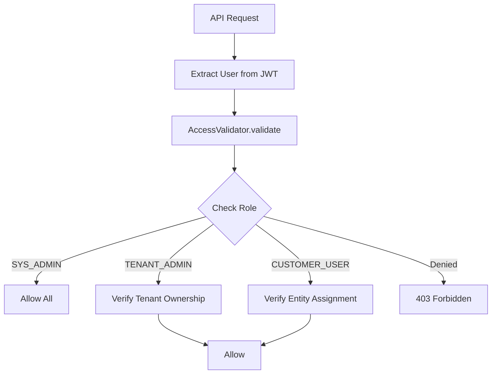
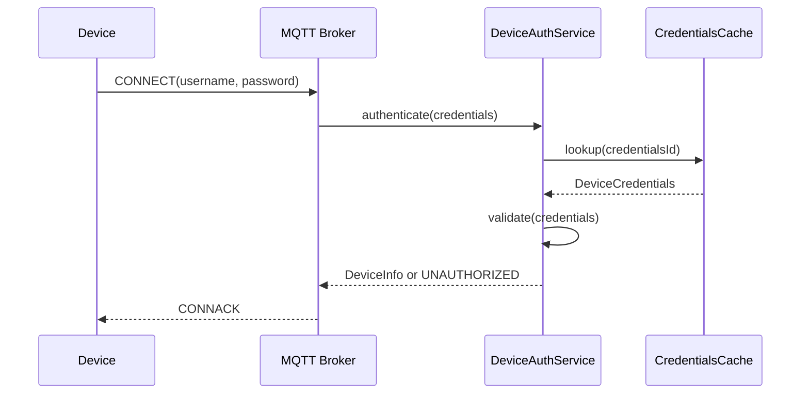
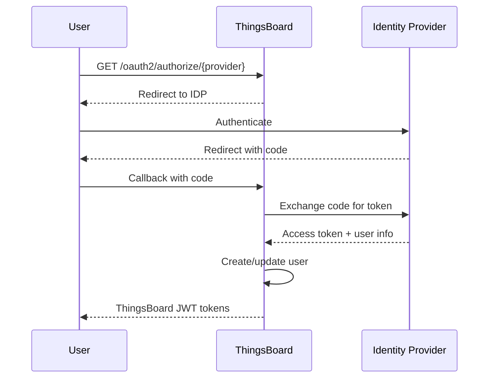
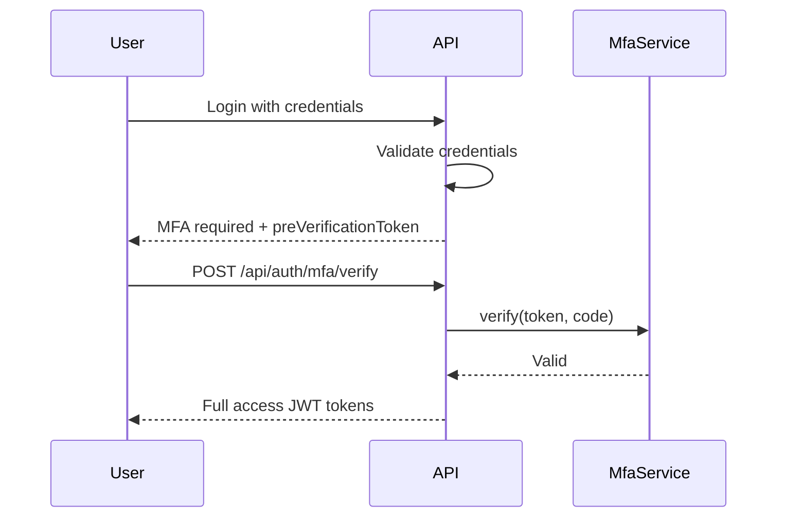

# Security and Authentication Specification

## Overview

This document describes the security, authentication, and authorization model in ThingsBoard, including JWT tokens, access validation, permission enforcement, OAuth2, and MFA.

---

## Authentication Architecture



---

## User Authentication

### JWT Token Flow



### Token Types

| Token | Lifetime | Purpose |
|-------|----------|---------|
| Access Token | Short (15-30 min) | API authentication |
| Refresh Token | Long (hours/days) | Obtain new access tokens |

### Access Token Claims

| Claim | Description |
|-------|-------------|
| sub | User ID (UUID) |
| scopes | Authorities (e.g., TENANT_ADMIN) |
| userId | User ID |
| firstName | User first name |
| lastName | User last name |
| enabled | Account enabled flag |
| tenantId | Tenant ID |
| customerId | Customer ID (if customer user) |
| isPublic | Public user flag |
| iat | Issued at timestamp |
| exp | Expiration timestamp |

### Token Refresh



---

## Authorization

### Role-Based Access Control

| Role | Permissions |
|------|-------------|
| SYS_ADMIN | Full system access |
| TENANT_ADMIN | Full tenant access, manage users/devices/assets |
| CUSTOMER_USER | Access to assigned devices/assets only |

### Permission Operations

```java
public enum Operation {
    READ, WRITE, DELETE, 
    RPC_CALL, CLAIM, 
    READ_CREDENTIALS, WRITE_CREDENTIALS,
    READ_ATTRIBUTES, WRITE_ATTRIBUTES,
    READ_TELEMETRY, WRITE_TELEMETRY,
    ASSIGN_TO_CUSTOMER, UNASSIGN_FROM_CUSTOMER
}
```

### Permission Check Flow



---

## Device Authentication

### Credential Types

| Type | Description |
|------|-------------|
| ACCESS_TOKEN | Simple token for HTTP/CoAP |
| X509_CERTIFICATE | Certificate auth for MQTT/CoAP |
| MQTT_BASIC | Username/password for MQTT |
| LWM2M_CREDENTIALS | LwM2M-specific credentials |

### Device Auth Flow



---

## Key Interfaces

### AccessValidator

| Method | Description |
|--------|-------------|
| validate(...) | Validate user access to an entity |
| validateEntityAndCallback(...) | Validate and invoke callback on result |

### TokenOutdatingService

| Method | Description |
|--------|-------------|
| isOutdated(token) | Check if a token has been invalidated |
| outdateOldUserTokens(userId) | Invalidate all tokens for a user |

---

## OAuth2 Integration

### Supported Providers

| Provider | Configuration |
|----------|---------------|
| Google | OAuth2 client credentials |
| GitHub | OAuth2 client credentials |
| Facebook | OAuth2 client credentials |
| Custom | OpenID Connect configuration |

### OAuth2 Flow



---

## Multi-Factor Authentication (MFA)

### Supported Methods

| Method | Description |
|--------|-------------|
| TOTP | Time-based one-time password (Google Auth) |
| SMS | SMS-based verification code |
| EMAIL | Email-based verification code |
| BACKUP_CODE | Pre-generated backup codes |

### MFA Flow



---

## Rate Limiting

| Limit Type | Description |
|------------|-------------|
| login.attempts | Max failed login attempts before lockout |
| login.lockout.duration | Account lockout duration (seconds) |
| api.rate.limit | Max API requests per time window |
| ws.rate.limit | WebSocket message rate limit |

---

## Security Headers

| Header | Value |
|--------|-------|
| X-Content-Type-Options | nosniff |
| X-Frame-Options | DENY |
| X-XSS-Protection | 1; mode=block |
| Content-Security-Policy | Configurable CSP policy |
| Strict-Transport-Security | max-age=31536000; includeSubDomains |

---

## Personal Access Tokens (PAT)

### Use Cases

- API automation without user credentials
- CI/CD pipeline integrations
- Third-party system access

### PAT Management

| Operation | Endpoint |
|-----------|----------|
| Create PAT | POST /api/user/personal-access-token |
| List PATs | GET /api/user/personal-access-tokens |
| Revoke PAT | DELETE /api/user/personal-access-token/{id} |

---

## Best Practices

### Do's

- Use short-lived access tokens with refresh
- Enforce MFA for admin accounts
- Scope API integrations with PATs
- Audit access and permission changes
- Use X.509 certificates for production devices
- Configure rate limiting for public endpoints

### Don'ts

- Don't store tokens in localStorage (use httpOnly cookies)
- Don't disable HTTPS in production
- Don't use shared device credentials
- Don't skip permission validation in custom code
- Don't expose admin endpoints publicly

---

## See Also

- [Transport Layer](transport-layer.md)
- [Device & Asset Management](device-asset-management.md)
- [Architecture Blueprint](architecture-blueprint.md)
