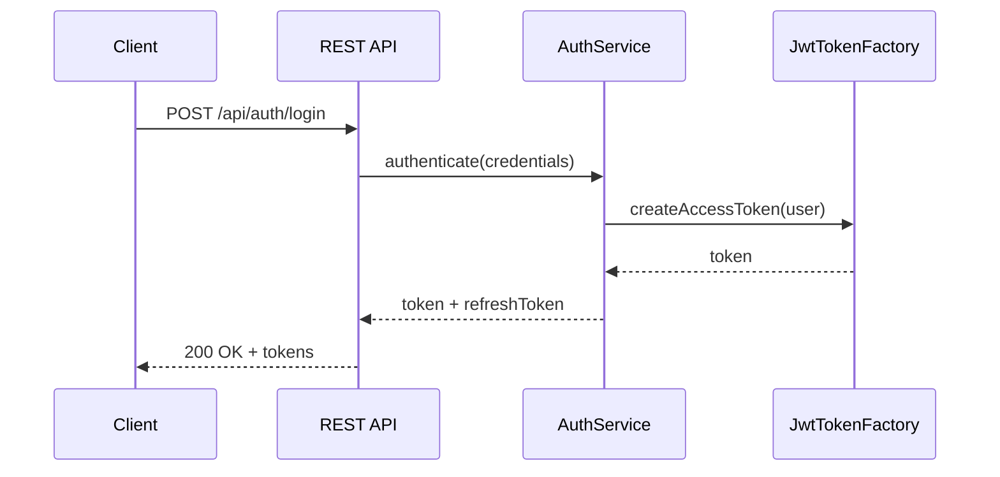

# Security and Authentication Specification

## Overview

This document describes the security, authentication, and authorization model in ThingsBoard, including JWT tokens, access validation, and permission enforcement.

---

## Key Components

### Authentication

- **JWT Tokens:** Used for REST API authentication
- **Refresh Tokens:** Allow session renewal without re-login
- **MFA:** Multi-factor authentication support
- **OAuth2:** External identity provider integration
- **Personal Access Tokens (PAT):** For API automation

### Authorization

- **Role-Based Access Control (RBAC):** Users assigned roles with specific permissions
- **Tenant Isolation:** All entities scoped to a tenant
- **Customer Isolation:** Customers see only their assigned devices/assets

---

## Key Interfaces

### AccessValidator

Located at: `org/thingsboard/server/service/security/AccessValidator.java`

| Method                | Description                                      |
|-----------------------|--------------------------------------------------|
| validate(...)         | Validate user access to an entity                |
| validateEntityAndCallback(...) | Validate and invoke callback on result  |

### TokenOutdatingService

Located at: `org/thingsboard/server/service/security/auth/TokenOutdatingService.java`

| Method                | Description                                      |
|-----------------------|--------------------------------------------------|
| isOutdated(token)     | Check if a token has been invalidated            |
| outdateOldUserTokens(userId) | Invalidate all tokens for a user          |

---

## Authentication Flow

---

## Permission Model

| Role         | Permissions                                      |
|--------------|--------------------------------------------------|
| SYS_ADMIN    | Full system access                               |
| TENANT_ADMIN | Full tenant access, manage users/devices/assets  |
| CUSTOMER_USER| Access to assigned devices/assets only           |

---

## Best Practices

- Use short-lived access tokens with refresh
- Enforce MFA for admin accounts
- Scope API integrations with PATs
- Audit access and permission changes

---

## See Also

- [TbContext & Services](tb-context-and-services.md)
- [DAO & Entity Services Overview](dao-entity-services-overview.md)
