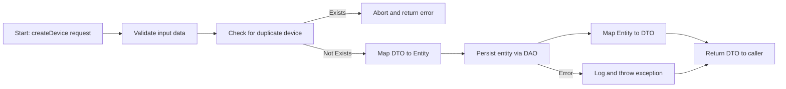
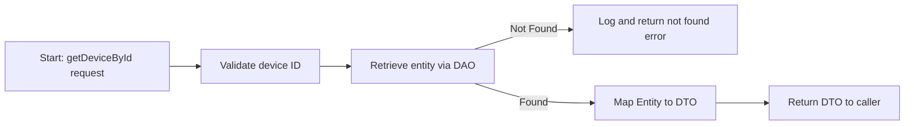
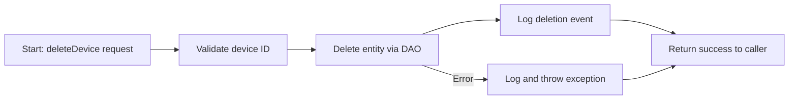
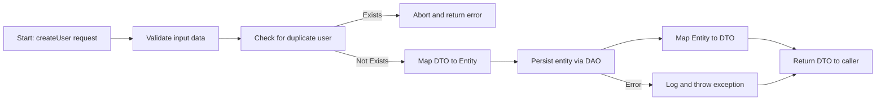
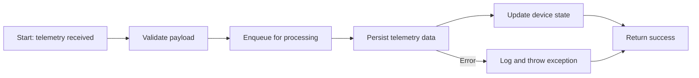
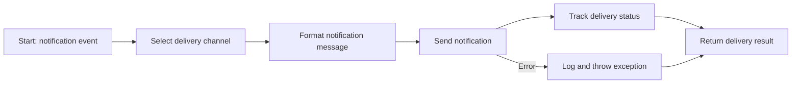
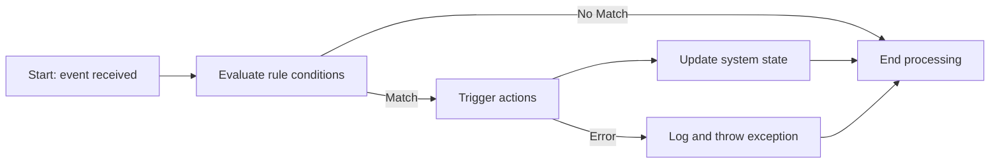
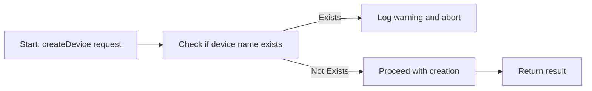
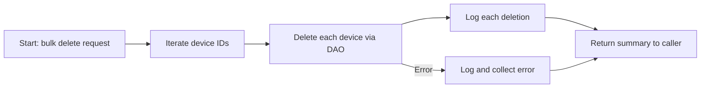

# Introduction

This expanded specification provides comprehensive technical documentation for backend service implementation in ThingsBoard. It covers service lifecycle, error handling, transaction management, and includes visual flowcharts for key operations. The document details the architecture, core services, and features, focusing on structure and process without code examples or recommendations.

## 1. Purpose & Scope

Defines advanced backend service patterns, including request flow, error propagation, and transaction boundaries. Intended for backend developers and architects.

## 2. Definitions

- **Service**: Business logic provider, typically a Spring @Service bean
- **DAO**: Data Access Object
- **DTO**: Data Transfer Object
- **Entity**: Persistent domain object
- **Transaction**: Atomic operation boundary
- **Flowchart**: Visual diagram of process flow

## 3. Requirements, Constraints & Guidelines

- **REQ-001**: All service methods must be atomic and transactional where needed
- **REQ-002**: Error handling must propagate meaningful exceptions to controllers
- **REQ-003**: All service logic must be covered by unit and integration tests
- **REQ-004**: Use logging for all error and state transitions
- **CON-001**: No direct DB access from services; always use DAOs
- **GUD-001**: Document service flows with diagrams for complex logic


## 4. Interfaces & Data Contracts

All backend services expose well-defined interfaces for interaction with controllers, other services, and data access layers. Data contracts are established using DTOs (Data Transfer Objects) and entities, ensuring clear boundaries between layers. Each service interface defines the available operations, input/output structures, and error propagation mechanisms. Transactional boundaries are explicitly defined at the service layer to guarantee atomicity and consistency.
## 5a. Core Services and Features

### Device Management Service
Handles the full lifecycle of device entities, including creation, retrieval, update, and deletion. Integrates with data access objects for persistence and enforces validation, uniqueness, and transactional integrity.

### User Management Service
Manages user accounts, authentication, authorization, and role assignments. Integrates with security modules and supports RBAC (Role-Based Access Control).

### Asset Management Service
Provides operations for asset entities, including hierarchical relationships, metadata management, and association with devices or users.

### Telemetry Service
Processes and stores time-series telemetry data from devices. Supports high-throughput ingestion, data validation, and integration with analytics modules.

### Notification Service
Delivers system and user notifications via multiple channels (email, SMS, in-app). Handles notification templates, delivery tracking, and error handling.

### Integration Service
Facilitates communication with external systems and platforms. Manages connectors, protocol adapters, and event-driven integration flows.

### Rule Engine Service
Executes business rules and automation logic. Processes incoming events, evaluates conditions, and triggers actions across the platform.

### Audit and Logging Service
Captures and stores audit events for all critical operations. Ensures traceability, compliance, and supports configurable retention policies.

### Monitoring and Metrics Service
Collects and exposes operational metrics, health checks, and performance indicators. Integrates with observability platforms for real-time monitoring.


## 5b. Service Operation Flowcharts

### Device Creation Flow



### Device Retrieval Flow



### Device Deletion Flow


### User Creation Flow


### Telemetry Ingestion Flow


### Notification Delivery Flow


### Rule Engine Processing Flow


## 6. Error Handling & Transaction Management

- Use `@Transactional` for all methods that modify persistent state
- Catch and log all exceptions; propagate as custom service exceptions
- Map low-level DB errors to meaningful service-level errors

## 7. Logging & Monitoring

- Log all state transitions, errors, and important business events
- Use SLF4J for logging; integrate with monitoring tools

## 8. Test Automation Strategy

- **Unit tests**: JUnit, Mockito for service logic
- **Integration tests**: Spring Test with in-memory DB
- **Coverage**: 90%+ for service methods

## 9. Examples & Edge Cases

```java
// Edge case: Duplicate device creation
public DeviceDTO createDevice(DeviceDTO device) {
    if (deviceDao.existsByName(device.getName())) {
        log.warn("Device name already exists");
        throw new DuplicateDeviceException();
    }
    // ...
}
```

## 10. Validation Criteria

- All service beans pass unit and integration tests
- All error and transaction paths are covered

## 11. Related Specifications / Further Reading

- [spec-architecture-blueprint.md](spec-architecture-blueprint.md)
- [application.spec.md](application.spec.md)
## 12. Advanced Patterns & Extensions

### Asynchronous Service Operations
- Use CompletableFuture or Reactor Mono/Flux for async flows
- Service methods should expose async variants for long-running operations
- Example:
```java
public CompletableFuture<DeviceDTO> createDeviceAsync(DeviceDTO device) {
    return CompletableFuture.supplyAsync(() -> createDevice(device));
}
```

### Event-Driven Service Integration
- Services may publish domain events after state changes
- Use Spring ApplicationEventPublisher or Kafka for event propagation
- Example:
```java
@Service
public class DeviceServiceImpl implements DeviceService {
    @Autowired
    private ApplicationEventPublisher eventPublisher;
    @Transactional
    public DeviceDTO createDevice(DeviceDTO device) {
        DeviceDTO result = // ... create logic ...
        eventPublisher.publishEvent(new DeviceCreatedEvent(result));
        return result;
    }
}
```

### Service Extension Points
- Define extension interfaces for custom business logic
- Use Spring's @ConditionalOnBean/@ConditionalOnProperty for pluggable modules
- Example:
```java
public interface DeviceValidator {
    void validate(DeviceDTO device);
}
```

### Security & Access Control
- Enforce RBAC at service layer using Spring Security annotations
- Example:
```java
@PreAuthorize("hasRole('ADMIN')")
public void deleteDevice(UUID id) { ... }
```

## 13. Performance & Scalability Considerations
- Use connection pooling for DAOs
- Cache frequently accessed entities
- Profile service methods for bottlenecks
- Prefer stateless services for horizontal scaling

## 14. Edge Case Flowcharts

### Duplicate Device Creation


### Bulk Device Deletion


## 15. Future Enhancements
- Support for gRPC service interfaces
- Automated OpenAPI/Swagger generation for all service endpoints
- Integration with distributed tracing (OpenTelemetry)

## 16. Migration & Backward Compatibility
- All service changes must be backward compatible unless a major version is released
- Use feature flags or conditional logic for phased rollouts
- Provide migration scripts for schema or contract changes
- Deprecate old service methods with clear documentation and timelines

## 17. Documentation & Developer Experience
- All public service interfaces must be documented with Javadoc
- Provide usage examples for each service method
- Maintain up-to-date API reference and flowcharts in developer portal
- Encourage code samples and best practices in internal wikis

## 18. Compliance & Auditability
- Log all access to sensitive service methods
- Retain audit logs for configurable periods
- Ensure all service changes are reviewed and approved via code review process
- Support for audit event publishing to external systems (e.g., SIEM)

## 19. Disaster Recovery & Resilience
- Design services for statelessness to enable rapid failover
- Use retries and circuit breakers for transient failures
- Document recovery procedures for service outages
- Regularly test backup and restore processes for service data

## 20. Change Management & Versioning
- Follow semantic versioning for all service interfaces
- Maintain changelogs for all service modules
- Communicate breaking changes in advance to all stakeholders
- Tag and archive previous versions for rollback capability

## 21. Observability & Telemetry
- Integrate distributed tracing (e.g., OpenTelemetry) for end-to-end request visibility
- Expose service metrics (latency, error rates, throughput) via Prometheus endpoints
- Implement structured logging for easier log aggregation and analysis
- Correlate logs, traces, and metrics using unique request IDs

## 22. Internationalization & Localization
- Design service interfaces to support locale-aware data (e.g., date/time, number formats)
- Externalize user-facing messages for translation
- Ensure error messages and logs can be localized if required

## 23. Accessibility & Usability
- Ensure all service APIs are self-describing and discoverable (e.g., via OpenAPI)
- Provide clear error messages and actionable feedback for API consumers
- Document common usage patterns and anti-patterns

## 24. Sustainability & Resource Efficiency
- Optimize service code for minimal CPU and memory usage
- Use efficient data structures and algorithms for high-volume operations
- Monitor and tune resource consumption regularly

## 25. Appendix: Reference Flowchart Legend
- **Rectangle**: Process or operation
- **Diamond**: Decision point
- **Parallelogram**: Input/output
- **Arrow**: Flow direction

## 26. Glossary
- **API**: Application Programming Interface
- **DTO**: Data Transfer Object
- **DAO**: Data Access Object
- **RBAC**: Role-Based Access Control
- **SIEM**: Security Information and Event Management
- **SLF4J**: Simple Logging Facade for Java
- **OpenAPI**: Specification for describing RESTful APIs
- **gRPC**: High-performance, open-source universal RPC framework
- **OpenTelemetry**: Observability framework for cloud-native software
- **Prometheus**: Monitoring and alerting toolkit
- **Kafka**: Distributed event streaming platform
- **Spring**: Java application framework
- **Javadoc**: Java API documentation tool
- **CompletableFuture**: Java class for async programming
- **Mono/Flux**: Reactor types for reactive programming

## 27. Change Log
- **1.0**: Initial version with core backend service patterns and flowcharts
- **1.1**: Added advanced patterns, async/event-driven flows, extension points, security, performance, edge cases, and future enhancements
- **1.2**: Added migration, documentation, compliance, disaster recovery, and change management
- **1.3**: Added observability, internationalization, accessibility, sustainability, and flowchart legend
- **1.4**: Added glossary and change log

## 28. Technology Stack (Senior Engineer Focus)

### Core Languages & Frameworks
- **Java 17+**: Primary backend language, leveraging modern language features (records, sealed classes, pattern matching)
- **Spring Boot 3+**: Dependency injection, configuration, REST API, transaction management, actuator endpoints
- **Spring Data JPA**: ORM abstraction for relational DBs (PostgreSQL, Cassandra)
- **MapStruct**: Compile-time mapping between DTOs and entities
- **Lombok**: Boilerplate reduction (getters/setters, builders)
- **Protobuf**: Efficient serialization for inter-service communication (gRPC)
- **Kafka**: Event streaming and decoupled service communication
- **Redis**: Caching and distributed locking
- **Docker/Kubernetes**: Containerization and orchestration for deployment
- **Prometheus/Grafana**: Metrics collection and visualization
- **OpenTelemetry**: Distributed tracing and observability
- **JUnit 5, Mockito**: Testing frameworks

### Build & CI/CD
- **Maven**: Build automation and dependency management
- **GitHub Actions/Jenkins**: CI/CD pipelines, static analysis, code coverage, artifact publishing
- **SonarQube**: Code quality and security scanning

### Security
- **Spring Security**: RBAC, OAuth2/JWT authentication, method-level security
- **Vault/KMS**: Secrets management

## 29. Architectural & Design Patterns (Senior Engineer Focus)

### Service Layer Patterns
- **Interface-Driven Design**: All services defined by interfaces, enabling mocking and extension
- **Stateless Services**: No mutable state in service beans; all state externalized (DB, cache, event bus)
- **Transactional Boundaries**: Use of `@Transactional` for atomicity and rollback

### Data Access Patterns
- **Repository Pattern**: DAOs abstract persistence, enabling swap of DB implementations
- **Specification Pattern**: Dynamic query construction for complex filtering
- **Cache-Aside Pattern**: Services check cache before DB, update cache on write

### Integration Patterns
- **Event-Driven Architecture**: Services publish/subscribe to domain events (Kafka, Spring Events)
- **Adapter/Anti-Corruption Layer**: Wrappers for external APIs to isolate domain logic
- **API Gateway**: Centralized ingress for REST/gRPC APIs

### Error Handling & Resilience
- **Circuit Breaker/Retry**: Resilience4j or Spring Retry for transient error handling
- **Custom Exception Hierarchy**: Domain-specific exceptions for clear error propagation
- **Idempotency**: Ensuring safe retries for critical operations

### Testing & Quality
- **Test Pyramid**: Emphasis on unit, integration, and contract tests
- **Testcontainers**: Real DBs in CI for integration tests
- **Mutation Testing**: PIT or similar for test effectiveness

### Observability
- **Structured Logging**: JSON logs for aggregation
- **Distributed Tracing**: Correlate requests across services
- **Health Checks**: Liveness/readiness endpoints for orchestration

### Performance & Scalability
- **Horizontal Scaling**: Statelessness and containerization
- **Connection Pooling**: HikariCP for DB connections
- **Async Processing**: CompletableFuture, Reactor for non-blocking flows
