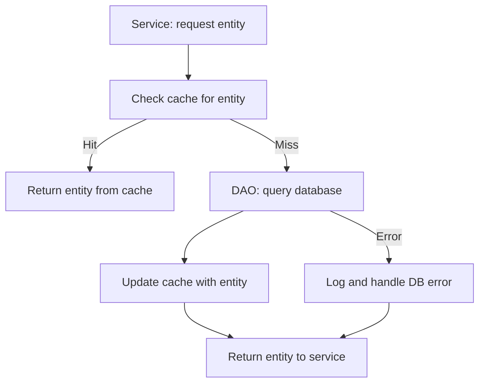
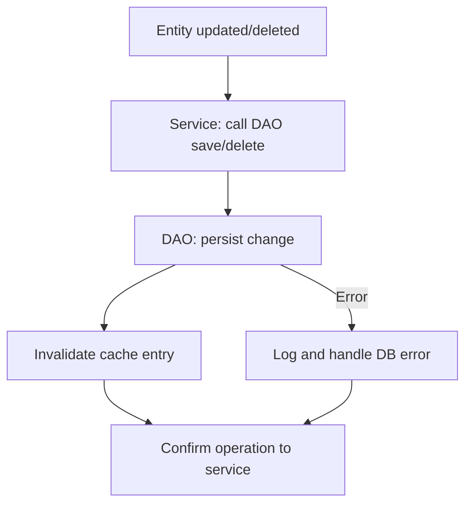

# Introduction

This specification details technical patterns for data access and caching in ThingsBoard, focusing on DAOs, async operations, and cache invalidation for performance and consistency.

## 1. Purpose & Scope

Defines how DAOs and caches should be implemented and integrated. Intended for backend developers and architects.

## 2. Definitions

- **DAO**: Data Access Object
- **Cache**: In-memory store for entities/profiles
- **Async DAO**: DAO using ListenableFuture for non-blocking operations
- **Entity**: Persistent domain object

## 3. Requirements, Constraints & Guidelines

- **REQ-001**: All DAOs must provide async CRUD methods
- **REQ-002**: Caches must be invalidated on entity update/delete
- **REQ-003**: DAOs must not leak database exceptions
- **CON-001**: Caches must be thread-safe
- **GUD-001**: Use Guava or Caffeine for cache implementation
- **PAT-001**: Use Factory pattern for DAO instantiation

## 4. Interfaces & Data Contracts

Example async DAO:
```java
public interface DeviceDao {
    ListenableFuture<Device> findByIdAsync(UUID id);
    ListenableFuture<List<Device>> findAllAsync(PageLink pageLink);
    ListenableFuture<Void> saveAsync(Device device);
    ListenableFuture<Void> deleteAsync(UUID id);
}
```

Example cache:
```java
public class DeviceCache {
    private final LoadingCache<UUID, Device> cache;
    // ...methods for get, invalidate, refresh...
}
```

## 5. Acceptance Criteria

- **AC-001**: All DAOs provide async methods
- **AC-002**: All caches are invalidated on update/delete
- **AC-003**: All cache and DAO errors are handled

## 6. Test Automation Strategy

- **Unit tests**: JUnit, Mockito for DAO/cache logic
- **Integration tests**: DB and cache consistency checks
- **Coverage**: 90%+ for DAO/cache methods

## 7. Rationale & Context

Async DAOs and robust caching improve throughput and scalability for IoT workloads.

## 8. Dependencies & External Integrations

- **INF-001**: Guava, Caffeine (cache)
- **DAT-001**: SQL/NoSQL DBs

## 9. Examples & Edge Cases

```java
// Edge case: Stale cache
public void updateDevice(Device device) {
    deviceDao.saveAsync(device);
    deviceCache.invalidate(device.getId());
}
```

## 10. Validation Criteria

- All DAOs and caches pass unit and integration tests
- All cache invalidation paths are covered

## 11. Related Specifications / Further Reading

- [spec-architecture-blueprint.md](spec-architecture-blueprint.md)
- [dao.spec.md](dao.spec.md)

## 12. Advanced Data Access & Caching Implementation (Expanded)

This section provides additional technical depth for implementing robust data access and caching, including lifecycle, error handling, performance, observability, and visual flowcharts for key operations.

### 12.1 Data Access Flowchart


### 12.2 Cache Invalidation Flowchart


### 12.3 In-Depth Technical Implementation

- **Async DAO Implementation:**
  - Use `CompletableFuture` or `ListenableFuture` for all async methods.
  - Wrap all DB operations in try/catch; map exceptions to domain-specific errors.
  - Use connection pooling (e.g., HikariCP) for efficient DB access.

- **Cache Implementation:**
  - Use Caffeine or Guava for thread-safe, high-performance in-memory caches.
  - Implement cache-aside pattern: check cache before DB, update cache on write.
  - Use immutable objects for cache values to avoid concurrency issues.
  - Monitor cache hit/miss rates and tune size/eviction policies.

- **Cache Invalidation:**
  - Explicitly invalidate cache entries on entity update/delete.
  - For bulk operations, support batch invalidation.
  - Document all invalidation logic and edge cases.

- **Error Handling:**
  - Catch and log all DB and cache errors with context (operation, entity ID).
  - Propagate errors as domain-specific exceptions to service layer.
  - Use retry logic for transient DB errors if appropriate.

- **Performance & Observability:**
  - Profile DAO and cache operations for latency and throughput.
  - Expose metrics (cache hit/miss, DB query time, error rates) via monitoring endpoints.
  - Use structured logging for all data access and cache operations.

- **Security:**
  - Validate and sanitize all data before DB operations.
  - Use least privilege for DB connections.
  - Secure cache if sensitive data is stored (consider encryption or access controls).

- **Testing:**
  - Unit tests for all DAO and cache logic (JUnit, Mockito).
  - Integration tests for DB/cache consistency (Testcontainers).
  - Contract tests for DAO interfaces and cache APIs.

- **Example: Async DAO and Cache**
```java
public class DeviceDaoImpl implements DeviceDao {
    private final LoadingCache<UUID, Device> cache;
    public ListenableFuture<Device> findByIdAsync(UUID id) {
        Device cached = cache.getIfPresent(id);
        if (cached != null) return Futures.immediateFuture(cached);
        return Futures.transform(
            dbAsyncFind(id),
            device -> {
                cache.put(id, device);
                return device;
            },
            MoreExecutors.directExecutor()
        );
    }
    public ListenableFuture<Void> saveAsync(Device device) {
        return Futures.transform(
            dbAsyncSave(device),
            result -> {
                cache.invalidate(device.getId());
                return null;
            },
            MoreExecutors.directExecutor()
        );
    }
    // ...other methods...
}
```

## 13. Best Practices
- Use immutable objects for cache values
- Prefer explicit cache invalidation over time-based expiry for consistency
- Monitor cache hit/miss rates and tune size accordingly
- Always wrap DB exceptions in domain-specific exceptions
- Use connection pooling for DB access

## 14. Common Pitfalls
- Stale cache due to missed invalidation
- Thread-safety issues in custom cache implementations
- Leaking DB exceptions to upper layers
- Over-caching leading to memory pressure

## 15. Recommendations
- Use Caffeine for new cache implementations
- Profile DAO and cache performance regularly
- Document cache invalidation logic
- Use integration tests to verify cache/DB consistency

## 16. Glossary
- **Cache-Aside**: Pattern where application loads data into cache on demand
- **DAO**: Data Access Object
- **Async DAO**: DAO with non-blocking methods
- **Testcontainers**: Library for running DBs in Docker during tests

## 17. Change Log
- **1.0**: Initial version
- **1.1**: Added advanced technology, patterns, best practices, pitfalls, glossary, and change log

---
