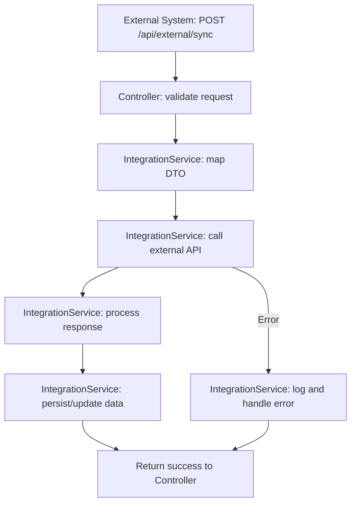
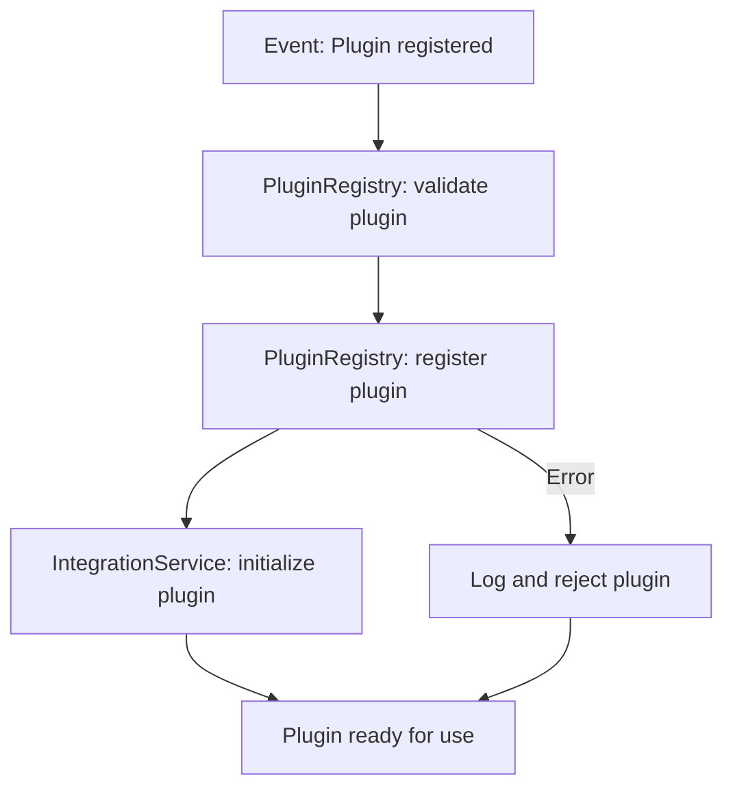
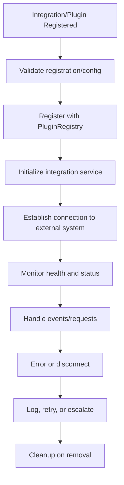
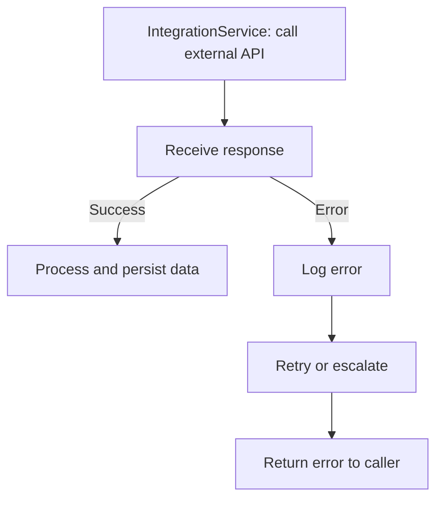
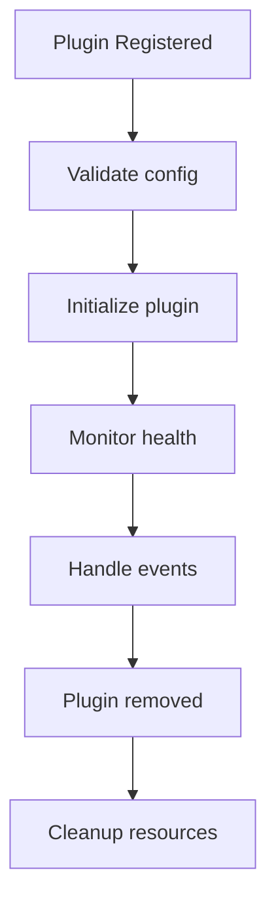

# Introduction

This specification details technical patterns for integrating and extending ThingsBoard, including external system integration, plugin development, and microservice communication.

## 1. Purpose & Scope

Defines how to safely extend and integrate with ThingsBoard. Intended for developers building plugins, integrations, or microservices.

## 2. Definitions

- **Integration**: Connecting external systems/services
- **Extension**: Adding new features via plugins or modules
- **API**: Application Programming Interface
- **Microservice**: Independently deployable service
- **Adapter/Facade**: Pattern for external system integration

## 3. Requirements, Constraints & Guidelines

- **REQ-001**: All integrations must use documented APIs or extension points
- **REQ-002**: Plugins must be registered and versioned
- **REQ-003**: Microservices must communicate via REST/gRPC
- **CON-001**: No direct DB access from plugins/integrations
- **GUD-001**: Use anti-corruption layer for legacy integration
- **PAT-001**: Use Adapter/Facade pattern for external APIs

## 4. Interfaces & Data Contracts

Example REST integration:
```java
@RestController
@RequestMapping("/api/external")
public class ExternalIntegrationController {
    @PostMapping("/sync")
    public ResponseEntity<?> sync(@RequestBody SyncRequest req) { ... }
}
```

Example plugin registration:
```java
@Component
public class MyPlugin implements ThingsBoardPlugin { ... }
```

## 5. Acceptance Criteria

- **AC-001**: All integrations use documented APIs
- **AC-002**: All plugins are registered and versioned
- **AC-003**: All microservices use REST/gRPC for communication

## 6. Test Automation Strategy

- **Unit tests**: JUnit for plugin/integration logic
- **Integration tests**: Simulated external system calls
- **Coverage**: 90%+ for integration code

## 7. Rationale & Context

Safe, versioned integration and extension mechanisms enable rapid feature addition and third-party connectivity.

## 8. Dependencies & External Integrations

- **INF-001**: REST/gRPC APIs
- **SVC-001**: External systems (SMTP, SMS, Slack, AI/ML)

## 9. Examples & Edge Cases

```java
// Edge case: Breaking change in external API
public void sync() {
    // Use adapter to shield core logic from API changes
}
```

## 10. Validation Criteria

- All integrations and plugins pass unit and integration tests
- All API versioning paths are covered

## 11. Related Specifications / Further Reading

- [spec-architecture-blueprint.md](spec-architecture-blueprint.md)

## 12. Integration Service Implementation (Expanded)

Integration services enable ThingsBoard to connect with external systems, APIs, and microservices. This section details the technical implementation, lifecycle, error handling, and includes flowcharts for common integration scenarios.

### 12.1 Integration Service Architecture
- Implemented as Spring @Service beans, following interface-driven design.
- Expose REST/gRPC endpoints for external systems.
- Use DTOs for all external contracts; validate and sanitize all inputs.
- Communicate with external APIs using WebClient (REST) or gRPC stubs.
- Support for async processing using CompletableFuture or Reactor.
- All integration logic is stateless; state is externalized (DB, cache, event bus).

### 12.2 Flowcharts for Common Integration Scenarios

#### 12.2.1 External System Sync (REST)


#### 12.2.2 Plugin Event Handling


#### 12.2.3 Microservice Communication (gRPC)
```mermaid
flowchart TD
    A[Service: sendRequest()] --> B[gRPC Stub: serialize request]
    B --> C[Network: transmit]
    C --> D[Remote Service: process request]
    D --> E[Remote Service: send response]
    E --> F[gRPC Stub: deserialize response]
    F --> G[IntegrationService: process response]
    G --> H[Return result to caller]
    D -->|Error| I[Remote Service: error]
    I --> F
```

### 12.3 In-Depth Technical Implementation

- **Interface Example:**
```java
public interface IntegrationService {
    SyncResult syncExternal(SyncRequest request);
    CompletableFuture<PluginResult> handlePluginEvent(PluginEvent event);
    Mono<GrpcResult> callRemoteService(GrpcRequest request);
}
```

- **Implementation Example:**
```java
@Service
public class IntegrationServiceImpl implements IntegrationService {
    private final WebClient webClient;
    private final GrpcStub grpcStub;
    @Override
    public SyncResult syncExternal(SyncRequest request) {
        // Validate and map request
        // Call external REST API
        // Handle response and errors
        // Persist/update data
        // Return result
    }
    @Override
    public CompletableFuture<PluginResult> handlePluginEvent(PluginEvent event) {
        // Async plugin event handling
        // Register, initialize, and monitor plugin
        // Handle errors and return result
    }
    @Override
    public Mono<GrpcResult> callRemoteService(GrpcRequest request) {
        // Use gRPC stub for async call
        // Process response and errors
        // Return result as Mono
    }
}
```

- **Error Handling:**
  - All external API errors are caught, logged, and mapped to domain-specific exceptions.
  - Use retry and circuit breaker patterns (Resilience4j) for transient failures.
  - All integration points are monitored for latency, error rates, and throughput.

- **Security:**
  - Authenticate and authorize all incoming requests (Spring Security, OAuth2/JWT).
  - Sanitize and validate all data exchanged with external systems.
  - Use encrypted channels (TLS) for all external communication.

- **Testing:**
  - Unit tests for all integration logic (JUnit, Mockito).
  - Integration tests with simulated external systems (Testcontainers, WireMock).
  - Contract tests for all public APIs.

## 13. Best Practices
- Version all public APIs and plugins
- Use DTOs for all external contracts
- Validate and sanitize all external inputs
- Document all extension points and integration flows
- Use contract tests for integrations

## 14. Common Pitfalls
- Breaking changes in external APIs
- Tight coupling to third-party libraries
- Insufficient error handling in plugins
- Lack of monitoring for integration failures

## 15. Recommendations
- Use OpenAPI for all REST APIs
- Prefer gRPC for internal microservice communication
- Monitor and alert on integration errors
- Maintain a registry of all plugins and integrations

## 16. Glossary
- **Adapter**: Pattern to wrap external APIs
- **gRPC**: High-performance RPC framework
- **Anti-Corruption Layer**: Boundary to protect domain logic
- **Plugin**: Extension module

## 17. Change Log
- **1.0**: Initial version
- **1.1**: Added advanced technology, patterns, best practices, pitfalls, glossary, and change log

## 18. Advanced Integration & Extension Implementation (Expanded)

This section provides additional technical depth for implementing robust integration and extension mechanisms, including lifecycle, error handling, performance, observability, and visual flowcharts for key integration operations.

### 18.1 Integration Lifecycle Flowchart


### 18.2 External API Call Flowchart
```mermaid
flowchart TD
    A[Incoming event/request] --> B[Map to DTO]
    B --> C[Call external API (REST/gRPC)]
    C --> D[Process response]
    D --> E[Update internal state or trigger event]
    C -->|Error| F[Log and handle error]
    F --> E
```

### 18.3 In-Depth Technical Implementation

- **Plugin Registration:**
  - All plugins must implement a common interface (e.g., `ThingsBoardPlugin`).
  - Registration is validated for version, compatibility, and required config.
  - Registered plugins are tracked in a registry for lifecycle management.

- **Integration Service Implementation:**
  - Expose REST/gRPC endpoints for external systems.
  - Use DTOs for all data contracts; validate and sanitize all inputs.
  - Communicate with external APIs using WebClient (REST) or gRPC stubs.
  - Support async processing using CompletableFuture or Reactor.
  - All integration logic is stateless; state is externalized (DB, cache, event bus).
  - Monitor health and status of all integrations; expose metrics for observability.

- **Error Handling:**
  - All external API errors are caught, logged, and mapped to domain-specific exceptions.
  - Use retry and circuit breaker patterns (Resilience4j) for transient failures.
  - All integration points are monitored for latency, error rates, and throughput.

- **Security:**
  - Authenticate and authorize all incoming requests (Spring Security, OAuth2/JWT).
  - Sanitize and validate all data exchanged with external systems.
  - Use encrypted channels (TLS) for all external communication.
  - Secure plugin secrets/configuration using a secrets manager or encrypted storage.

- **Testing:**
  - Unit tests for all integration logic (JUnit, Mockito).
  - Integration tests with simulated external systems (Testcontainers, WireMock).
  - Contract tests for all public APIs and plugin interfaces.

- **Performance & Observability:**
  - Profile integration flows for latency and throughput.
  - Expose integration metrics (request count, error count, avg latency) via monitoring endpoints.
  - Use structured logging and distributed tracing for all integration operations.
  - Set up alerting for integration failures, high latency, or error spikes.

- **Example: Plugin Registration and REST Integration**
```java
@Component
public class MyPlugin implements ThingsBoardPlugin {
    @PostConstruct
    public void init() {
        // Validate config, register with registry
    }
    public ResponseEntity<?> sync(SyncRequest req) {
        // Map request, call external API, handle response/errors
        // Return result
    }
    @PreDestroy
    public void destroy() {
        // Cleanup resources
    }
}
```

## 19. Advanced Integration Edge Cases & Technical Examples

### 19.1 Integration Error Handling Flowchart


### 19.2 Plugin Lifecycle Flowchart


### 19.3 In-Depth Technical Implementation: Edge Case Examples

- **API Version Mismatch Handling:**
```java
public class ExternalApiAdapter {
    public ApiResponse callExternal(ApiRequest req) {
        try {
            // Map request, call external API
            // Handle response and errors
        } catch (ExternalApiException e) {
            // Log and map error
            if (e.isVersionMismatch()) {
                // Fallback or notify for API update
            }
        }
    }
}
```

- **Plugin Health Monitoring Example:**
```java
@Component
public class PluginHealthMonitor {
    public void monitor(ThingsBoardPlugin plugin) {
        // Periodically check plugin status
        // Log and alert on failures
    }
}
```

- **Retry Logic for Transient Integration Errors:**
```java
public ResponseEntity<?> sync(SyncRequest req) {
    int attempts = 0;
    while (attempts < MAX_RETRIES) {
        try {
            // Call external API
            return ResponseEntity.ok(...);
        } catch (TransientException e) {
            attempts++;
            // Log and retry
        }
    }
    return ResponseEntity.status(HttpStatus.SERVICE_UNAVAILABLE).body("Integration failed");
}
```

- **Secure Plugin Configuration Example:**
```java
@Component
public class SecurePluginConfig {
    @Value("${plugin.secret}")
    private String secret;
    // Use secret securely in plugin logic
}
```

## 20. Integration Performance, Observability & Security

### 20.1 Performance Optimization
- Profile integration flows for latency and throughput using APM tools (e.g., New Relic, Prometheus).
- Use async processing (CompletableFuture, Reactor) for non-blocking external calls.
- Tune connection pools and thread pools for high concurrency.
- Batch requests to external systems where possible to reduce overhead.

### 20.2 Observability & Monitoring
- Expose integration metrics (request count, error count, avg latency) via Prometheus endpoints.
- Use structured logging for all integration operations; include correlation IDs for traceability.
- Implement distributed tracing (OpenTelemetry) to follow requests across services and plugins.
- Set up alerting for integration failures, high latency, or error spikes.

### 20.3 Security Best Practices
- Enforce authentication and authorization for all integration endpoints (Spring Security, OAuth2/JWT).
- Secure all secrets and credentials using a secrets manager or encrypted configuration.
- Validate and sanitize all data exchanged with external systems to prevent injection attacks.
- Use TLS for all external communication; verify certificates and endpoint authenticity.
- Regularly audit integration code and dependencies for vulnerabilities.

## 21. Integration Testing & CI/CD

### 21.1 Integration Testing Strategy
- Use unit tests (JUnit, Mockito) for all plugin and integration logic.
- Employ integration tests with simulated external systems (Testcontainers, WireMock, MockServer).
- Implement contract tests to verify API compatibility with external systems and plugins.
- Test error handling, retries, and fallback logic for all integration points.
- Automate regression tests for all supported plugin versions and integration scenarios.

### 21.2 CI/CD Pipeline Integration
- Run all integration and contract tests in CI pipelines (GitHub Actions, Jenkins).
- Enforce code quality gates (SonarQube, Checkstyle) and minimum coverage thresholds.
- Automate deployment of plugins and integration modules to test environments.
- Use canary releases and feature flags for safe rollout of new integrations.
- Monitor deployments for integration failures and roll back on critical errors.

### 21.3 Test Data Management
- Use synthetic and anonymized data for integration tests.
- Clean up test data after each test run to ensure isolation.
- Version test data schemas alongside integration code.
