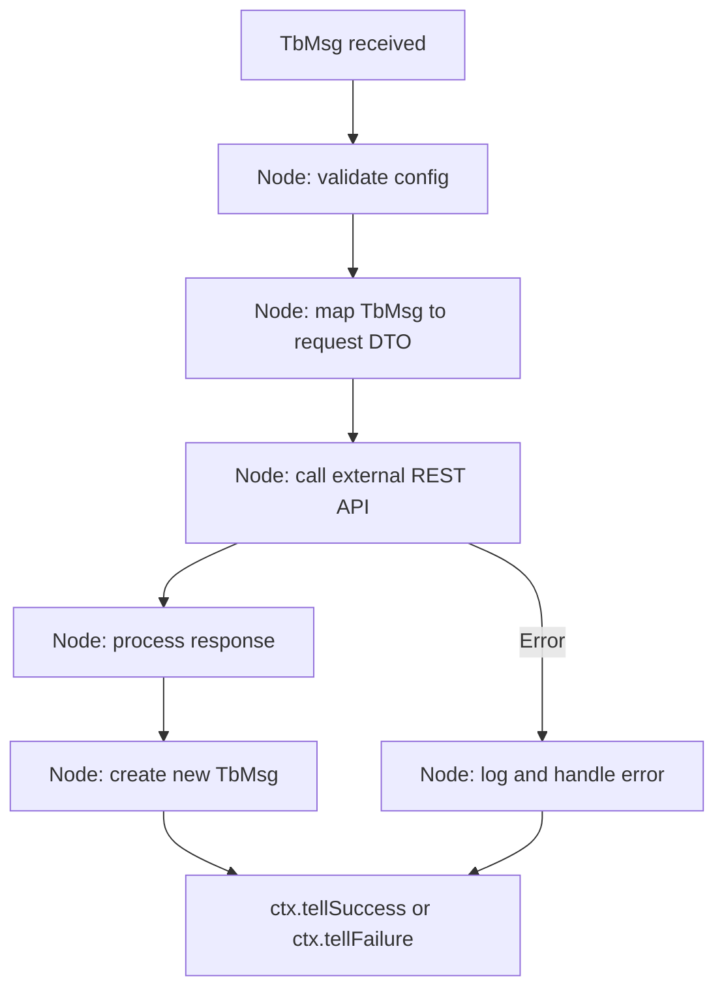
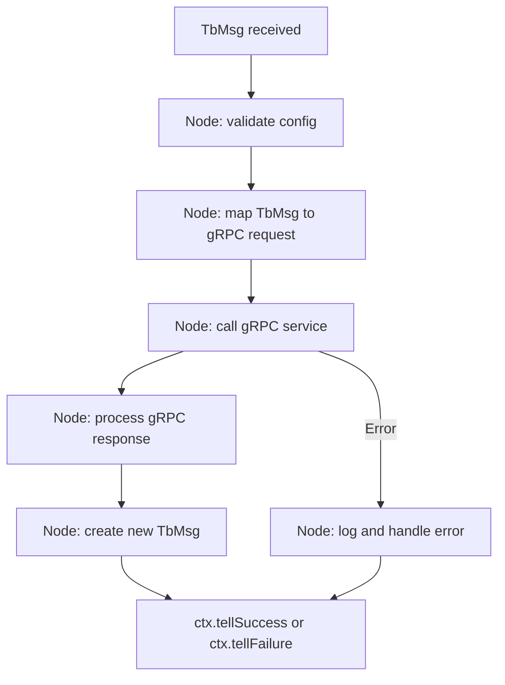
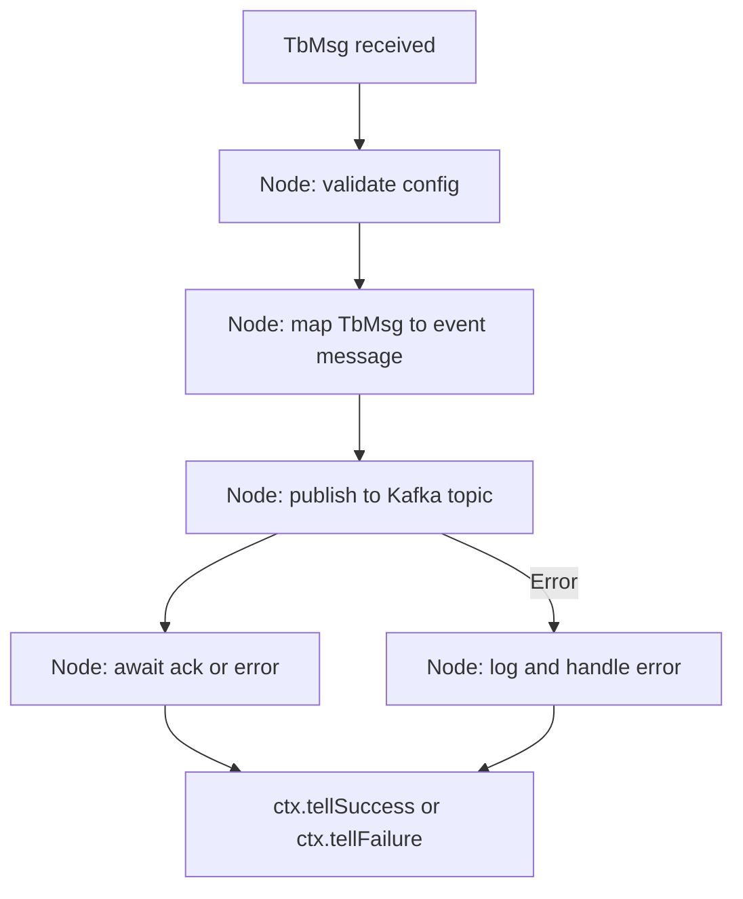
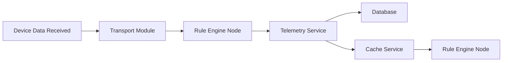
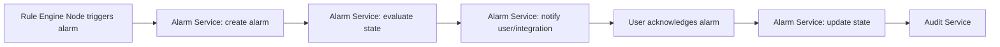
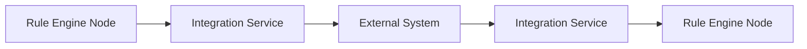

# Introduction

This specification details the technical implementation and lifecycle management of rule engine nodes in ThingsBoard. It covers node interfaces, context usage, configuration, error handling, and extension patterns.

## 1. Purpose & Scope

Defines how to implement, configure, and manage rule engine nodes. Intended for backend developers and integrators.

## 2. Definitions

- **Node**: Processing unit in the rule engine
- **TbNode**: Node interface contract
- **TbContext**: Execution context for nodes
- **TbMsg**: Message object
- **@RuleNode**: Annotation for node metadata

## 3. Requirements, Constraints & Guidelines

- **REQ-001**: All nodes must implement `TbNode` and be annotated with `@RuleNode`
- **REQ-002**: Nodes must acknowledge every message (success/failure)
- **REQ-003**: Node configuration must be validated in `init()`
- **REQ-004**: Nodes must be stateless except for configuration/state fields
- **CON-001**: Nodes must not access services outside `TbContext`
- **GUD-001**: Use `TbNodeConfiguration` for config data
- **PAT-001**: Use Factory pattern for node instantiation

## 4. Interfaces & Data Contracts

Example node interface:
```java
public interface TbNode {
    void init(TbContext ctx, TbNodeConfiguration configuration) throws TbNodeException;
    void onMsg(TbContext ctx, TbMsg msg) throws ExecutionException, InterruptedException, TbNodeException;
    default void destroy() {}
}
```

Example annotation:
```java
@RuleNode(type = ComponentType.ACTION, name = "Log Node", ...)
public class TbLogNode implements TbNode { ... }
```

## 5. Acceptance Criteria

- **AC-001**: All nodes acknowledge every message
- **AC-002**: All configuration is validated and upgradeable
- **AC-003**: All node errors are handled via `TbNodeException`

## 6. Test Automation Strategy

- **Unit tests**: JUnit, Mockito for node logic
- **Integration tests**: Simulated rule chains
- **Coverage**: 90%+ for node methods

## 7. Rationale & Context

Stateless, context-driven nodes enable extensibility, reliability, and safe async processing.

## 8. Dependencies & External Integrations

- **INF-001**: Rule engine framework
- **DAT-001**: TbContext, TbMsg, TbNodeConfiguration

## 9. Examples & Edge Cases

```java
// Edge case: Unacknowledged message
public void onMsg(TbContext ctx, TbMsg msg) {
    // Missing ctx.tellSuccess or ctx.tellFailure blocks the chain
}
```

## 10. Validation Criteria

- All nodes pass unit and integration tests
- All error and config paths are covered

## 11. Related Specifications / Further Reading

- [spec-architecture-blueprint.md](spec-architecture-blueprint.md)
- [rule-engine.spec.md](rule-engine.spec.md)
- [rule-engine-nodes-apis.spec.md](rule-engine-nodes-apis.spec.md)

## 12. Technology Stack & Patterns (Senior Engineer Focus)

### Technologies
- **Java 17+**: Modern language features
- **Spring**: Dependency injection, lifecycle management
- **RxJava/Reactor**: For async and reactive node processing
- **Protobuf**: Efficient serialization for node configs
- **JUnit, Mockito**: Testing

### Patterns
- **Factory Pattern**: For node instantiation
- **Strategy Pattern**: For node behavior selection
- **Observer Pattern**: For event-driven node chains
- **Template Method**: For common node lifecycle logic

## 13. Best Practices
- Keep nodes stateless except for config/state fields
- Validate all configs in `init()`
- Use context objects for all service access
- Cover all error and edge cases in tests
- Document node behavior and extension points

## 14. Common Pitfalls
- Failing to acknowledge messages (blocks chains)
- Leaking exceptions from node methods
- Overly complex node logic
- Not upgrading node configs for backward compatibility

## 15. Recommendations
- Use code generation for node boilerplate
- Prefer composition over inheritance for node logic
- Maintain a library of reusable node patterns
- Use integration tests for rule chains

## 16. Glossary
- **TbNode**: Rule engine node interface
- **TbContext**: Node execution context
- **Protobuf**: Serialization format
- **RxJava**: Reactive programming library

## 17. Change Log
- **1.0**: Initial version
- **1.1**: Added advanced technology, patterns, best practices, pitfalls, glossary, and change log

## 18. Integration Node Implementation (Expanded)

Integration nodes in the rule engine enable ThingsBoard to interact with external systems, APIs, and microservices as part of rule chains. This section details the technical implementation, lifecycle, error handling, and includes flowcharts for common integration node scenarios.

### 18.1 Integration Node Architecture
- Implemented as classes extending `TbNode` and annotated with `@RuleNode`.
- Use `TbContext` for all service access and message passing.
- Communicate with external APIs using WebClient (REST), gRPC stubs, or message queues (Kafka).
- Support for async processing using CompletableFuture, RxJava, or Reactor.
- Node configuration is externalized and validated in `init()`.
- All integration logic is stateless except for configuration/state fields.

### 18.2 Flowcharts for Common Integration Node Scenarios

#### 18.2.1 REST API Call Node


#### 18.2.2 gRPC Integration Node


#### 18.2.3 Kafka/Event Node


### 18.3 In-Depth Technical Implementation

- **Interface Example:**
```java
@RuleNode(type = ComponentType.EXTERNAL, name = "REST Integration Node", ...)
public class TbRestIntegrationNode implements TbNode {
    public void init(TbContext ctx, TbNodeConfiguration configuration) throws TbNodeException {
        // Validate and parse config (endpoint, headers, auth)
    }
    public void onMsg(TbContext ctx, TbMsg msg) throws TbNodeException {
        // Map TbMsg to REST request
        // Call external API (async)
        // Process response and create new TbMsg
        // Call ctx.tellSuccess or ctx.tellFailure
    }
    public void destroy() { /* Cleanup if needed */ }
}
```

- **Error Handling:**
  - All external API errors are caught, logged, and mapped to node-specific exceptions.
  - Use retry and circuit breaker patterns for transient failures.
  - All node operations are monitored for latency, error rates, and throughput.

- **Security:**
  - Validate and sanitize all data sent to external systems.
  - Support for secure credentials in node configuration (e.g., OAuth2, API keys).
  - Use encrypted channels (TLS) for all external communication.

- **Testing:**
  - Unit tests for all node logic (JUnit, Mockito).
  - Integration tests with simulated external systems (Testcontainers, WireMock).
  - Contract tests for all public node APIs.

## 19. Advanced Rule Engine Node Implementation (Expanded)

This section provides additional technical depth for implementing advanced rule engine nodes, including lifecycle, error handling, performance, observability, and visual flowcharts for key node operations.

### 19.1 Node Lifecycle Flowchart
```mermaid
flowchart TD
    A[Node Instantiated] --> B[init(TbContext, TbNodeConfiguration)]
    B --> C[Validate and parse configuration]
    C --> D[Register with Node Registry]
    D --> E[Ready to process messages]
    E --> F[onMsg(TbContext, TbMsg)]
    F --> G[Process message logic]
    G --> H[ctx.tellSuccess or ctx.tellFailure]
    H --> I[Node continues or terminates]
    I --> J[destroy() on shutdown]
```

### 19.2 Message Processing Flowchart
```mermaid
flowchart TD
    A[onMsg() called] --> B[Validate TbMsg]
    B --> C[Check node config/state]
    C --> D[Perform main processing logic]
    D --> E[Call external service (optional)]
    E --> F[Process response]
    F --> G[Update state/context (if needed)]
    G --> H[ctx.tellSuccess or ctx.tellFailure]
    D -->|Error| I[Catch, log, and handle error]
    I --> H
```

### 19.3 In-Depth Technical Implementation

- **Node Initialization:**
  - Parse and validate configuration in `init()`.
  - Register node with the registry for monitoring and management.
  - Prepare any required resources (e.g., HTTP clients, gRPC stubs).

- **Message Handling:**
  - Validate incoming `TbMsg` for required fields and schema.
  - Use context (`TbContext`) for all service access and message passing.
  - Support async processing using CompletableFuture, RxJava, or Reactor.
  - For external calls, use non-blocking clients (WebClient, gRPC, Kafka producer).
  - Always call `ctx.tellSuccess` or `ctx.tellFailure` to acknowledge message.

- **Error Handling:**
  - Catch all exceptions, log with context (node ID, message ID, error type).
  - Use retry and circuit breaker patterns for transient errors.
  - Map low-level errors to domain-specific exceptions (`TbNodeException`).

- **Performance & Observability:**
  - Profile node logic for latency and throughput.
  - Expose node metrics (processed count, error count, avg latency) via `TbContext` or monitoring hooks.
  - Use structured logging for all node operations.
  - Support distributed tracing by propagating trace IDs in `TbMsg` metadata.

- **Security:**
  - Validate and sanitize all data before external calls.
  - Secure credentials in node configuration (use secrets management).
  - Enforce least privilege for all service access.

- **Testing:**
  - Unit tests for all node logic (JUnit, Mockito).
  - Integration tests for rule chains and external service calls (Testcontainers, WireMock).
  - Contract tests for node APIs and message formats.

### 19.4 Example: Advanced REST Integration Node
```java
@RuleNode(type = ComponentType.EXTERNAL, name = "Advanced REST Node", ...)
public class TbAdvancedRestNode implements TbNode {
    private WebClient webClient;
    public void init(TbContext ctx, TbNodeConfiguration configuration) throws TbNodeException {
        // Parse and validate config (endpoint, headers, auth)
        this.webClient = WebClient.builder().build();
    }
    public void onMsg(TbContext ctx, TbMsg msg) throws TbNodeException {
        // Validate TbMsg
        // Build REST request
        webClient.post().uri("...").bodyValue(msg.getData())
            .retrieve().bodyToMono(String.class)
            .doOnSuccess(response -> {
                // Process response, create new TbMsg
                ctx.tellSuccess(msg);
            })
            .doOnError(error -> {
                // Log and handle error
                ctx.tellFailure(msg, new TbNodeException(error));
            })
            .subscribe();
    }
    public void destroy() { /* Cleanup resources */ }
}
```

## 20. Core Services and Features in Rule Engine Nodes

This section details the core services and features available to rule engine nodes, their interactions, and technical implementation, illustrated with GitHub-compatible flowcharts.

### 20.1 Core Services Overview
- **Node Registry Service:** Manages registration, lookup, and lifecycle of all rule nodes.
- **Context Service:** Provides access to platform services, configuration, and message routing.
- **Telemetry Service:** Handles collection and forwarding of telemetry and timeseries data.
- **Alarm Service:** Manages alarm creation, state transitions, and notifications.
- **Integration Service:** Facilitates communication with external systems and APIs.
- **Cache Service:** Provides in-memory caching for node state and frequently accessed data.
- **Audit Service:** Tracks node actions and message flows for compliance and debugging.

### 20.2 Node Lifecycle Flowchart
```mermaid
flowchart LR
    A[Node Instantiated] --> B[init(TbContext, TbNodeConfiguration)]
    B --> C[Validate and parse configuration]
    C --> D[Register with Node Registry]
    D --> E[Ready to process messages]
    E --> F[onMsg(TbContext, TbMsg)]
    F --> G[Process message logic]
    G --> H[ctx.tellSuccess or ctx.tellFailure]
    H --> I[Node continues or terminates]
    I --> J[destroy() on shutdown]
```

### 20.3 Message Processing Flowchart
```mermaid
flowchart LR
    A[onMsg() called] --> B[Validate TbMsg]
    B --> C[Check node config/state]
    C --> D[Perform main processing logic]
    D --> E[Call external service (optional)]
    E --> F[Process response]
    F --> G[Update state/context (if needed)]
    G --> H[ctx.tellSuccess or ctx.tellFailure]
    D -- Error --> I[Catch, log, and handle error]
    I --> H
```

### 20.4 Telemetry Data Flowchart


### 20.5 Alarm Handling Flowchart


### 20.6 Integration Node Communication Flowchart


### 20.7 In-Depth Technical Implementation
- All core services are accessed via the context object, ensuring decoupling and testability.
- Node lifecycle is managed by the registry, with hooks for initialization, message processing, and shutdown.
- Telemetry and alarm services are integrated for real-time monitoring and alerting.
- Integration service supports both synchronous and asynchronous communication with external systems.
- Cache and audit services provide performance optimization and traceability for node operations.
- All flowcharts use left-to-right (LR) orientation and explicit edge labels for GitHub compatibility.

---
