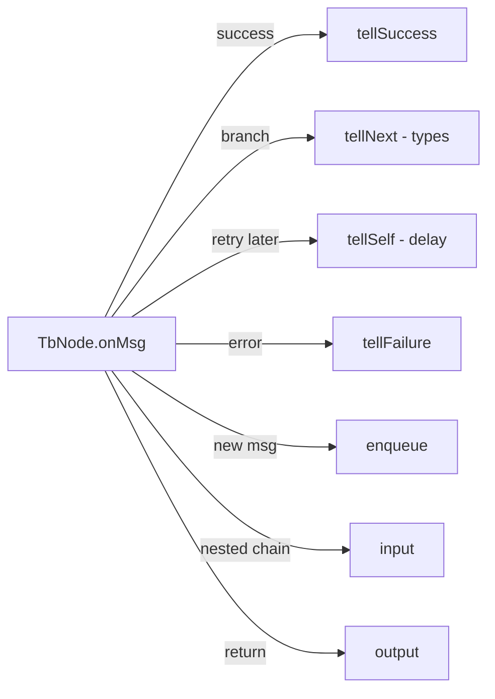
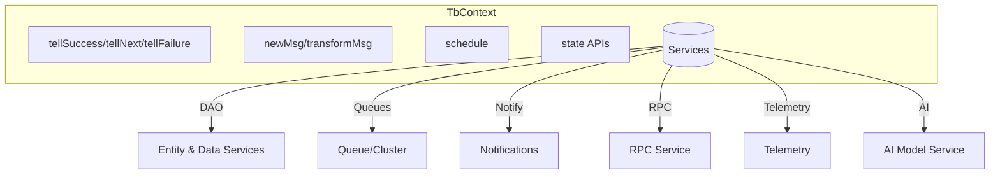

# ThingsBoard Rule Engine: `TbContext` and Platform Services

## Language & Context

- Language: Java (server-side)
- Domain: Rule Engine execution context and service access for node implementations.

## Overview

`TbContext` exposes:

- Message routing APIs (success/next/failure, input/output, enqueue, ack)
- Message creation/transformation helpers
- Scheduling and partition-awareness
- Access to platform services (DAO, cache, notifications, RPC, telemetry, etc.)

Key source file: org/thingsboard/rule/engine/api/TbContext.java

## Message Flow Control

- `tellSuccess(TbMsg)`: route to `SUCCESS` relations
- `tellNext(TbMsg, String|Set<String>)`: route to specific relation type(s)
- `tellSelf(TbMsg, delayMs)`: requeue to same node after delay (not persisted)
- `tellFailure(TbMsg, Throwable)`: route to `FAILURE` relations and mark processing failed
- `enqueue(...)`: submit a new message to a queue (root or custom) with success/failure callbacks
- `input(TbMsg, RuleChainId)`: forward to nested rule chain
- `output(TbMsg, relationType)`: return to caller rule chain using specified relation
- `ack(TbMsg)`: acknowledge message (used with external/pack processing)

## Message Construction & Transformation

- `newMsg(queueName, TbMsgType, originator, customerId?, meta, data)`
- `transformMsg(orig, TbMsgType?, originator?, meta?, data?)`
- Helpers for common events: `customerCreatedMsg`, `deviceCreatedMsg`, `alarmActionMsg`, `attributesUpdatedActionMsg`, etc.

Best practice: prefer `TbMsgType` over custom string `type` (string overloads are deprecated).

## Scheduling & State

- `schedule(Runnable, delay, TimeUnit)`: timing within node context
- `getSelfId()/getSelf()`: node identity
- `getRuleChainName()/getQueueName()`: runtime routing metadata
- `findRuleNodeStates(PageLink)`, `saveRuleNodeState`, etc.: persist/retrieve per-entity node state

## Service Access Highlights

`TbContext` provides rich service accessors for domain operations; common ones include:

- Entity/DAO: `AttributesService`, `DeviceService`, `AssetService`, `RuleChainService`, `RelationService`, `TimeseriesService`, `EventService`, `AuditLogService`, etc.
- Messaging & Queues: `QueueService`, `QueueStatsService`, `TbClusterService`
- Caches: `RuleEngineDeviceProfileCache`, `RuleEngineAssetProfileCache`, `TbResourceDataCache`
- Notifications: `NotificationCenter`, `Notification*Service` family, `SlackService`, `MailService`, `SmsService/SmsSenderFactory`
- RPC & Telemetry: `RuleEngineRpcService`, `RuleEngineTelemetryService`
- AI & Scripting: `RuleEngineAiChatModelService`, `AiModelService`, `createScriptEngine(ScriptLanguage, ...)`
- Misc: `MqttClientSettings`, `EventLoopGroup`, Cassandra helpers

## Practical Patterns

- Use `enqueueForTellNext/tellFailure` when operating with batch/pack callbacks to keep routing consistent.
- Set `getDeviceStateNodeRateLimitConfig()` to avoid excessive state updates when using `DeviceStateManager`.
- Offload blocking I/O to `getExternalCallExecutor()` or dedicated executors (`getMailExecutor`, `getSmsExecutor`).

## Common Pitfalls

- Using `tellSelf` for critical flows: it is non-persistent and may be lost after restart.
- Creating messages with string `type`: use enum `TbMsgType` to avoid mismatches.
- Forgetting `ack` when managing message packs or external node acks.

## Quick Reference (selected)

- Routing: `tellSuccess`, `tellNext`, `tellFailure`, `input`, `output`
- Message: `newMsg`, `transformMsg`, `customerCreatedMsg`, `deviceCreatedMsg`
- Services: `getAttributesService`, `getTimeseriesService`, `getRpcService`, `getNotificationCenter`
- Execution: `schedule`, `getSharedEventLoop`, Cassandra `submit*Task`

## References

- org/thingsboard/rule/engine/api/TbContext.java
