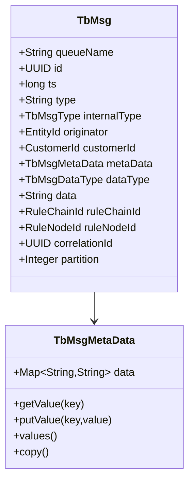
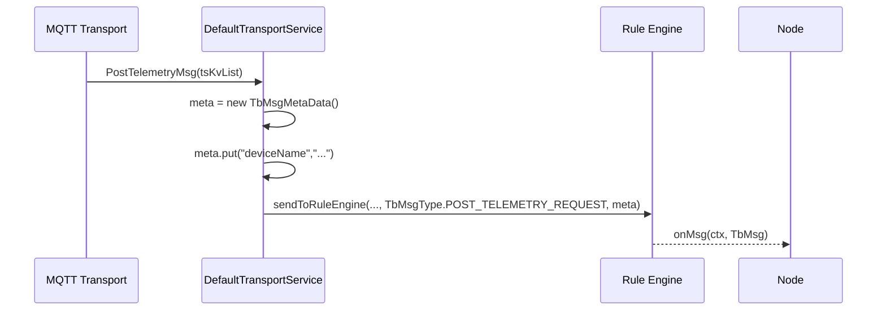
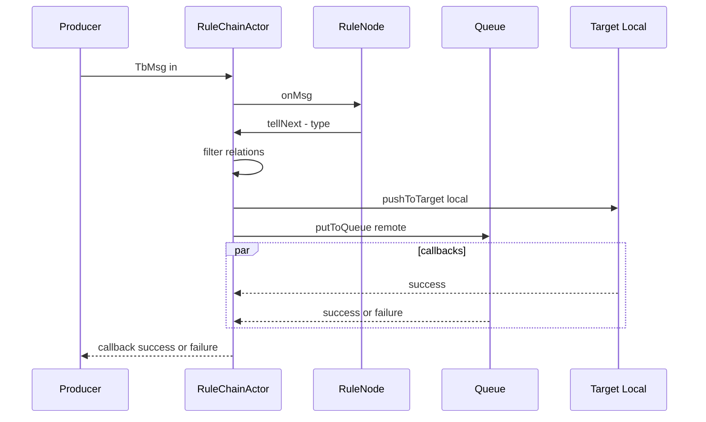

# ThingsBoard Message (tbmsg) and Metadata API Documentation

## Overview

This document describes the internal API and data structures for ThingsBoard messages (`tbmsg`) and their associated metadata. These are core abstractions used throughout the ThingsBoard Rule Engine and messaging subsystems to represent, route, and process device and system events.

---

## tbmsg Structure

The `tbmsg` object encapsulates a single logical message in the ThingsBoard platform. It is used to carry telemetry, attribute updates, RPC requests/responses, alarms, and other event types.

**Typical tbmsg fields:**

| Field         | Type     | Description                                      |
|-------------- |----------|-------------------------------------------------|
| id            | string   | Unique message identifier (UUID)                 |
| type          | string   | Message type (e.g., POST_TELEMETRY_REQUEST)      |
| originator    | string   | Entity ID (device, asset, etc.)                  |
| entityType    | string   | Originator entity type (DEVICE, ASSET, etc.)     |
| ts            | long     | Message timestamp (epoch ms)                     |
| data          | object   | Main message payload (JSON)                      |
| metadata      | object   | Key-value metadata map (see below)               |

**Example:**

```json
{
  "id": "b1e2c3d4-5678-90ab-cdef-1234567890ab",
  "type": "POST_TELEMETRY_REQUEST",
  "originator": "f1a2b3c4-5678-90ab-cdef-1234567890ab",
  "entityType": "DEVICE",
  "ts": 1704537600000,
  "data": {
    "temperature": 22.5,
    "humidity": 60
  },
  "metadata": {
    "deviceName": "Weather Station 1",
    "deviceType": "sensor",
    "tenantId": "t1a2b3c4-5678-90ab-cdef-1234567890ab"
  }
}
```

---

## Metadata Structure

The `metadata` object is a flat key-value map (string to string) that provides context for the message. Metadata is used for routing, filtering, enrichment, and audit purposes in the Rule Engine.

**Common metadata keys:**

- `deviceName`, `deviceType`, `tenantId`, `customerId`, `assetName`, `relationType`, `originatorType`, `originatorName`, `ruleNodeId`, `ruleChainId`, `msgType`, `ts` (as string)

**Usage:**

- Metadata is automatically populated by the platform when a message is created or routed.
- Rule Nodes can read, modify, or add metadata fields as part of processing.
- Metadata is not persisted with telemetry but is available during message processing.

---

## API Usage Patterns

### Creating a tbmsg

Tbmsg objects are typically created by the platform when device data arrives, but can also be constructed by custom integrations or Rule Nodes.

**Example (Java):**

```java
TbMsg msg = TbMsg.newMsg(
    "POST_TELEMETRY_REQUEST",
    deviceId,
    TbMsgMetaData.newInstance(metadataMap),
    jsonPayload
);
```

### Accessing and Modifying Metadata

**Get a metadata value:**

```java
String deviceName = msg.getMetaData().getValue("deviceName");
```

**Set a metadata value:**

```java
msg.getMetaData().putValue("customKey", "customValue");
```

---

## Integration with Rule Engine

- Every Rule Node receives a `tbmsg` and can access or modify its metadata.
- Rule Nodes can emit new messages with updated data or metadata.
- Metadata is used for dynamic routing, filtering, and enrichment in complex workflows.

---

## Best Practices

- Use metadata for context and routing, not for storing large or sensitive data.
- Always check for the presence of required metadata keys before using them.
- Document any custom metadata keys used in your Rule Nodes or integrations.

---

## See Also

- [Rule Engine Core Interfaces](rule-engine-core-interfaces.md)
- [Transport to Rule Engine Flow](transport-to-rule-engine-flow.md)
- [Device State Management](device-state-management.md)

# ThingsBoard Messaging Model: `TbMsg` and `TbMsgMetaData`

## Language & Context

- Language: Java (server-side)
- Domain: Internal message model used by Transport, Actors, and Rule Engine.

## Overview

- `TbMsg`: immutable message envelope carrying type, originator, payload, routing context, and callbacks.

- `TbMsgMetaData`: thread-safe key-value map for supplemental attributes.

Key source files:

- common/message/src/main/java/org/thingsboard/server/common/msg/TbMsg.java
- common/message/src/main/java/org/thingsboard/server/common/msg/TbMsgMetaData.java
- common/data/src/main/java/org/thingsboard/server/common/data/msg/TbMsgType.java

## `TbMsg` Structure

Fields (selected):

- `queueName`: destination processing queue
- `id`, `ts`: message identity and timestamp
- `type`, `internalType`: string type and enum `TbMsgType` (prefer enum)
- `originator`: `EntityId` (Device/Asset/...) that produced the message
- `customerId`: optional customer context (auto-inferred if originator is a Customer)
- `metaData`: `TbMsgMetaData` key-value store
- `dataType`: `TbMsgDataType` (e.g., JSON)
- `data`: payload as string
- `ruleChainId`, `ruleNodeId`: current processing context
- `correlationId`, `partition`: cross-service tracing & queue partition
- `previousCalculatedFieldIds`: guard against repeated calculated-field loops
- `ctx`: internal processing stack (push/pop), not serialized
- `callback`: `TbMsgCallback` for backpressure/timeouts, not serialized



## Construction & Transformation

- Builder API: `TbMsg.newMsg()` → fluent setters → `build()`
- Copy/transform:
  - `copy()`: clone with modifications
  - `transform()`: context-safe transform; copies internal ctx and resets `ruleNodeId` when `ruleChainId` changes
  - `transform(queueName)`: convenience to redirect to another queue
  - `newMsg(tbMsg, queueName, ruleChainId, ruleNodeId)`: for `enqueueForTellNext`

Best practice: always prefer `.type(TbMsgType.X)` over `.type(String)` (string is deprecated in multiple APIs).

## Serialization

- Protobuf conversion: `TbMsg.toProto()` / `TbMsg.fromProto(...)`
- Preserves identity, routing context, metadata, and payload
- Non-serialized runtime-only fields: callback handlers and internal processing stack (ctx)

### Field Mapping (conceptual)

- Identity: `id`, `ts`, `correlationId`
- Routing: `queueName`, `ruleChainId`, `ruleNodeId`, `partition`
- Origin: `tenantId` (in envelope), `originator`, `customerId`
- Type & data: `internalType` (`TbMsgType`), `dataType`, `data`
- Metadata: key-value pairs serialized into the proto metadata section

Note: Exact proto message classes may vary by module; consult `TbMsg.toProto()` usages for authoritative mapping.

## Runtime Helpers

- `getAndIncrementRuleNodeCounter()`: guard against infinite loops
- `isValid()`: check if callback has not timed out/canceled
- `getMetaDataTs()`: prefer metadata `ts` if present, else internal `ts`

## `TbMsgMetaData`

- Thread-safe, copy-on-write semantics for safe sharing
- `EMPTY` singleton is immutable; use `copy()` to duplicate
- Recommended pattern: start with `new TbMsgMetaData()`, add values, then pass into message

### Copying Rules

- When branching a message to multiple targets, create a metadata copy per branch to avoid cross-branch mutations: `msg.getMetaData().copy()`
- When reusing a base metadata across loop iterations (e.g., multiple `tsKv` points), copy per iteration before adding iteration-specific fields.

## Transform vs Copy

Use `copy()` for simple modifications; use `transform()` to maintain context safety across chains/nodes.

```mermaid
flowchart TD
  A[Original TbMsg] --> B[copy(): change data/meta]
  A --> C[transform(): safe context changes]
  C --> D[ruleChainId changed → reset ruleNodeId]
  C --> E[preserve internal ctx where appropriate]
```

Example (conceptual):

```java
TbMsg newMsg = msg.copy()
    .type(TbMsgType.ALARM)
    .data(newJson)
    .build();

TbMsg moved = msg.transform()
    .ruleChainId(targetChain)
    .resetRuleNodeId()
    .build();
```

## Common Metadata Keys

Typical keys added by transports and services:

- `deviceName`, `deviceType`
- `ts` (message timestamp used by processors)
- `scope` (for attributes, e.g., `SERVER_SCOPE`, `SHARED_SCOPE`)
- `NOTIFY_DEVICE_METADATA_KEY` (signals device notification)
- Transport-specific: `MQTT_TOPIC`, `X-Request-Id`, etc.

Treat metadata as routing/context hints; avoid storing large payloads in metadata.

## Size and Encoding Considerations

- `data` is a string; prefer compact JSON with a clear contract.
- Large payloads increase queue pressure and memory; avoid oversized arrays/blobs.
- Use `dataType` (e.g., JSON) consistently; downstream nodes rely on expected encoding.
- For high-rate telemetry, consider batching upstream and choosing save strategies (latest-only vs raw) appropriately.

## Builder Examples

Preferred: create via `TbContext` helpers in node code.

```java
// Within a TbNode implementation
TbMsgMetaData meta = new TbMsgMetaData();
meta.putValue("ts", String.valueOf(System.currentTimeMillis()));
meta.putValue("source", "custom-node");

TbMsg out = ctx.newMsg(
  ctx.getQueueName(),
  TbMsgType.ALARM,
  msg.getOriginator(),
  msg.getCustomerId(),
  meta,
  newJson
);
ctx.tellNext(out, "ALARM");
```

Branching with per-branch metadata copies:

```java
TbMsgMetaData base = msg.getMetaData();
TbMsgMetaData leftMeta = base.copy();
leftMeta.putValue("branch", "left");
TbMsg left = msg.copy().metaData(leftMeta).build();
ctx.tellNext(left, "LEFT");

TbMsgMetaData rightMeta = base.copy();
rightMeta.putValue("branch", "right");
TbMsg right = msg.copy().metaData(rightMeta).build();
ctx.tellNext(right, "RIGHT");
```

## Schema Examples

Telemetry payload (compact JSON):

```json
{
  "ts": 1736160000000,
  "values": {
    "temp": 22.4,
    "humidity": 47
  }
}
```

Attributes payload:

```json
{
  "fwVersion": "1.2.3",
  "serial": "ABC-123-XYZ"
}
```

Guidance:

- Keep numeric types numeric; avoid stringified numbers.
- Use consistent key naming and units to reduce downstream parsing branches.

## Reserved Metadata Keys

- `NOTIFY_DEVICE_METADATA_KEY`: toggles device notification side effects for attributes
- Transport injection keys (e.g., `MQTT_TOPIC`): do not overwrite unless intentional
- `ts`: used broadly by processors; ensure it reflects the correct event time

Avoid collisions by prefixing custom keys (e.g., `x-` or domain-specific prefixes).

## Operational Log Queries

Quick grep examples to trace a message by id and correlationId:

```bash
# Replace with actual values
id="3f2a8e90-..."; corr="6d51f6d5-..."

# Search app logs
grep -R "${id}" /var/log/thingsboard/ | sed -n '1,120p'
grep -R "${corr}" /var/log/thingsboard/ | sed -n '1,120p'

# Focus on routing decisions
grep -R "Pushing message to" /var/log/thingsboard/ | sed -n '1,120p'
grep -R "putToQueue" /var/log/thingsboard/ | sed -n '1,120p'
```

## Example: Transport → Rule Engine



## Best Practices & Pitfalls

- Do not mutate metadata shared across async flows; use `.copyMetaData()` or `metaData.copy()` when branching.
- Ensure `callback` is propagated when you expect pack-level acks/timeouts.
- Normalize `data` to a clear schema (JSON with a contract) to reduce parsing errors in nodes.
- Prefer `internalType` (`TbMsgType`) for routing and analytics over string `type`.
- When sending across partitions/chains, expect new `id` on forwarded clones while `correlationId` ties related messages.

## Debug Tips

- Log identifiers: `id`, `correlationId`, `originator`, `ruleChainId`, `ruleNodeId`, `partition`, `queueName`
- Dump metadata keys relevant to routing (e.g., `ts`, `scope`, device fields)
- When troubleshooting fan-out, trace callback outcomes (success/failure) and count of targets

## Lifecycle & Callbacks



Notes:

- Callback success requires all downstream paths to succeed when multiple targets are involved.
- Remote deliveries use `putToQueue` which clone the message id; use `correlationId` to trace lineage.

## Troubleshooting

- Symptom: Message appears to stall.
  - Check callback status and actor logs; verify `isValid()` and timeouts.
  - Inspect partition ownership and whether `putToQueue` forwarded to a different node.
- Symptom: Wrong relation taken.
  - Print relationTypes requested by `tellNext` and compare to node route labels.
  - Ensure label case and spelling match; routing uses case-insensitive equals.
- Symptom: Metadata bleeding across branches.
  - Confirm `meta.copy()` per branch; avoid modifying shared meta.
- Symptom: Unexpected node context after chain switch.
  - Use `transform()` and reset `ruleNodeId` when `ruleChainId` changes.

## Performance & Concurrency

- Callbacks and threading
  - `TbMsgCallback` may be invoked from IO or actor threads; avoid blocking operations in callback handlers.
  - Aggregate callbacks (multiple targets) complete after all downstream paths resolve; design upstream timeouts accordingly.
- Metadata thread-safety
  - `TbMsgMetaData` is safe for concurrent reads; prefer creating copies before writes in multi-threaded contexts.
- Backpressure & batching
  - Use pack/aggregate callbacks for bursty telemetry to reduce callback overhead.
  - Consider batching upstream and applying `Strategy` (e.g., latest-only) to control storage pressure.
- Payload size
  - Keep `data` compact; large messages raise GC pressure and queue latency.

## Hands-on

- See: ../labs/queue-actor-tracing-lab.md (trace `TbMsg` through queue and actors with `correlationId` and `partition`)

## Verification Checklist

- [ ] Uses `TbMsgType` enums
- [ ] Metadata copied when reused across branches
- [ ] Routing context set/cleared intentionally (ruleChainId/ruleNodeId)
- [ ] Callback supplied where timeouts/backpressure matter

## References

- common/message/src/main/java/org/thingsboard/server/common/msg/TbMsg.java
- common/message/src/main/java/org/thingsboard/server/common/msg/TbMsgMetaData.java
- common/transport/transport-api/src/main/java/org/thingsboard/server/common/transport/service/DefaultTransportService.java

---

Previous: transport-to-rule-engine-flow.md · Next: tb-context-and-services.md
