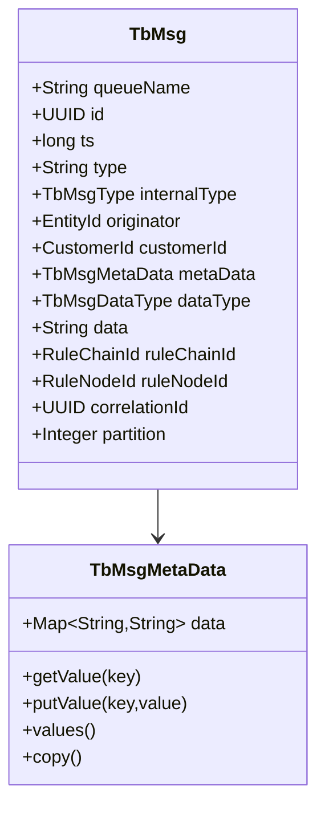
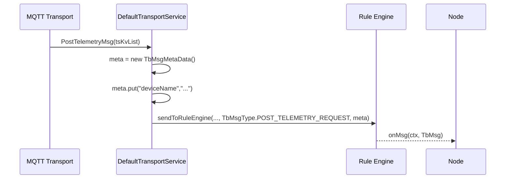

# ThingsBoard Messaging Model: `TbMsg` and `TbMsgMetaData`

## Language & Context

- Language: Java (server-side)
- Domain: Internal message model used by Transport, Actors, and Rule Engine.

## Overview

+ `TbMsg`: immutable message envelope carrying type, originator, payload, routing context, and callbacks.
- `TbMsgMetaData`: thread-safe key-value map for supplemental attributes.

Key source files:

- common/message/src/main/java/org/thingsboard/server/common/msg/TbMsg.java
- common/message/src/main/java/org/thingsboard/server/common/msg/TbMsgMetaData.java
- common/data/src/main/java/org/thingsboard/server/common/data/msg/TbMsgType.java

## `TbMsg` Structure

Fields (selected):

- `queueName`: destination processing queue
- `id`, `ts`: message identity and timestamp
- `type`, `internalType`: string type and enum `TbMsgType` (prefer enum)
- `originator`: `EntityId` (Device/Asset/...) that produced the message
- `customerId`: optional customer context (auto-inferred if originator is a Customer)
- `metaData`: `TbMsgMetaData` key-value store
- `dataType`: `TbMsgDataType` (e.g., JSON)
- `data`: payload as string
- `ruleChainId`, `ruleNodeId`: current processing context
- `correlationId`, `partition`: cross-service tracing & queue partition
- `previousCalculatedFieldIds`: guard against repeated calculated-field loops
- `ctx`: internal processing stack (push/pop), not serialized
- `callback`: `TbMsgCallback` for backpressure/timeouts, not serialized



## Construction & Transformation

- Builder API: `TbMsg.newMsg()` → fluent setters → `build()`
- Copy/transform:
  - `copy()`: clone with modifications
  - `transform()`: context-safe transform; copies internal ctx and resets `ruleNodeId` when `ruleChainId` changes
  - `transform(queueName)`: convenience to redirect to another queue
  - `newMsg(tbMsg, queueName, ruleChainId, ruleNodeId)`: for `enqueueForTellNext`

Best practice: always prefer `.type(TbMsgType.X)` over `.type(String)` (string is deprecated in multiple APIs).

## Serialization

- Protobuf conversion: `TbMsg.toProto()` / `TbMsg.fromProto(...)`
- Preserves identity, routing context, metadata, and payload
- Non-serialized runtime-only fields: callback handlers and internal processing stack (ctx)

### Field Mapping (conceptual)

- Identity: `id`, `ts`, `correlationId`
- Routing: `queueName`, `ruleChainId`, `ruleNodeId`, `partition`
- Origin: `tenantId` (in envelope), `originator`, `customerId`
- Type & data: `internalType` (`TbMsgType`), `dataType`, `data`
- Metadata: key-value pairs serialized into the proto metadata section

Note: Exact proto message classes may vary by module; consult `TbMsg.toProto()` usages for authoritative mapping.

## Runtime Helpers

- `getAndIncrementRuleNodeCounter()`: guard against infinite loops
- `isValid()`: check if callback has not timed out/canceled
- `getMetaDataTs()`: prefer metadata `ts` if present, else internal `ts`

## `TbMsgMetaData`

- Thread-safe, copy-on-write semantics for safe sharing
- `EMPTY` singleton is immutable; use `copy()` to duplicate
- Recommended pattern: start with `new TbMsgMetaData()`, add values, then pass into message

### Copying Rules

- When branching a message to multiple targets, create a metadata copy per branch to avoid cross-branch mutations: `msg.getMetaData().copy()`
- When reusing a base metadata across loop iterations (e.g., multiple `tsKv` points), copy per iteration before adding iteration-specific fields.

## Transform vs Copy

Use `copy()` for simple modifications; use `transform()` to maintain context safety across chains/nodes.

```mermaid
flowchart TD
  A[Original TbMsg] --> B[copy(): change data/meta]
  A --> C[transform(): safe context changes]
  C --> D[ruleChainId changed → reset ruleNodeId]
  C --> E[preserve internal ctx where appropriate]
```

Example (conceptual):

```java
TbMsg newMsg = msg.copy()
    .type(TbMsgType.ALARM)
    .data(newJson)
    .build();

TbMsg moved = msg.transform()
    .ruleChainId(targetChain)
    .resetRuleNodeId()
    .build();
```

## Example: Transport → Rule Engine



## Best Practices & Pitfalls

- Do not mutate metadata shared across async flows; use `.copyMetaData()` or `metaData.copy()` when branching.
- Ensure `callback` is propagated when you expect pack-level acks/timeouts.
- Normalize `data` to a clear schema (JSON with a contract) to reduce parsing errors in nodes.
- Prefer `internalType` (`TbMsgType`) for routing and analytics over string `type`.
- When sending across partitions/chains, expect new `id` on forwarded clones while `correlationId` ties related messages.

## Debug Tips

- Log identifiers: `id`, `correlationId`, `originator`, `ruleChainId`, `ruleNodeId`, `partition`, `queueName`
- Dump metadata keys relevant to routing (e.g., `ts`, `scope`, device fields)
- When troubleshooting fan-out, trace callback outcomes (success/failure) and count of targets

## Hands-on

- See: ../labs/queue-actor-tracing-lab.md (trace `TbMsg` through queue and actors with `correlationId` and `partition`)

## Verification Checklist

- [ ] Uses `TbMsgType` enums
- [ ] Metadata copied when reused across branches
- [ ] Routing context set/cleared intentionally (ruleChainId/ruleNodeId)
- [ ] Callback supplied where timeouts/backpressure matter

## References

- common/message/src/main/java/org/thingsboard/server/common/msg/TbMsg.java
- common/message/src/main/java/org/thingsboard/server/common/msg/TbMsgMetaData.java
- common/transport/transport-api/src/main/java/org/thingsboard/server/common/transport/service/DefaultTransportService.java

---

Previous: transport-to-rule-engine-flow.md · Next: tb-context-and-services.md
