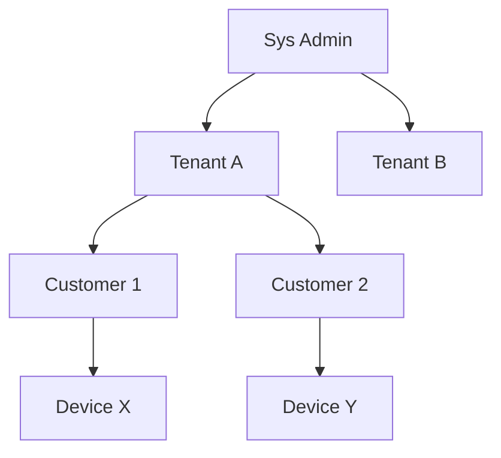

# Tenant and Customer Model Specification

## Overview

This document describes the tenant and customer hierarchy in ThingsBoard, which provides multi-tenancy and customer isolation.

---

## Key Concepts

### Tenant

- Top-level organizational unit
- Owns devices, assets, dashboards, users, rule chains, etc.
- Isolated from other tenants
- Has a tenant profile defining limits and features

### Customer

- Subdivision within a tenant
- Owns or is assigned devices, assets, dashboards
- Can have its own users
- Isolated from other customers within the same tenant

---

## Key Interfaces

### TenantService

| Method                        | Description                                      |
|-------------------------------|--------------------------------------------------|
| findTenantById(...)           | Retrieve tenant by id                            |
| saveTenant(...)               | Create or update tenant                          |
| deleteTenant(...)             | Remove tenant and all owned entities             |
| findTenants(...)              | List tenants (sys admin only)                    |

### CustomerService

| Method                        | Description                                      |
|-------------------------------|--------------------------------------------------|
| findCustomerById(...)         | Retrieve customer by id                          |
| saveCustomer(...)             | Create or update customer                        |
| deleteCustomer(...)           | Remove customer and unassign entities            |
| findCustomersByTenantId(...)  | List customers for tenant                        |

---

## Entity Hierarchy

---

## Tenant Profile

| Field         | Type      | Description                        |
|---------------|-----------|------------------------------------|
| id            | TenantProfileId | Unique identifier            |
| name          | String    | Profile name                       |
| isolatedTbRuleEngine | Boolean | Dedicated rule engine        |
| maxDevices    | Integer   | Max devices allowed                |
| maxAssets     | Integer   | Max assets allowed                 |
| maxCustomers  | Integer   | Max customers allowed              |
| maxUsers      | Integer   | Max users allowed                  |
| maxDashboards | Integer   | Max dashboards allowed             |
| maxRuleChains | Integer   | Max rule chains allowed            |

---

## Customer Assignment

- Devices, assets, dashboards can be assigned to customers
- Customer users see only assigned entities
- Assignment tracked via entity relations

---

## Best Practices

- Use tenant profiles to enforce limits
- Assign entities to customers for isolation
- Avoid mixing tenant-level and customer-level access
- Clean up orphaned entities when deleting customers

---

## See Also

- [Security and Authentication](security-auth.md)
- [DAO & Entity Services Overview](dao-entity-services-overview.md)
