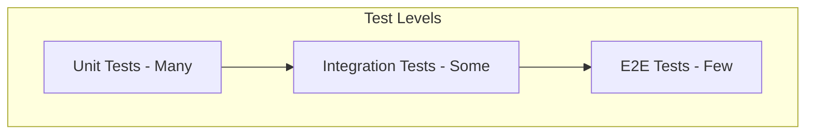
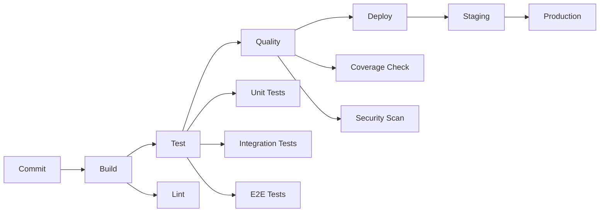

# Testing and CI/CD Specification

## Overview

This document defines testing strategies, CI/CD pipeline patterns, and quality gates for ThingsBoard development.

---

## Test Pyramid



| Level | Description | Speed | Scope |
|-------|-------------|-------|-------|
| Unit | Test individual functions/classes | Fast | Narrow |
| Integration | Test module/service interactions | Medium | Medium |
| E2E | Test full user flows | Slow | Broad |

---

## Test Frameworks

### Backend (Java)

| Framework | Purpose |
|-----------|---------|
| JUnit 5 | Unit testing |
| Mockito | Mocking dependencies |
| Spring Test | Integration testing |
| TestContainers | Database/container testing |
| Jacoco | Code coverage |

### Frontend (Angular)

| Framework | Purpose |
|-----------|---------|
| Jasmine | Unit testing |
| Karma | Test runner |
| Cypress | E2E testing |

---

## Unit Testing

### Guidelines

- Test one thing per test
- Use descriptive test names
- Mock external dependencies
- Follow Arrange-Act-Assert pattern

### Example

```java
@Test
void shouldTransformMessage_WhenValidInput() {
    // Arrange
    TbMsg input = createTestMessage();
    
    // Act
    TbMsg result = node.transform(input);
    
    // Assert
    assertThat(result.getType()).isEqualTo("TRANSFORMED");
}
```

---

## Integration Testing

### Guidelines

- Use in-memory databases where possible
- Use TestContainers for complex dependencies
- Clean up test data after each test
- Test actual integrations, not mocks

### Example

```java
@SpringBootTest
@ActiveProfiles("test")
class DeviceServiceIntegrationTest {
    
    @Autowired
    private DeviceService deviceService;
    
    @Test
    void shouldCreateDevice() {
        Device device = new Device();
        device.setName("Test Device");
        
        Device saved = deviceService.save(device);
        
        assertThat(saved.getId()).isNotNull();
    }
    
    @AfterEach
    void cleanup() {
        deviceService.deleteAll();
    }
}
```

---

## E2E Testing

### Guidelines

- Test critical user paths
- Use stable selectors (data-testid)
- Handle async operations properly
- Keep tests independent

### Example (Cypress)

```javascript
describe('Device Management', () => {
  beforeEach(() => {
    cy.login('tenant@thingsboard.org', 'tenant');
  });

  it('should create a new device', () => {
    cy.visit('/devices');
    cy.get('[data-testid="add-device"]').click();
    cy.get('[data-testid="device-name"]').type('Test Device');
    cy.get('[data-testid="save"]').click();
    cy.contains('Test Device').should('exist');
  });
});
```

---

## CI/CD Pipeline

### Pipeline Stages



### GitHub Actions Example

```yaml
name: CI
on: [push, pull_request]
jobs:
  build:
    runs-on: ubuntu-latest
    steps:
      - uses: actions/checkout@v2
      
      - name: Set up JDK
        uses: actions/setup-java@v2
        with:
          java-version: '17'
          
      - name: Build and test
        run: mvn clean verify
        
      - name: Run UI tests
        run: yarn test
        
      - name: Check coverage
        run: mvn jacoco:report
        
      - name: SonarQube scan
        run: mvn sonar:sonar
```

---

## Quality Gates

### Coverage Requirements

| Module | Minimum Coverage |
|--------|------------------|
| Core Services | 80% |
| Rule Engine | 80% |
| Transport | 75% |
| UI Components | 70% |

### Code Quality

| Check | Tool | Threshold |
|-------|------|-----------|
| Code Coverage | Jacoco | 80% |
| Code Smells | SonarQube | A rating |
| Security Vulnerabilities | SonarQube/Snyk | 0 critical |
| Duplications | SonarQube | < 3% |

---

## Test Data Management

### Guidelines

| Practice | Description |
|----------|-------------|
| Isolation | Each test has its own data |
| Cleanup | Remove test data after tests |
| Factories | Use factories for test data creation |
| Fixtures | Use fixtures for complex scenarios |

### Test Data Factory Example

```java
public class TestDataFactory {
    public static Device createDevice() {
        Device device = new Device();
        device.setName("Test Device " + UUID.randomUUID());
        device.setType("default");
        return device;
    }
    
    public static TbMsg createTelemetryMessage(DeviceId deviceId) {
        return TbMsg.newMsg(
            TbMsgType.POST_TELEMETRY_REQUEST,
            deviceId,
            new TbMsgMetaData(),
            "{\"temperature\": 25}"
        );
    }
}
```

---

## Mocking Strategies

### When to Mock

| Mock | Don't Mock |
|------|------------|
| External APIs | Core business logic |
| Database (unit tests) | Database (integration tests) |
| Time-dependent code | Simple transformations |
| Slow operations | Fast operations |

### Mockito Example

```java
@Mock
private AttributesService attributesService;

@Test
void shouldEnrichWithAttributes() {
    when(attributesService.find(any(), any(), any(), anyList()))
        .thenReturn(Futures.immediateFuture(testAttributes));
    
    node.onMsg(ctx, msg);
    
    verify(ctx).tellSuccess(any(TbMsg.class));
}
```

---

## Flaky Test Handling

### Prevention

- Avoid sleep() - use explicit waits
- Use stable test data
- Isolate tests properly
- Handle async operations correctly

### Recovery

```yaml
# Retry failed tests
- name: Run E2E tests
  run: yarn cypress run --retry 2
```

---

## Performance Testing

### Tools

| Tool | Purpose |
|------|---------|
| JMeter | Load testing |
| Gatling | Performance testing |
| k6 | Modern load testing |

### Metrics to Track

| Metric | Target |
|--------|--------|
| Response time (p95) | < 200ms |
| Throughput | > 10K msg/s |
| Error rate | < 0.1% |
| Memory usage | Stable |

---

## Security Testing

### SAST (Static Analysis)

| Tool | Purpose |
|------|---------|
| SonarQube | Code quality and security |
| Snyk | Dependency vulnerabilities |
| Checkmarx | Security scanning |

### DAST (Dynamic Analysis)

| Tool | Purpose |
|------|---------|
| OWASP ZAP | Web vulnerability scanning |
| Burp Suite | Security testing |

---

## Best Practices

### Do's

- Write tests before or alongside code
- Keep tests fast and reliable
- Use meaningful test names
- Clean up test data
- Run tests locally before push

### Don'ts

- Don't skip tests temporarily
- Don't use Thread.sleep()
- Don't share test data between tests
- Don't test implementation details
- Don't ignore flaky tests

---

## Requirements Summary

| ID | Requirement |
|----|-------------|
| REQ-001 | All code must have unit, integration, and E2E tests |
| REQ-002 | CI pipelines must run all tests and enforce coverage gates |
| REQ-003 | All test data must be isolated and cleaned up |
| CON-001 | No manual deployment to production |
| GUD-001 | Use mocks/stubs for external dependencies |

---

## See Also

- [Architecture Blueprint](architecture-blueprint.md)
- [Rule Node Implementation Guide](rule-node-implementation-guide.md)
- [Infrastructure & Queue](infrastructure-queue.md)
