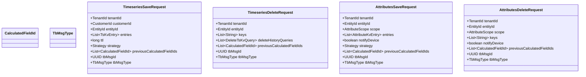
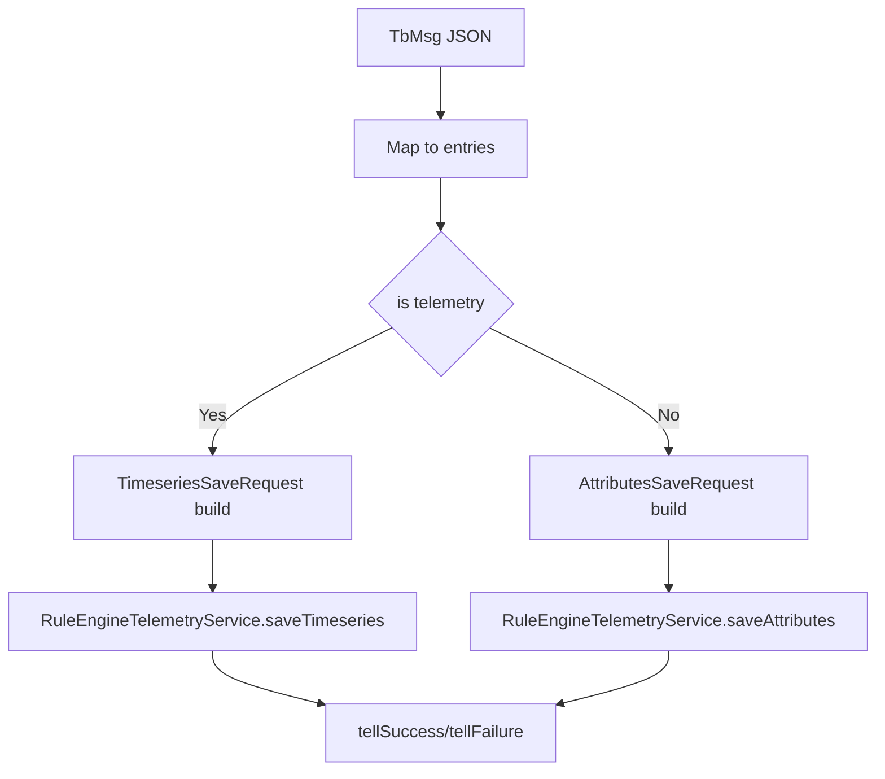

# Timeseries and Attributes Requests in Rule Engine

## Language & Context

- Language: Java (server-side)
- Domain: Request DTOs used by `RuleEngineTelemetryService` to persist or delete data.

Key source files:

- org/thingsboard/rule/engine/api/TimeseriesSaveRequest.java
- org/thingsboard/rule/engine/api/TimeseriesDeleteRequest.java
- org/thingsboard/rule/engine/api/AttributesSaveRequest.java
- org/thingsboard/rule/engine/api/AttributesDeleteRequest.java

## Common Concepts

All four DTOs support:

- Tenant and target entity identification
- Correlation to originating `TbMsg` (`tbMsgId`, `tbMsgType`)
- Calculated Fields loop-protection via `previousCalculatedFieldIds`
- Asynchronous completion via `FutureCallback` (or helper `future(SettableFuture)`)

## Strategies

### TimeseriesSaveRequest.Strategy

- `PROCESS_ALL`: save raw timeseries, update `latest`, send WebSocket, process calculated fields
- `WS_ONLY`: send WebSocket update only
- `LATEST_AND_WS`: update latest and WebSocket, skip raw storage
- `SKIP_ALL`: no persistence or notifications
- `CF_ONLY`: process calculated fields only

### AttributesSaveRequest.Strategy

- `PROCESS_ALL`: save attributes, send WebSocket, process calculated fields
- `WS_ONLY`: send WebSocket update only
- `SKIP_ALL`: skip all processing
- `CF_ONLY`: calculated fields only

## Builder Patterns

DTOs provide fluent builders with convenience methods:

- Single entry adders: `entry(TsKvEntry|KvEntry)` and `entry(AttributeKvEntry|KvEntry)` (auto-wraps with current ts)
- Attribute scope overload (string) exists but is deprecated; use `AttributeScope` enum
- `future(SettableFuture)` to adapt callbacks easily

## Typical Node Usage

## Best Practices

- Normalize schemas: keys, types, timestamps
- Use `Strategy` to optimize storage vs real-time needs (latest-only vs raw timeseries)
- Always set `tbMsgType` to match the originating event for traceability
- For deletes, prefer precise `DeleteTsKvQuery` over broad key lists where possible

## Common Pitfalls

- Using deprecated string scope; prefer `AttributeScope` enum
- Forgetting to supply callbacks in tight loops; use `future(SettableFuture)` when batching
- Saving attributes without `notifyDevice` when device-side sync is needed

## References

- org/thingsboard/rule/engine/api/TimeseriesSaveRequest.java
- org/thingsboard/rule/engine/api/TimeseriesDeleteRequest.java
- org/thingsboard/rule/engine/api/AttributesSaveRequest.java
- org/thingsboard/rule/engine/api/AttributesDeleteRequest.java
