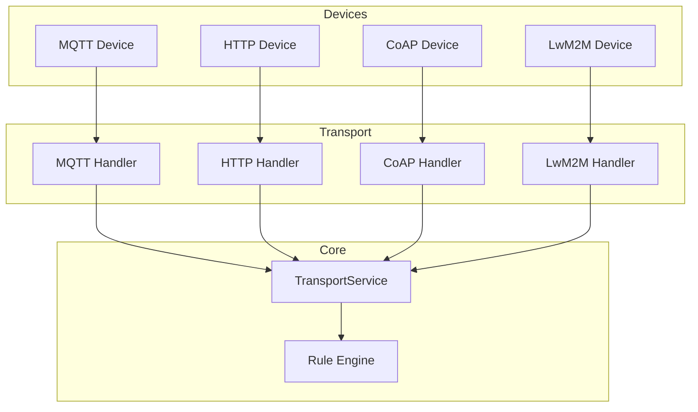
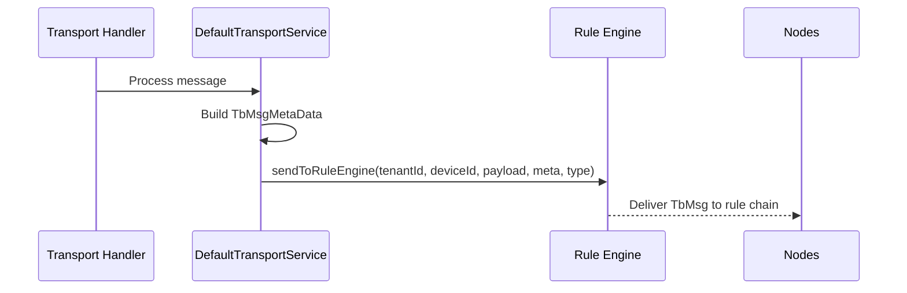
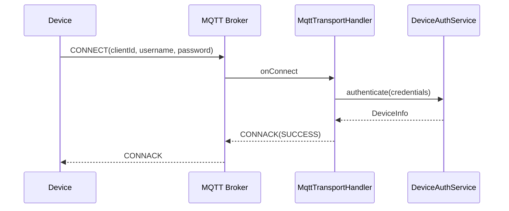
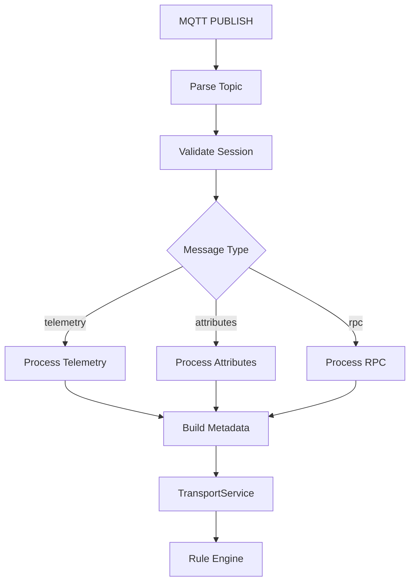
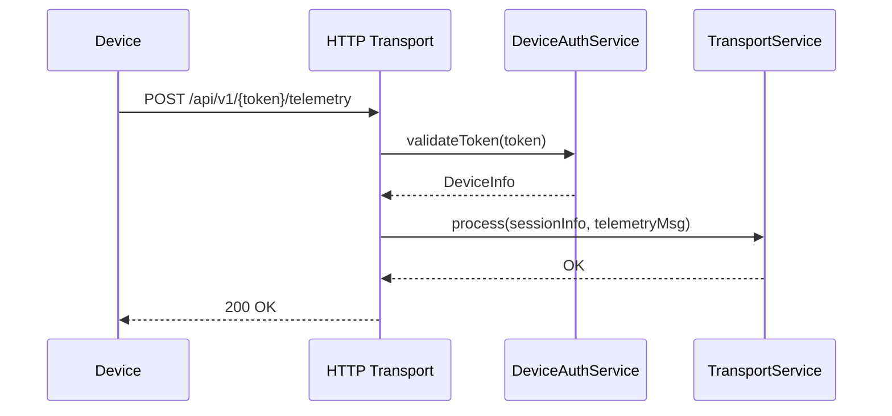
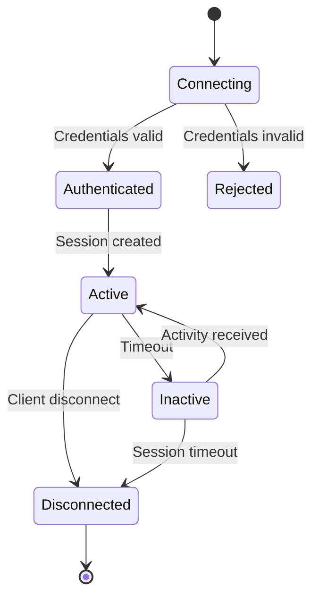

# Transport Layer Specification

## Overview

The Transport layer handles device connectivity, protocol-specific message processing, and routing to the Rule Engine. ThingsBoard supports MQTT, HTTP, CoAP, and LwM2M protocols.

---

## High-Level Architecture

---

## Transport → Rule Engine Flow

### Key Steps

1. Validate limits per session and message (`checkLimits`)
2. Record device activity (`recordActivityInternal`)
3. Prepare identifiers: `TenantId`, `DeviceId`, `CustomerId`
4. Construct metadata per data point
5. Convert incoming data to JSON payload
6. Build and send `TbMsg` with appropriate `TbMsgType`

---

## MQTT Transport

### Topic Structure

| Topic Pattern | Purpose |
|---------------|---------|
| v1/devices/me/telemetry | Publish telemetry data |
| v1/devices/me/attributes | Publish client attributes |
| v1/devices/me/attributes/request/{id} | Request attributes from server |
| v1/devices/me/attributes/response/{id} | Receive attribute response |
| v1/devices/me/rpc/request/{id} | Receive RPC request from server |
| v1/devices/me/rpc/response/{id} | Respond to RPC request |
| v1/devices/me/claim | Claim device |
| v1/devices/me/provision | Provision device |

### Gateway Topics

| Topic Pattern | Purpose |
|---------------|---------|
| v1/gateway/telemetry | Gateway publishes device telemetry |
| v1/gateway/attributes | Gateway publishes device attributes |
| v1/gateway/connect | Gateway connects device |
| v1/gateway/disconnect | Gateway disconnects device |
| v1/gateway/rpc | Gateway RPC handling |

### Connection Flow

### Authentication Methods

| Method | Configuration |
|--------|---------------|
| Access Token | Username: `$ACCESS_TOKEN`, Password: (empty) |
| Basic Auth | Username: `$DEVICE_NAME`, Password: `$DEVICE_PASSWORD` |
| X.509 Certificate | Client certificate, no username/password |

### Message Processing

---

## HTTP Transport

### Endpoints

| Endpoint | Method | Purpose |
|----------|--------|---------|
| /api/v1/{token}/telemetry | POST | Submit telemetry |
| /api/v1/{token}/attributes | POST | Submit attributes |
| /api/v1/{token}/attributes | GET | Get shared attributes |
| /api/v1/{token}/rpc | GET | Long-poll for RPC requests |
| /api/v1/{token}/rpc/{requestId} | POST | Respond to RPC |
| /api/v1/{token}/claim | POST | Claim device |

### Request Flow

---

## CoAP Transport

### Endpoints

| Path | Method | Purpose |
|------|--------|---------|
| /api/v1/{token}/telemetry | POST | Submit telemetry |
| /api/v1/{token}/attributes | POST | Submit attributes |
| /api/v1/{token}/attributes | GET | Get shared attributes |
| /api/v1/{token}/rpc | GET | Observe RPC requests |

### CoAP Features

- Lightweight UDP-based protocol
- Confirmable (CON) and Non-confirmable (NON) messages
- Block-wise transfer for large payloads
- DTLS for secure communication

---

## Device Session Management

### Session Lifecycle

### Session Properties

| Property | Description |
|----------|-------------|
| sessionId | Unique session identifier |
| tenantId | Owning tenant |
| deviceId | Connected device |
| customerId | Customer (if assigned) |
| transportType | MQTT, HTTP, CoAP, LwM2M |
| lastActivityTime | Last message timestamp |

---

## Rate Limiting

### Configuration

| Property | Description |
|----------|-------------|
| transport.rate_limits.enabled | Enable rate limiting |
| transport.rate_limits.tenant | Tenant-level limits |
| transport.rate_limits.device | Device-level limits |
| transport.sessions.max_per_tenant | Max sessions per tenant |
| transport.sessions.max_per_device | Max sessions per device |

### Limit Types

| Type | Description |
|------|-------------|
| Messages per second | Max message rate |
| Data points per second | Max telemetry points |
| Concurrent sessions | Max active sessions |

---

## Best Practices

### Do's

- Use appropriate protocol for device constraints
- Enable TLS/DTLS for production
- Configure rate limits per tenant
- Monitor session counts and message rates
- Use gateways for legacy protocol conversion

### Don'ts

- Don't expose transport ports without authentication
- Don't disable rate limiting in production
- Don't use HTTP for battery-constrained devices
- Don't ignore connection timeouts

---

## Common Pitfalls

| Pitfall | Solution |
|---------|----------|
| Missing metadata fields | Ensure `meta.copy()` per data point |
| Rate limit rejections | Check `checkLimits` counters |
| Wrong TbMsgType | Telemetry uses `POST_TELEMETRY_REQUEST` |
| Session timeouts | Configure appropriate keep-alive |

---

## See Also

- [Rule Engine Core](rule-engine-core.md)
- [Device State Management](device-state-management.md)
- [Security & Authentication](security-auth.md)
