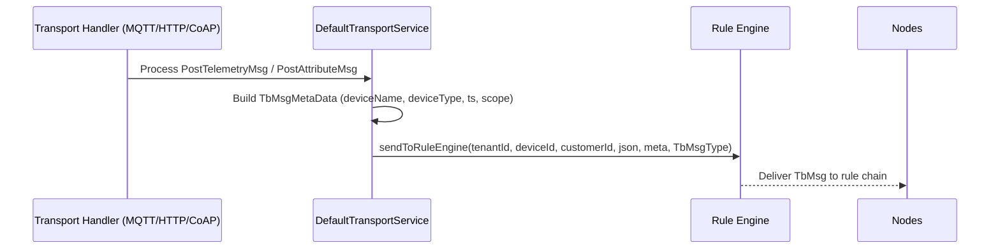
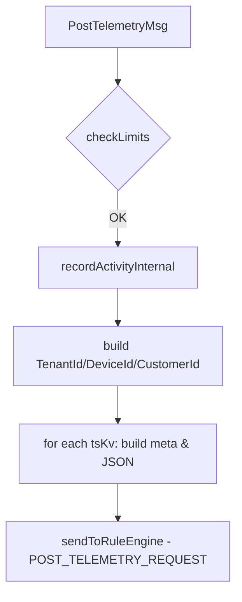

# Transport → Rule Engine Flow

## Language & Context

- Language: Java (server-side)
- Domain: How inbound telemetry/attributes from transports become `TbMsg` and enter the Rule Engine.

Key source file (example path):

- common/transport/transport-api/src/main/java/org/thingsboard/server/common/transport/service/DefaultTransportService.java

## High-Level Flow

## Key Steps in DefaultTransportService

- Validate limits per session and message (`checkLimits`)
- Record device activity (`recordActivityInternal`)
- Prepare identifiers: `TenantId`, `DeviceId`, `CustomerId`
- Construct metadata per data point (e.g., `ts`, `deviceName`, `deviceType`, `scope`)
- Convert incoming KV lists to JSON payload
- Build and send `TbMsg` with appropriate `TbMsgType` (e.g., `POST_TELEMETRY_REQUEST`, `POST_ATTRIBUTES_REQUEST`)
- Use pack/aggregate callbacks for multi-point telemetry bursts

## Telemetry Example

Selected flow from `process(SessionInfoProto, PostTelemetryMsg, TbMsgMetaData?, TransportServiceCallback)`:

- Iterate `tsKvList` and count points (for rate limiting)
- For each `tsKv`, copy or create `TbMsgMetaData`
- Inject `deviceName`, `deviceType`, and `ts`
- Convert KV entries to `JsonObject` payload
- Call `sendToRuleEngine(...)` with `TbMsgType.POST_TELEMETRY_REQUEST`

## Attributes Example

- Similar to telemetry; may set `scope` to `SHARED_SCOPE` in metadata
- Builds `TbMsgType.POST_ATTRIBUTES_REQUEST`

## Best Practices

- Reuse a base `TbMsgMetaData` per session where possible but call `copy()` per data point to avoid cross-contamination.
- Enforce fair usage via `checkLimits` to protect cluster stability.
- Maintain consistent JSON schema for downstream nodes.

## Common Pitfalls

- Forgetting to copy metadata when looping over `tsKvList`.
- Not setting `NOTIFY_DEVICE_METADATA_KEY` appropriately for attributes.

## Troubleshooting & Ops

- Rate limit rejections:
  - Inspect `checkLimits` counters and thresholds; confirm session-scoped vs global limits.
  - Verify the number of points in `tsKvList` matches expectations.
- Missing metadata fields:
  - Confirm per-point `meta.copy()` before injecting `ts` and device fields.
  - Check transport-specific injectors (e.g., MQTT topic in `MqttTransportHandler`).
- Wrong `TbMsgType`:
  - Ensure telemetry uses `POST_TELEMETRY_REQUEST` and attributes use `POST_ATTRIBUTES_REQUEST`.
- Pack callback timeouts:
  - Validate downstream callbacks aggregate properly; check Rule Engine queue health.

---

Previous: mqtt-transport-flow.md · Next: tbmsg-and-metadata.md

## References

- common/transport/transport-api/src/main/java/org/thingsboard/server/common/transport/service/DefaultTransportService.java
