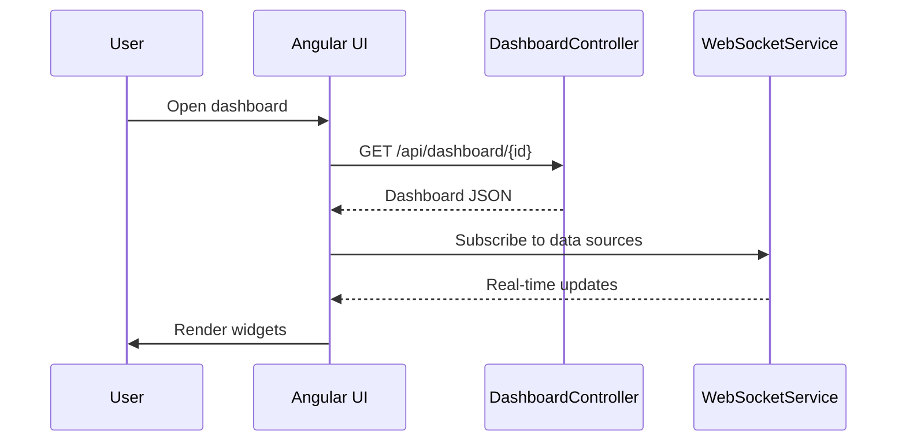
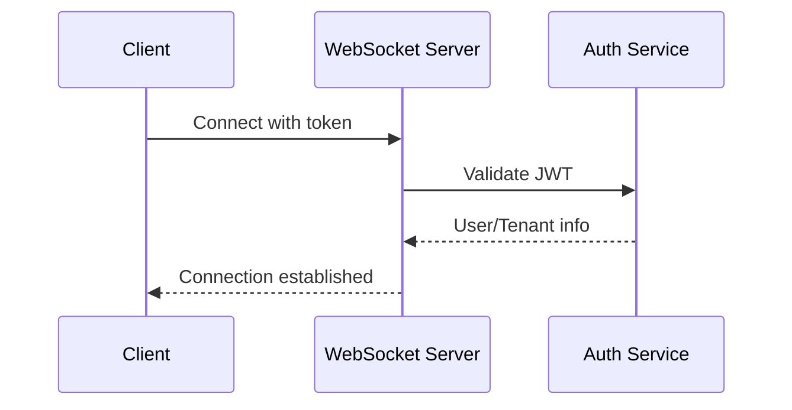
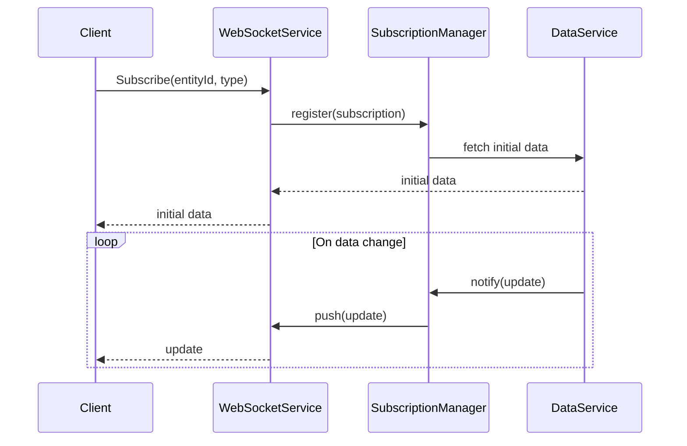
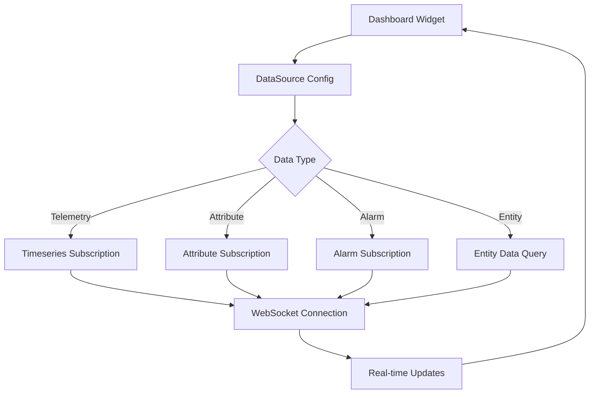
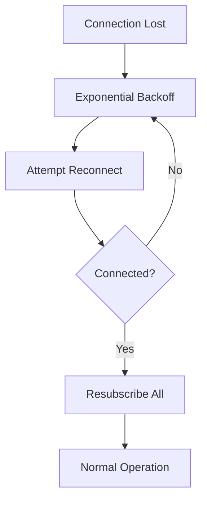

# UI and Real-Time Data Specification

## Overview

This document describes the dashboard system, widget management, WebSocket subscriptions, and real-time data delivery in ThingsBoard.

---

## Part 1: Dashboard System

### Dashboard Structure

| Field | Type | Description |
|-------|------|-------------|
| id | DashboardId | Unique identifier |
| tenantId | TenantId | Owning tenant |
| title | String | Dashboard title |
| configuration | JsonNode | Layout and widget configuration |
| assignedCustomers | List | Customers with access |

### Dashboard Services

#### DashboardService

| Method | Description |
|--------|-------------|
| findDashboardById(...) | Retrieve dashboard by id |
| saveDashboard(...) | Create or update dashboard |
| deleteDashboard(...) | Remove dashboard |
| assignDashboardToCustomer(...) | Assign to customer |
| findDashboardsByTenantId(...) | List dashboards for tenant |

### Dashboard Flow



---

## Part 2: Widget System

### Widget Configuration

| Field | Type | Description |
|-------|------|-------------|
| type | String | Widget type identifier |
| title | String | Widget title |
| config | JsonNode | Widget-specific configuration |
| dataSource | JsonNode | Data binding (entity, keys) |

### Widget Services

#### WidgetTypeService

| Method | Description |
|--------|-------------|
| findWidgetTypeById(...) | Retrieve widget type |
| saveWidgetType(...) | Create or update widget type |
| deleteWidgetType(...) | Remove widget type |
| findWidgetTypesByBundleId(...) | List types in a bundle |

#### WidgetsBundleService

| Method | Description |
|--------|-------------|
| findWidgetsBundleById(...) | Retrieve bundle |
| saveWidgetsBundle(...) | Create or update bundle |
| deleteWidgetsBundle(...) | Remove bundle |

---

## Part 3: WebSocket Subscriptions

### Connection Endpoint

```text
ws://{host}:{port}/api/ws/plugins/telemetry?token={JWT_TOKEN}
wss://{host}:{port}/api/ws/plugins/telemetry?token={JWT_TOKEN}
```

### Connection Flow



---

### Subscription Types

| Type | Description |
|------|-------------|
| TIMESERIES | Subscribe to telemetry updates |
| ATTRIBUTES | Subscribe to attribute updates |
| ALARM | Subscribe to alarm updates |
| ENTITY_DATA | Subscribe to entity data queries |
| ENTITY_COUNT | Subscribe to entity count queries |

### Subscription Flow



---

### Command Examples

#### Telemetry Subscription

```json
{
  "tsSubCmds": [{
    "cmdId": 1,
    "entityType": "DEVICE",
    "entityId": "device-uuid",
    "keys": "temperature,humidity",
    "scope": "LATEST_TELEMETRY",
    "startTs": 0,
    "timeWindow": 3600000
  }]
}
```

#### Attribute Subscription

```json
{
  "attrSubCmds": [{
    "cmdId": 2,
    "entityType": "DEVICE",
    "entityId": "device-uuid",
    "keys": "active,config",
    "scope": "CLIENT_SCOPE"
  }]
}
```

#### Alarm Subscription

```json
{
  "alarmSubCmds": [{
    "cmdId": 3,
    "entityType": "DEVICE",
    "entityId": "device-uuid"
  }]
}
```

#### Entity Data Query

```json
{
  "entityDataCmds": [{
    "cmdId": 4,
    "query": {
      "entityFilter": {
        "type": "deviceType",
        "deviceType": "thermostat"
      },
      "latestValues": [
        {"type": "TIME_SERIES", "key": "temperature"}
      ],
      "pageLink": {"page": 0, "pageSize": 10}
    }
  }]
}
```

#### Unsubscribe

```json
{
  "tsSubCmds": [{
    "cmdId": 1,
    "unsubscribe": true
  }]
}
```

---

### Response Formats

#### Telemetry Update

```json
{
  "subscriptionId": 1,
  "data": {
    "temperature": [[1704537610000, "23.0"]]
  }
}
```

#### Alarm Update

```json
{
  "subscriptionId": 3,
  "alarm": {
    "id": "alarm-uuid",
    "type": "HighTemperature",
    "severity": "CRITICAL",
    "status": "ACTIVE_UNACK"
  }
}
```

### Error Codes

| Code | Description |
|------|-------------|
| 0 | Success |
| 1 | Entity not found |
| 2 | Unauthorized |
| 3 | Internal error |
| 4 | Too many subscriptions |
| 5 | Bad request |

---

### History Query

```json
{
  "historyCmds": [{
    "cmdId": 5,
    "entityType": "DEVICE",
    "entityId": "device-uuid",
    "keys": "temperature",
    "startTs": 1704451200000,
    "endTs": 1704537600000,
    "interval": 60000,
    "agg": "AVG",
    "limit": 100
  }]
}
```

### Aggregation Types

| Aggregation | Description |
|-------------|-------------|
| NONE | Raw values |
| AVG | Average |
| MIN | Minimum |
| MAX | Maximum |
| SUM | Sum |
| COUNT | Count |

---

## Part 4: Widget Integration

### Widget Subscription Pattern



---

## Part 5: Connection Management

### Heartbeat

```json
{"ping": true}
```

Response:

```json
{"pong": true}
```

### Session Configuration

| Configuration | Default | Description |
|---------------|---------|-------------|
| ws.idle_timeout | 300000 | Idle timeout in ms |
| ws.ping_interval | 30000 | Ping interval in ms |
| ws.max_subscriptions_per_tenant | 10000 | Max per tenant |
| ws.max_sessions_per_tenant | 1000 | Max sessions per tenant |
| ws.max_subscriptions_per_session | 100 | Max per session |

### Reconnection Strategy



| Attempt | Delay |
|---------|-------|
| 1 | 1 second |
| 2 | 2 seconds |
| 3 | 4 seconds |
| 4 | 8 seconds |
| 5+ | 30 seconds |

---

## Best Practices

### Dashboard Design

- Use widget bundles to organize related widgets
- Limit widgets per dashboard for performance
- Use entity aliases for flexible data binding
- Test dashboards with expected data volumes

### WebSocket Usage

- Limit subscriptions per client
- Use entity data queries for complex filtering
- Unsubscribe when data is no longer needed
- Implement reconnection with exponential backoff
- Use WSS in production environments
- Handle connection errors gracefully

---

## See Also

- [Security & Authentication](security-auth.md)
- [Alarm & Notification Services](alarm-notification-services.md)
- [Device & Asset Management](device-asset-management.md)
