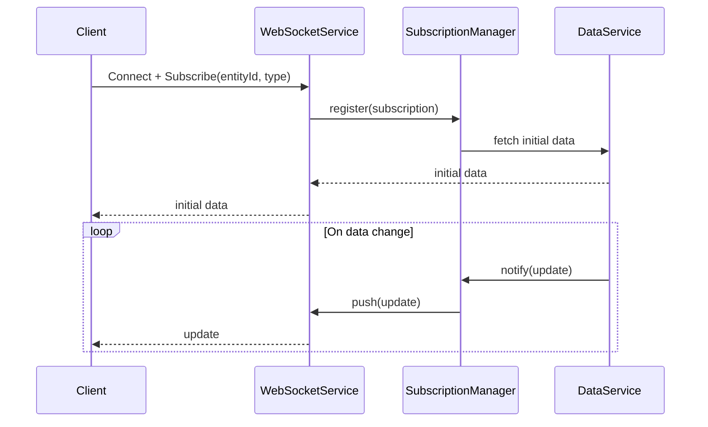

# WebSocket Subscriptions Specification

## Overview

This document describes the WebSocket subscription mechanism in ThingsBoard, which enables real-time data delivery to web and mobile clients.

---

## Key Components

### TelemetryWebSocketService

Handles WebSocket connections and subscriptions for telemetry and attribute updates.

| Method                        | Description                                      |
|-------------------------------|--------------------------------------------------|
| handleWebSocketMessage(...)   | Process incoming WebSocket message               |
| sendUpdate(...)               | Push update to subscribed clients                |

### Subscription Types

| Type              | Description                                      |
|-------------------|--------------------------------------------------|
| TIMESERIES        | Subscribe to telemetry updates                   |
| ATTRIBUTES        | Subscribe to attribute updates                   |
| ALARM             | Subscribe to alarm updates                       |
| ENTITY_DATA       | Subscribe to entity data queries                 |
| ENTITY_COUNT      | Subscribe to entity count queries                |

---

## Subscription Flow



---

## Subscription Message Format

**Subscribe:**

```json
{
  "cmds": [
    {
      "cmdId": 1,
      "entityType": "DEVICE",
      "entityId": "<uuid>",
      "keys": ["temperature", "humidity"],
      "type": "TIMESERIES"
    }
  ]
}
```

**Update:**

```json
{
  "subscriptionId": 1,
  "data": {
    "temperature": [[1704537600000, "22.5"]],
    "humidity": [[1704537600000, "60"]]
  }
}
```

---

## Authentication

- WebSocket connection authenticated via JWT token
- Token passed as query parameter or in initial message

---

## Best Practices

- Limit subscriptions per client to prevent overload
- Use entity data queries for complex filtering
- Unsubscribe when data is no longer needed

---

## See Also

- [Timeseries & Attributes Requests](timeseries-and-attributes-requests.md)
- [Security and Authentication](security-auth.md)
